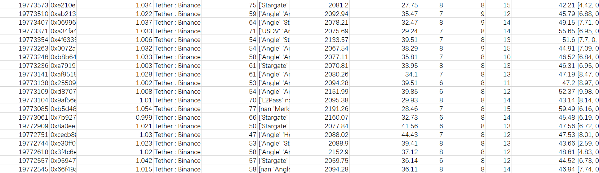
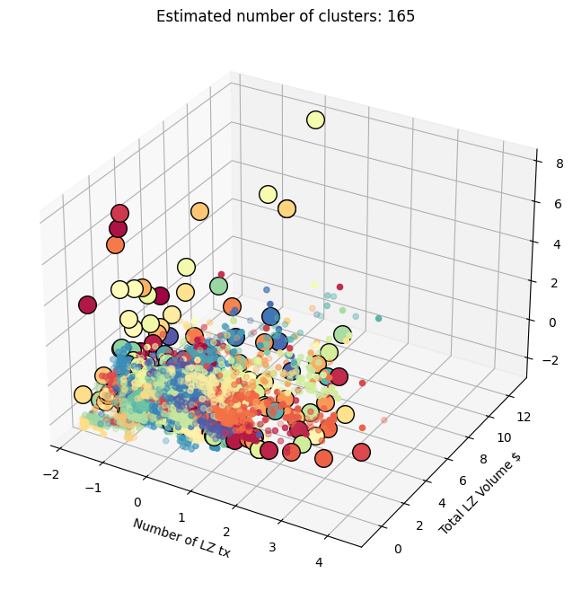

# Reported Addresses

This is first batches(batch1-10) I submit, the , ,  one is here.

```
0xa19960039c04e7708302bdbe25d1fdf4ac3116f5
0x3272e3b78347e71d5654b24091d63bf1a8f6f6db
0xeeade5a7275859a57e483393ec0766caaab5cf90
0xa121eefe30403df0fd09a782eb7b5ef2942c87a5
0xd9767066bbbf52a75499c761169485f74cf8721b
0x758aeb4ff703e1affeac4b80e67dded073c6b93d
0x4877352ca9327ac47fc6265c3abaaa3116f61a6c
0x6d24bf0c974ba2bba8f803fa101e7730e0a9c3f3
0x7452e6f475ba5694f1fc7504a2dd5798efce9ba1
0x0a443225f7ef7b602cbd42b01e767a702340e25e
0xf0a31aaa27c675f47b4dc221eda3bbc18aac6a9b
0x6e690a05377b020d7852e349c549c7f03e617f0b
0x11821424ec207cbd42006ba1387ff2fa9e50b653
0x36118ffb81dc7d92a9c0edb54bd68b5d6d662cfb
0xdc9623ba6ad2d33b7b9036a676f50967209fd332
0x7f6bf86e30561293d5ba6cba82708b31a861e2a4
0x3bb967679bbd6b1b3c2084d231d0a226fce08389
0xee0dfe0248fcb04734ab3373d01c89af9b5001c6
0x63c713a0b6bb6b754778f752341e18248c2b1df7
0xf13e30854d758723fdeb43129cfeff2f9da7de94
0x3a4e588206e953e1989a268024cafdd0a5bb07a7
0x3a9b7a5224e3d86f7dc464e4a173fe6ec5876a73
0xaedfd3f7b71c155131044e555e59a44b141dd3de
0xb168612840a4ec9a963f27b3cfd23f2e58722a91

0xad6f31394a6bc2b174534c9d7dd59996ce09bb7d
0x5e03fd6104ed10dc9a6a5f2d995f9be9fc1ceff8
0x3a9a1d3f04954aa8f793b4384b9beaacd54c2939
0xc2e823ee187f264e8607469fed7e92a7936388cb
0xbd4bfc5216a4832892ff686ae067739e09223f8e
0x91647480e2d0f43b393d6dc6071db180d1331b9e
0x68ef2ddd7fddb10accbaa0c2b65272648b65ad86
0x85dac966499c5f86c7db6e305d98884b4b7fe1cc
0xe5f2a53e3f9d52b6b3d39e89ade81eef9c8f1819
0x0f36dba814d8e7a0cfecace21a8cc7f229b370f2
0xdcb4d6fdcddbdb05330048ef483b676b61602220
0x97050b09d21ae1e2b557e9ff05915ee62880ee4e
0x888115e53c20a84b6ca37dfba811039a88dfb08c
0xe7d6564385e86f501b6d7c2c7dcd5499de6efd00
0xc166fe4154842d94c80d7abad44795865b6522d7
0x2feab8ce21431f5a90f31a9a1c77356a93bf6586
0xc406408a25f267c0a043529855ad256cb799a090
0xc5729c7a357f1600b77213906158e11ca82ae566
0xcbe5fbb475f07a190aec7ce8ba00f3f478dff723
0xc647bf7633619f4cf85546807f78b286bc1af229

0xb090f96217b418c97e980e4005fe634fd2b737b2
0x60ccf6925a8f45c0ce6a9655f50c8ea6ce33952a
0xb37ff94f78231b8b5e9a7e32f22ad408882784e7
0x69c20fc7ceefb54ed9184a0bde20d2d5866dd4c3
0x92746060ae79c94bf095abb47094b016401adc8b
0x2c3f585c9c0c9cb0dc4228d63632cafa148e4416
0x0dc11211fab254dd5425e5c0228fc9620d323016
0xe8a65e810f133bbdaffefa9f90be90c8d56a23b1
0x9bfe00c52d8c94a5b175be8e461914c5fcadd0ed
0x21f86143e20c7086bcdd4837fc7949804bc3a888
0xda58a4bd933a23679b1c979b955f1a988a809104
0x47219d34b791e0410ad21640980c6b9dc0899611
0xbe901266dff35ea39f2a7a5dabc2e6cc45778bfc
0x6ee55fe37bae880227472fb3dbc1fe11963df91d
0xeecac155fb1a089d2692cc685ba0ecc3cfa15629
0x1ad6ac71806509ad218f5246696d3388cc84bfcd
0x97da34678b354015d7ad5f04e888b63b7ffbced8
0xafdb9a90239ff6b9e0531a0e1ac0ad3f82cb945b
0x7478ad653fa917fe89eaeaf4064cd462c6335fa5
0xefe023aa11393e3df061e8be493dbfa77869f284
0x2748f17fa6932f0ebf053ace2a907cff9b9d8404
0x33af30775bc8413579d95e66fffb15366b5ac9af
0xd56835d541c837f554852f63a739bf2c0979338e
0xe0968684596d5a609c5ed00f3e49e4d57dcdb499
0x03dde88684aaac0b8139f637fee5f4850e7421c0
0x93af2043ea4a8b8f99ae11c600c61c4b3be15f0e
0xe307ba0820c0fc19ab83f3188adbc9e11298e59b
0x38910032d0feead5602d2f6ce6d131d44b4a98a0
0x8d3148e26bf2ce716fcb58460dc93aa964e7cf88
0x1d2b6d4bfd8c24e87ca2b62590f6225b4c4cff33
0xd357b82587e0165953343ea1862d038989950b95
0xa1113bbc7a3697ae22be61ec62f2f48d44611b67
0x02366b42492ebe0ca2463d0a61ab656a6386f19a

0xfecfdd0db641eebfd249e666af38e6a066c1a89a
0xb495ca1b55ee5e42d7f9a2e9a6ac7ea2a7e7c338
0x33caad34dc955022935c2204b9a4c19c87499d7f
0x879cdf63139b75ff04c909fce9fbe3aecee43123
0x3396438b4c11229629aa44fe570631ff7953445a
0xd389619f28740744df7faa82fad027f228c8e76e
0xcf82d08fc5ffddfed44462429c17c5f1d715f3f2
0x1470a080960d0a95cbd538abf43b257f9f521769
0x96cb85da6140bd65c4e5f36e3e8d3ab4a47c45b4
0x688c6923701b4fc414287226940b954d2d20133d
0x99f611ac89a827c98d7e8c0f1e9d657aa559e5dc
0x9c669ff4303ad97ea64f0527b34a737f1af0c7fe
0x28ef7a223b9a5b094d142a95e52a68ab6c342192
0xae749c409880348b1d44c9c2e3eb4f5907f3a2cf
0x389c7aee49f52b12ab3afa1fcb6bebbdd6c6b705
0xf5609ca8aa4b819dd6f1b1ff9f0e7b91cc6c87db
0x4a18524233bd4fea6ba97f634fc4875bf54c6044
0xb05816d88fabafc254ffb7e5ca7b957c92a73c8f
0xcdf34c77ef7e932d425026cff62888503c32f209
0xb2d17c07fb9f83e52e05fe71629a6a65c61e235f
0xfaac2c4b3778b8b46fc2c4a0ea770c52dd05c055
0x436d90bbb003ee29201ba29494d6c7d6c32d04a8
0xe9fbbde90e353e8746cf6217c14ee66cd737604d
0x36b428ebea5d3677adb7dc12aa7704100530f821
0x468b9ec7b0e205edbd8aecb9507df406ebf3c76d
0xe196bc5cea189cb8128faac44c5199489426220e
0xe561b37e16c5d6902376b85333874ab7a0d57d8c
0x5173f3cc3363705a9d0a09e4ed1bfbf9969a1b87
0x45eeeaadc0274576a8668bb01e28c1dc87f6e988
0x02ee08141c932d5b2a918bed7e11e6c9015c7625
0xe5b8bf05e0546c45ea6d6ab633c9843d75d78e93
0xe1937575f134e4a51c5390fc83e5bf6cef3df03b
0x43701819083944e07c21da49247c760f48009af8
0xa74b06720f508d6d8697cb354b4c139e617f20d8
0x6b59355fb03af9e1d5baa58493b3a5f0263083a8
0xb0b3aeb7696d9183db7dd9b7df6a5a1232695be6
0xcde8b5d97eeca3a803620bba5e49194e94157f6d
0xfd2db89dfb177fee20ec2e49acd826f27931897b
0x4141791c61fde9ebbf4d84dce114150d2779a5ab
0x2816a6ab1c6c3c7b6e5766739123943529fabfb1
0x3e065fc5ec022721e0befe56f3fa1473dffcac3f
0x69fb8a14a6dfbc666439ae3f54e60d2d363b19e9
0xcaf6a9a750754b6ad8666eb60421bc9725d0d150
0x84b64a48180c0271951c1e81736d5514e8478b20
0xf1f65f84856cc47fb8a52ba1d653482be28da94d
0xdc7147263be2db6fb39b49a9a0464808e4d3dddf
0x6e3dd4e21e8be393fd561c43b4a9afbf176412ea
0x182cf0fb0aa748ea01d1d994638f6db2a0158afe
0x98558794e5d2195c5a7d0e9bc502eeddf8688dd9
0x023f2b20a1cbf9198b203ce45f5d139119269cc5
0x5938ed40c4a42c4ed0adc71593db15889e815d28
0xce49ea273dacb9f2462aa95fa0046d385f2ba7b1
0x7a05c3b5b81d2bf88fa78590b0d851dd794f3cfd
0x34e8f97a021e79d497812e59344bc3ded01c889b
0xcd2169c15c01bd7c4fafb7858dadf2d94fbf08a4
0x3cf88ae076aa2a174a74aaf2a1624fbcbcc72f2e
0x5ba071eadeb8f97835066a820a5b24e44c2ebc23
0x5f6d388d64c228f278dcb346d53f407277113969
0x8456d00565962e9f24cd9688d78426acfb27f00b
0xbf012517493146a5a431b1169f687eeda2f5002f

0x468f11811dea6ce37a6be6faee59879205caebc5
0xf62c577fbf1cd302650f92b387d1a5205be3d228
0x68bd8761441f2be31f4703ca4e6fbc559f9df53c
0x56cb2aa085341f2f1feedfb13d9a4723d851c5da
0x133a4feb7ffc8060027c43805a06753eabd9ad9f
0x7c40d81ebea94ae73914dba68ce1587c7d577dc6
0xe79c61bf88e9d38fbeab5e724d03567d4091ada6
0x4858914eb66494414d83a57b031f57c232b6c59a
0x922b90d4700228ca278fe8e7c31823e2bc3b39a7
0x9950fbb363b6f87eba0c4916322640a96dbacf9c
0xc316ef557bc63bad2fa306a5a127d3ceeaf9d97f
0xc400179b1fbdb375df1f977a8e65fbb841771a0f
0xf656082c0da334c46774ddc384b636a336d6366b
0xc51265ae59dce814fe824f002d4880d6f41bf843
0xd1d40fd3b270228f344626a758b8abe9df1fe833
0x28d680ad0647015cb6376f9bc2a5892b1fcf687e
0x872ce14e1d75030069b656d62ef6c8502cc2daf8
0x88478cab9141c3473242901cc6c287289ce19f60
0x6cbd15ba0c7f138fba7a8c8a960620450877117d
0x9417141ac9db93fc367178d6469e46e8e72b63cd
0x85e817bc32782b3a588f5dd8f48117ba9814bdb2
0x7b4f5ed486b339ff8d1773aceef33915482ed4f2
0x9579f71e1f6d36a9674517de536af4fc587d78d9
0x159e6aa09c1903e9059197370b9ff7aa1ccb9967
0xe88d58551d625bd737c85ceb71a7db62ceadb71e
0x9850045e3baccaf8383d16519de7652ca9e0b93e
0x3dd80d540eaf868f2fa5ed0e0eca9f6b69937137
0x7911585ad9d6b9cddc7157954bd9d11e406b794e
0xd41f958bfe9f0fb8424b97c5130fa60124f79280
0x5df36f444f6974e8533a7e2bafe4d3d13d919565
0x6564faa3d5702e2dca5d88f02f813cd74943c5a8
0x614268aea1a2c23ffb455aadc199badbb0aa0cc5
0x4379d633e016d7a897b2a0983ae8df53f909c861
0x5a23c8b595583036fef475711131c4f1b3dac25a
0x0e9c864e1d7452cfe5914bf4d749df8c68933588
0x3fe85b774fe15389597a08130737ed7514c52c03
0x58112d362ab2f873e181b14e9a9157c93b72b18d
0xf08cafdea51b5080cf1a492425ff25e4dc5c6516
0x940db3d7f19e65b747e70211899b563982a44f91
0x960ae7799172bee24f67d7c310135d47213f990e
0x703cf3e85d408e9e56b98a92e47d0d0b771f2340
0xa2ff154102385ea5c672df20b39e38f17c8f1f94
0xb3d249df7bdb286fd86a722b9b5e8040f6aa415d
0xdd5b82fa588ae23fa3ea9c8713e710df498d6662
0x66772efdd1da6fa7cf261c67e1d297ae87f1545f
0x661815019a8a6ee594c06206fa2a5a96af972054
0x97c95b0110f1b58f1016dceb5b46261b50f2caf7
0xaa6ca4d4b034a03324748f60339e01197a723c93
0x68d9162920fb0e40434e573566797e41b6312669
0xea03cb14f059f47812b1f4af5167dcf1fe16aae9
0xdb974079065bf032ea172a6bbb706fe3a6186da3
0x7e8588773f24a520b4a64bb042b647e7e4abf884
0xdd0a97b39ed725f0f7cc36c75e4c6791b8e894c7
0xb601956b73f0041bb11d38dffbd13010a96346c8
0xc4f4ad0343ba0bc33166c0dca9bf18fd24eae119
0xf8bd043132dd77b8a25cab21f0eaa3428c8d5a45
0x0a412fe7443888158df08fab846db5cb6ecbd8d8

0x61bdd863e5d56066b2f7350cee09572c010ee0d5
0x4c0c00db1698f69dd1e64a48584a555ba7d663ce
0x758b6cf84510ddea069805eb45d149b965b455cd
0x82a3994f99ecb7764fe5c3ce502a7c49f83a5a80
0x248c71e697ecf02e12986b6c757d571bda4f0d3c
0x32b48052d11e588692d93b3505a0d58c10d4f146
0xfd3d803dfbe43765afc51f1a1a148222e6200f11
0x4f7dfa65ec9ec7ae299271ed6b7304f336895880
0xd60a2d64420af844fa87fb518db7ecc3daf784aa
0xcb95f28358d59f1768e140b41af65d45aee5ab20
0xd51f768c59104b7f7dde477dc2d1ee6ee87d190f
0xed0eccd6b919ef2cacbe2a7e7cf8a42875591ffd
0xa6e552ae382895963a954436dd3d996a705b13e7
0x3b122590b29c72a00c57c119cd20113bec4d792e
0x311ac640638a5ae3e70693b299a6dc8d5fb9fa1e
0xc097cf2ce04befcbdaa016032e52cce303ff1a66
0xb0e0a874ac92a18dcccde8ad946a7fc7387fb25a
0x1f99eaa06abb8918e8030c46eefdda8c713283d0
0x0e166a6734267548ff1f3775103a4aa500afefbc
0x98a27d3a355dd9638df068786a67f7a9fff87d45

0xd769fc1d3480b37f921da1528809b8503ab451f0
0xb0c837120de9744b91c941d4a3d55694ee9fabb5
0x5a1b77f06810723220ef470bc9ead023f57831f4
0x6c7e9cb543337391e2726d0d0d2df78c8bbb2f6a
0x9fab970ddb0989fad05caa65a1bce14b05abfd7b
0xd31417462e36b684a13bb5a298f4a4a511502e70
0x57ca4640bbeaaab7f3795e2f7a354fafffa270f3
0x2e6cbb5c74d768c16181be3d7bcdd5ae8ccb56ae
0x9803ef29f56dd1450d8b8d642e2a1353191d8b5e
0xdfc39d2486c8fed1d0d934b6936e10245c73188a
0xf0e1880899e7e8c21a2d83c139b68abe009a70aa
0x406dfbc0da7e7cc55fae0ae321fb20b3d90afb9f
0xbe853ab048c69fc47c89915842fc8f9c972320bc
0x99c5bf7151736251d1c976131b480b11f5113167
0x494e62f97d9fea0546d28516b90d6551841ceff1
0x29da7081fa996a8ac624d1b1feb4626c28a7ecaa
0xc7c951c0fa83c98e7684590ed01cd4eda2839b7c
0xd3b8163a18d575b5b458562481e9b2ce896dff7c
0xc1d587a9e8a2164293b1dc5c12ae9d308a612d98
0x9269715c4b52b63521d1c2f2b40fcbc736a3e63c
0x6f2677af703ef4b31fc117797b62c449c6f3f0db
0x7f0f0ea18671eac2cb0a2347dbee30a6ec5e6de0
0x3b679df6d7e93b2816c827650a8e9b0ee229f248
0x05eeecfbeeb9f8c685f3f8610e4a747a52526515
0x27f1cb730c1f2c5b3d11b2541682be4a0e7b7c7a
0x36c0b29dc3612bc588310d9d50ebbf21a638a77a
0x6f4d8bb11e975ff7cad0cfd9336e616284125142

0xc07e43dae5cc40aee4e7e9eca6ea6966a8ac6f1f
0x5beffc2d55ea3cf2ee9f0b2151ee22d1eb83499a
0x6e3beb825ea6e5c4e3b32c474a53bae0f18cc370
0x967cfda7eedf68f2cf496ffa4cacd57b2623fa6d
0x8cf30eaed751624b2377fabd7d44434dbee85669
0x66ec38bef62a8a63a2fbaaad08055b325a371b00
0x7ab133d3d729352106ee9aee12d0111aa98eb4a0
0x49447c89740f0fd8acf4f52bf927270798efdc8e
0xd08409fa47880badd68154f5b40defcde454c476
0x1cde3da4f937dcd6b53f57dd96e72cc3da909674
0x7cbf32a14c8b7c2e9e8fa39efaa1e5a46a9414ae
0x393c44677ada955cf8cc7ad54f7ad8b373a060af
0xd6e2d6c813d66fc82d69b524b53e6dfdfad4ea26
0x42e576430f64355158c3718d8fbb4a1baa163f80
0x5e1f91ad8e4fc24d933bfd346b49903f415a5e5d
0x501fdc52102fc594bf5fdac5b63a0e03d6a2e2c1
0x624f17209f372f028050fa0bd076944a4e950666
0xa1c2f0ea31b87cf70245eb879772212e20c3d3ad
0x1636a4a63fb42645426d448f6af52de2335db42a
0x5ed35cc79a216ac4a5e5ac29f5a2aa17e5c2b1f5
0xe9e166690de7d6b6107a73be9a2afd81e01b69da
0x3247304dd89cf431ed8689d1f8055553d21e6acd
0xe2b533e414b2ed550ae0a13a748911c28e911c6a
0x092a2496137f6b383ef6658fd7f83fb14da120dd
0x840e31604799e7ce20dc3d81ba48affaa2a88ad5
0xc7b58a05ba4b0ad5e88b876253eda27a8b0f29fa
0xc9d9cb6895545ac812e4f5932c091e4e239d3afb
0xb9dba767fcb189cbc511f794dc876c7c0fe79ec2
0x7df042fc7720f2c6410a4d85866286414fbe1446
0x9bf34b0b1f194c5498d9834b3e2a55f601442e70
0x1335a7d421e591464b40e0b8dea5e335e97aeb0b
0x929a8ccf429b08fa21b46170c4ba380ace83b276
0x1ede26b1345597f27fc0aff6a6839c3b41a1dfa7
0x95b676bdb8a31570eb974cd672347d04e9d0b976
0xe210e20eccb76fbeaaeefa582e42db54e66aed51
0xab21378615b8f2a1c76d75dfb81f95a543eb5a11
0x06996eaa9f6f89d1dc37002c93a6b9e9273acc48
0xa34fa4e1046bf04a9dd7dae08080fc81c50d6165
0x4f633582a90f349b9c541a6bec23b30585b3e982
0x0072ad97f1523829909ca96aa32748ca79681b33
0xb8b642d5abb2fe48283b68f8d708049b43b3c53e
0xa791983c4ee376817a1765a93b832d4bc38235db
0xaf95194f5b9502afe04939360ba3e3d253c7ff0c
0x2550913d7da86e2842c2bb6b6eafc9d82f46b55e
0xd87070dd6511db37d1a293cd8ed2df3230fca44c
0x9af56efbb1bb451c71ecf7c339c268854de0030b
0xb5d48ef56cdf4ecbc9072f2ef7fe2aa02d3aee9c
0x7b927ce8749bde300fd62bb0e98af1b1e69b9e4f
0x8a0ee778f2bf47f6d04d0b0b41be1e9e207811bd
0xcecb8870cf37dcd769ada954d5d5cd55e56d08d8
0xe30ff005c9ba4120f308d4f0701fd9812cd2ed84
0x3f4c6eba51ddc20fee44db9df51540fec25eb3d2
0x95947372aa099bdcb4495fbcd495cd96b59d2590
0x66f49abca94d86805c6e1aa2741375de824a77c4

0x409dde45c1071d67f22a385acc4b1192be83cb8c
0xf66ff918f93469fe160ce36623f3901063c606c6
0x984d0dbf6e4ea0b5ed7cdc6013f996ebfa8a280c
0x87111567f7a32a9dfc5b9118c8e7289aa1721a7a
0x730db0c1da0915b6756bccd7462463ef64b5bd06
0x2eec9ce3733019aa34a548d6f5f98783b8997c38
0x2369338855b76e023c33abd9b3444a9796408e45
0x415adaeeef552a124c259900da5ec97dd3c23c10
0x0fc43226a9d4c8fa729fb99db434fb3673a38a50
0x5755a9330cb5535216994eb5d709f666a40ca03d
0x2f1f95081ec45d039a45a2694e8ac82ad7808f12
0xd2f07ed40c8396ef62e984f4da4ca1e5b7c2969c
0x2719322ed966132ddd0b466409aefa5ce50f1311
0x539ae840f53c41311139c54f325639e5c27a60b5
0xeaba4ac2c04c648ea6d922082671ae5ed1bc09b9
0xd4bc7479044056d1f30b8cabf7f86d2251b9e904
0xe221ff780bc8922288308a74546c5ff612417da5
0xbfa414da3c1b15e9690420498518c7f962d49d45
0x4f4426cd8746a55fe1c1f7c133178e8f8b6a21be
0xb02a6d94358b4bdc17b14de68e28372e79e597f1
0xb6466847df98eff4fad9019c553808ba4594212f
0x36209f390202849be84fc593954f6e484ea910bf
0x9070fdc4be3a3a7a7503eaedadfb9c35f758726d
0x5e3344e913f719858c18b6ac41bf372c0b411514
0xf60bed0e492bd24011efa51a99718147dbdeb92a
0x82ffe29d821b12e95dbc8084aaadbd52d99af635
0x3cb6f248fa718394be5ae004232b43e317cfae38
0xea67d0e53721d000009e02b25fac942d03a8f643
0xa678a735f5fb8fc68dd613fb554e5b345516a690
0x66464f3ca7d43eccd4ed3b3bca4e410480f401e0
0x8a77ec5b439398af30e0be937d9629bb39ba8911
0x054488be827f97faf67a54fca8693abdddf98b27
0xf271a222aad0e539284f373a563d6c0accf459bd
0xf5c7bea7e61a54f4d018c02e1ef4402fd21755af
0x41bcaf78b9d79b67874df8fa5ccaf0935d7d1622
0x0381dd6001fadc56d28996f3a3627301f6389a5c
0x6756b793f359cc897f6a1fbc66a2d4cccbaa4d07
0x71fd847e6171f808781b44c6d0338861261a0174
0x883709be52c121d84fc6b86a8025330fca2e2481
0x6301e715e664decb503378e97043d43324ca9daf
0x64c507a9bab15e69414f1997b6073ea53afdcded
0xbfec69babaf319d3e62252c4cb4cad8052b66b76
0x70bb59bea8c71e03f7f1aa2bec33be4fd5807dc4
0xfe9a53c398bde2c3117628392dc39ec5484cba22
0x657932fc6bc879857fff9b7210b53f1b716d1e59
0x20a4b8665671c6f081b18d679ae7acd1ad95d604
0x50f903321db731d5102fd479f5ef177699b88911
0xd43e17691ddfd874a0cca1822ead734073fe6b11
0x82b5b9eb3f6c7f8e27644a728a9d7b1213c45c50
0xa1d5581cb848fba959acd44de2b30319649ddb4b
0xd74a794cbec05f861bb6472a23d4d1f934402776
0xd3a7dbd0a6bc8b65b77e856d5343a993a4584f73
0xe4538f1e8d2c07b16dad27cdfc546a3e56c3b1ae
0xf21096dc02aa72aa910b11d1336697ab50a5569e
0x846736da8b56fc1bdce6bc5d0327fe4d2ad987d5
0xd5e0a12b4d8d88c06ea106e5cafb3d88d7d12cc8
0x1304c3d36f2c66d2a827861e7cb272439dde8c71
0x14f625f861ed3f03fec9e270b97ba7cc7dcdff7f
0xda3154cd24c0d87e6f0dd865ad44e44e6a5d9ce5
0x1d8e9df81b1edd3b0b190f5992fa4854563eb059
0xb449647ac86e43b30bb1a4fa30d770a748e02fcb
0x0aa09c098a410504cfc2485d220c1b62294a46d4
0xf99d054b8bfddaadbf1f70e9dcf7b12449c97428
0x2b378845ab6bd10ffee292b8310205009a4beb26
0xf109f55d215e09e8066795314a4fdb8e8f1a525d
0xd54ecadef52afd65cd688efec7d674ebe12aefae
0x250c3e389f2aa56d300e550986d4b33c8c63c08c
0x86e5dc875635d662a065c651f432fff4ab9b0897
0x382baa61f2bcd18d57bef26225f89f45d3677e3c
0xe7375faf9c18224627bfaded4f80ef3792865763
0xfab444bd70fa54d0094138f6a6662ac4777650c0
0xfe57152f3fe5fda3a61ee245741475395a89c397
0x927c100a885fe5c541c609493f98a50e12894960
0xc3e701c5e5bf7d095846546fc71ba4b44d682a8b
0x3ba68f17d93fad80519e2a6e5eb40b71c0cc33f1

0x184fbd50ffd480586c1a99231edb97c55c0a7d4e
0xe2a4ca0642a63f91850fe2af1b3279921c5e9075
0x3230306381859849d6301fb75541067afebd6c3d
0x5202d89d4ce39e1e4992ef2cfd40a46f5894ef1c
0x3da71ed03322c743ef57e260e2b4c039da4524d8
0x874198977b3fc5def41cfd241e7724f3169b201e
0x40acdc415c014134542df5fd4740c38974d04333
0x4c4dfc9e0352ab58ae26a10b1e696405f362e582
0x0cf6c763831ad7560dd5d210b290d674feb49a4a
0x98e9f6f2d4f7e547498c21c2e7eb8ae2a635ec43
0x1d6a48458f785594a3c1cb28fda36ade9ce5b32e
0x9f5a35dea35681b2fdabf4dd79d31e4b3a36b73b
0xd81124d3ee91df70b2f14d8f6c87e7d870b198c8
0x224f7f084eee6a6fe0860d87743155f1ba63c957
0x408ac7ba25a7216b44fad9c40622d93f4f5e2e97
0xabb21372a73d8cf24e967322e7d2841ad66fe339
0x9654ec8f159ccd4fdcfa359131703d35a766ee17
0xa40ddf6097bafbd4107c53cdd37b2fde5405e408
0x863fce66f12156369ad7361070223f3eef67bf48
0x9a90e966d54865bd2ee6d55a14357c32dee4f602
0x0bc40422b82bba9dd4413d0d10d8a5743825075f
0xdaea866c97dfe6b156b11009fb7ed46160afb044
0x63e06705faa7999d70643fe0da1e3f243adf572c
0xf47c5fd2c3ecc0ada5b2a66e7d2476c31f32b628
0x9f2c56d9903d4f178beefa24cb957f8f8de8b2c4
0x21eda1ba71d968755344dc54a58bf156b9a5aa47
0xd13bc292cb39f35c4609c72ec9466e4f2230cd55
0x0fea40dfb781dfef18421558d1c33622f142cf5c
0xf351786a648584def47f1def6bc6bdeeb0421b89
0x22e91217edba303701ee0b28e5a4e92760e63081
0xcf8f861d67a8cfe61c5b5293478828b89ccce16e
0x2d8e23bf14e58d7cbf4e64ddad0c97c1f71b4861
0x311d2541a4d694fed98342abf9d314fd4102b01a
0xc97cf72ca61d33ba4af48e80e536ec12142a4cf0
0xf58700cf1bad28fdf09ae7ee0c17cdec92f63227
0x3b9c145dbaedf08cd8db74dc061d5ad38d939023
0xaa5fe53724542189959df2a80d6e60b9b8967287

```

# Description
The Affinity Propagation algorithm is used to filter suspicious data four times, strictly reducing false positive samples, and the filtered cluster address data is highly similar. In order to be sufficiently convincing, evidence of the homogenization operation of each cluster address on the entire chain is also provided.

# Detailed Methodology & Walkthrough
Affinity Propagation is a clustering algorithm that identifies exemplars by passing "responsibility" and "availability" messages between data points. It automatically determines the number of clusters based on a preference parameter and similarity matrix, without requiring the number of clusters to be specified beforehand.I have tried many cluster analysis methods and found this method to be the most useful and effective.

## Dataset

**Note: The multichain wallet balance$ snapshot on around May-20-2024 00:30PM UTC+8, data get from debank api**

By monitoring the withdrawal operations from the Binance exchange on the CELO chain, I found that a large number of abnormal behaviors occurred on the chain from June 10th to June 16th (withdrawing ~CELO from the exchange, and then conducting layerzero transactions). I set the filter conditions to this time period, the sender is Tether-Binance, the transaction amount is 0.9-1.1CELO, and I got about 6,000 pieces of data.

Next, I used the transaction data provided by Layerzero to obtain the _'Number of LZ tx' 'Projects' 'Total LZ Volume $' 'Average LZ Volume $' 'Number of OAPPS' 'Number of Sendchian' 'Number of Chian'_ and **the _multichain wallet balance_ of each address were obtained through Debank**. You can see the .

## Data processing
In the data processing, I used the affinity propation algorithm four times to identify the data. After each identification, clusters with less than 20 samples were eliminated, and each identification and filtering process had different goals.

### First filter(initial filter)
The set Affinity Propagation feature parameters are
```python
features = ['Number of LZ tx', 'Average LZ Volume $', 'Number of OAPPS', 'Number of Chian', 'Onmichain Balance$']
```
After obtaining the clustering results, if the number of a certain cluster is less than 20, the cluster will be deleted. This step resulted in the deletion of addresses that had not traded layerzero and real-person accounts that had no problems at all.

### Second filter
The set Affinity Propagation feature parameters are
```python
features = ['Number of LZ tx', 'Total LZ Volume $', 'Average LZ Volume $', 'Number of OAPPS', 'Number of Sendchian','Number of Chian', 'Onmichain Balance$']
```
This is the first comprehensive cluster analysis. After the analysis, clusters with less than 20 counts are again eliminated.

### Third filter
The set Affinity Propagation feature parameters are
```python
features = ['Number of Sendchian','Number of Chian', 'Onmichain Balance$']
```
This clustering analysis reduces the dimensionality of the input parameters, especially focusing on wallet balances. By eliminating clusters with less than 20 counts, this step will eliminate real users whose wallets have larger balances (even though they may not be trustworthy). ). The consideration for this step is that Witch accounts generally do not hold large balances.

### Fourth filter(final filter)
The set Affinity Propagation feature parameters are
```python
features = ['Funding block','Funding Amount[CELO]','Number of LZ tx','Total LZ Volume $','Average LZ Volume $','Number of OAPPS','Number of Sendchian','Number of Chian', 'Onmichain Balance$','Onmichain Balance$']
```
The input of the last clustering algorithm is all available parameters of the data set, and it attempts to divide the data set into as many clusters as possible. Similarly, clusters with less than 20 internal members will be deleted. **Thanks to the efforts of Layerzero and its partners in the previous phase, I filtered out nearly 4,000 addresses and nearly 2,000+ addresses were flagged as known witches.** At this point, we have the final data, see . To provide further evidence, I will provide each cluster address with a large-scale homogenization operation different from this data set (such as a large-scale homogenization withdrawal from the exchange again)

### More ways to remove false positive samples
When verifying the evidence I provided, I used random sampling to verify, and paid special attention to the data at the edge of the cluster. Moreover, among the submitted clusters, I artificially excluded clusters whose features did not appear to be particularly obvious. The final cluster had almost no possibility of false positives.

---
## Sybil address batches and extra evidence

**batch1**
```
0xa19960039c04e7708302bdbe25d1fdf4ac3116f5
0x3272e3b78347e71d5654b24091d63bf1a8f6f6db
0xeeade5a7275859a57e483393ec0766caaab5cf90
0xa121eefe30403df0fd09a782eb7b5ef2942c87a5
0xd9767066bbbf52a75499c761169485f74cf8721b
0x758aeb4ff703e1affeac4b80e67dded073c6b93d
0x4877352ca9327ac47fc6265c3abaaa3116f61a6c
0x6d24bf0c974ba2bba8f803fa101e7730e0a9c3f3
0x7452e6f475ba5694f1fc7504a2dd5798efce9ba1
0x0a443225f7ef7b602cbd42b01e767a702340e25e
0xf0a31aaa27c675f47b4dc221eda3bbc18aac6a9b
0x6e690a05377b020d7852e349c549c7f03e617f0b
0x11821424ec207cbd42006ba1387ff2fa9e50b653
0x36118ffb81dc7d92a9c0edb54bd68b5d6d662cfb
0xdc9623ba6ad2d33b7b9036a676f50967209fd332
0x7f6bf86e30561293d5ba6cba82708b31a861e2a4
0x3bb967679bbd6b1b3c2084d231d0a226fce08389
0xee0dfe0248fcb04734ab3373d01c89af9b5001c6
0x63c713a0b6bb6b754778f752341e18248c2b1df7
0xf13e30854d758723fdeb43129cfeff2f9da7de94
0x3a4e588206e953e1989a268024cafdd0a5bb07a7
0x3a9b7a5224e3d86f7dc464e4a173fe6ec5876a73
0xaedfd3f7b71c155131044e555e59a44b141dd3de
0xb168612840a4ec9a963f27b3cfd23f2e58722a91
```

**Extra evidence**

In addition to accepting CELO in batches on the CELO chain on June 13th. **This batch of addresses also accepted approximately 0.22AVAX sent by Binance on the Avalanche chain** on around May-25-2023 10:54:16 PM +UTC

**Data at a glance**


---
**batch2**
```
0x133a455a2d8ee8322c00ab2456953fb3c1ba85a1
0x8817123916d53dc683f2b1eb20cc9660921593e3
0xad6f31394a6bc2b174534c9d7dd59996ce09bb7d
0x5e03fd6104ed10dc9a6a5f2d995f9be9fc1ceff8
0x3a9a1d3f04954aa8f793b4384b9beaacd54c2939
0xc2e823ee187f264e8607469fed7e92a7936388cb
0xbd4bfc5216a4832892ff686ae067739e09223f8e
0x91647480e2d0f43b393d6dc6071db180d1331b9e
0x68ef2ddd7fddb10accbaa0c2b65272648b65ad86
0xbe8463894d5b2075a152f6dc1b5dbc2176cbb4c0
0x85dac966499c5f86c7db6e305d98884b4b7fe1cc
0xf55373c40799a7e09b9ab3643e40b14566b6ae6a
0x2693000b10a357df535099d47c7ca2a6ff098a61
0x26d7c0681d576d3003e3b00318218526f224cf9b
0xc21742a6cfb790093b94398ea54d0b46b3f70651
0xe5f2a53e3f9d52b6b3d39e89ade81eef9c8f1819
0x0f36dba814d8e7a0cfecace21a8cc7f229b370f2
0xdcb4d6fdcddbdb05330048ef483b676b61602220
0xf4824f8f8018eae1ad49c1fbf12b9a899d0e5938
0xd9c1463747d33903b8b57081c110f7fd8e993ab2
0xd7dacc4f2e2bd39a2f0efa92f51cf0eab4d8e41a
0x6571057c309383c419e55d3ca9405accf887992e
0xcde10345e693b6f66443315cece6f857c7eaf962
0x97050b09d21ae1e2b557e9ff05915ee62880ee4e
0xdd8850c2129503acbc5f22da22299974bc130478
0xc2351b1aad31b9a37eaaa024c20df2ffba5627e3
0xe7d6564385e86f501b6d7c2c7dcd5499de6efd00
0x9ccbbb1f22cbc03e3a739a371c6d96950f5e3dd6
0xc166fe4154842d94c80d7abad44795865b6522d7
0x2feab8ce21431f5a90f31a9a1c77356a93bf6586
0xc406408a25f267c0a043529855ad256cb799a090
0xc5729c7a357f1600b77213906158e11ca82ae566
0xcbe5fbb475f07a190aec7ce8ba00f3f478dff723
0xc647bf7633619f4cf85546807f78b286bc1af229
0xad6f31394a6bc2b174534c9d7dd59996ce09bb7d
0x5e03fd6104ed10dc9a6a5f2d995f9be9fc1ceff8
0x3a9a1d3f04954aa8f793b4384b9beaacd54c2939
0xc2e823ee187f264e8607469fed7e92a7936388cb
0xbd4bfc5216a4832892ff686ae067739e09223f8e
0x91647480e2d0f43b393d6dc6071db180d1331b9e
0x68ef2ddd7fddb10accbaa0c2b65272648b65ad86
0x85dac966499c5f86c7db6e305d98884b4b7fe1cc
0xe5f2a53e3f9d52b6b3d39e89ade81eef9c8f1819
0x0f36dba814d8e7a0cfecace21a8cc7f229b370f2
0xdcb4d6fdcddbdb05330048ef483b676b61602220
0x97050b09d21ae1e2b557e9ff05915ee62880ee4e
0x888115e53c20a84b6ca37dfba811039a88dfb08c
0xe7d6564385e86f501b6d7c2c7dcd5499de6efd00
0xc166fe4154842d94c80d7abad44795865b6522d7
0x2feab8ce21431f5a90f31a9a1c77356a93bf6586
0xc406408a25f267c0a043529855ad256cb799a090
0xc5729c7a357f1600b77213906158e11ca82ae566
0xcbe5fbb475f07a190aec7ce8ba00f3f478dff723
0xc647bf7633619f4cf85546807f78b286bc1af229
```

**Extra evidence**

In addition to accepting CELO in batches on the CELO chain on June 13th. **This batch of addresses also accepted approximately 0.01ETH sent by OKX on the Ethereum, and then deposited ETH into Zora bridge** on around Aug-25-2023 11:17:35 PM +UTC

**Data at a glance**


---
**batch3**
```
0x4283f31dd85536917570594ec84cb2998825eef8
0xb7fbfb38de83be8a4b0a4ded860bcccca8a76915
0x1c06bdf82911d468c91316117fd72d70e10f1896
0xb090f96217b418c97e980e4005fe634fd2b737b2
0x60ccf6925a8f45c0ce6a9655f50c8ea6ce33952a
0x872b603456ee9ea07294346c7bc35e3a2659e699
0xe7ed81adac2a408ffe7a4cd1b277bf0456a5b350
0xb37ff94f78231b8b5e9a7e32f22ad408882784e7
0x3716988a03d859eb2a73d0525de5e571a5b5a549
0x69c20fc7ceefb54ed9184a0bde20d2d5866dd4c3
0x92746060ae79c94bf095abb47094b016401adc8b
0x2c3f585c9c0c9cb0dc4228d63632cafa148e4416
0x5616a7d0fbc6056816fc1fd1cff05eb1e6ed635a
0x0dc11211fab254dd5425e5c0228fc9620d323016
0xa0b7a66f3d109da1c2594f56c3d1d8029f210db4
0xe8a65e810f133bbdaffefa9f90be90c8d56a23b1
0x9bfe00c52d8c94a5b175be8e461914c5fcadd0ed
0x21f86143e20c7086bcdd4837fc7949804bc3a888
0xda58a4bd933a23679b1c979b955f1a988a809104
0x47219d34b791e0410ad21640980c6b9dc0899611
0x4063eaf693ab3ab40122660581fa97a2d5ed97b5
0xaaa17f31e659dd3bf86c309c059af441f783bfd8
0xbe901266dff35ea39f2a7a5dabc2e6cc45778bfc
0x6ee55fe37bae880227472fb3dbc1fe11963df91d
0xeecac155fb1a089d2692cc685ba0ecc3cfa15629
0x1ad6ac71806509ad218f5246696d3388cc84bfcd
0x97da34678b354015d7ad5f04e888b63b7ffbced8
0xafdb9a90239ff6b9e0531a0e1ac0ad3f82cb945b
0x7478ad653fa917fe89eaeaf4064cd462c6335fa5
0x0a347286cffc313fe8055d3953d75c76e9c56a00
0xd11904cd7d13938327777313bbd322f0e6ec780c
0xefe023aa11393e3df061e8be493dbfa77869f284
0xa953dee7609116a3902562aa6cb391a56276111c
0x2748f17fa6932f0ebf053ace2a907cff9b9d8404
0x33af30775bc8413579d95e66fffb15366b5ac9af
0xf1d43ef2e13d3c616cf3ca3be8fa3ed7e3f2af62
0x45008d950de88bef85906bd2c5a973f13d8c0942
0xa83ddca59a58748e677d259ab26e96cf14f6bfca
0xe7d16a506605138847a37b300340c5421c5eaa93
0xd56835d541c837f554852f63a739bf2c0979338e
0xe0968684596d5a609c5ed00f3e49e4d57dcdb499
0xd3772a66d1536efeb020df9aad85098bfcba85ac
0x03dde88684aaac0b8139f637fee5f4850e7421c0
0x93af2043ea4a8b8f99ae11c600c61c4b3be15f0e
0x3d464ef3706c30386e90e972df22b0a0ac7aa1d5
0xe307ba0820c0fc19ab83f3188adbc9e11298e59b
0x38910032d0feead5602d2f6ce6d131d44b4a98a0
0x8d3148e26bf2ce716fcb58460dc93aa964e7cf88
0x3bc4582ea042096628bde61b0a24b817bc2532d7
0x1d2b6d4bfd8c24e87ca2b62590f6225b4c4cff33
0xd357b82587e0165953343ea1862d038989950b95
0xa1113bbc7a3697ae22be61ec62f2f48d44611b67
0x02366b42492ebe0ca2463d0a61ab656a6386f19a

```

**Extra evidence**

This batch is like batch2. In addition to accepting CELO in batches on the CELO chain on June 13th. **This batch of addresses also accepted approximately 0.01ETH sent by OKX on the Ethereum, and then deposited ETH into Zora bridge** on around Aug-25-2023 11:17:35 PM +UTC

**Data at a glance**


---
**batch4**
```
0xfecfdd0db641eebfd249e666af38e6a066c1a89a
0xb495ca1b55ee5e42d7f9a2e9a6ac7ea2a7e7c338
0x33caad34dc955022935c2204b9a4c19c87499d7f
0x879cdf63139b75ff04c909fce9fbe3aecee43123
0x3396438b4c11229629aa44fe570631ff7953445a
0xd389619f28740744df7faa82fad027f228c8e76e
0xcf82d08fc5ffddfed44462429c17c5f1d715f3f2
0x1470a080960d0a95cbd538abf43b257f9f521769
0x96cb85da6140bd65c4e5f36e3e8d3ab4a47c45b4
0x688c6923701b4fc414287226940b954d2d20133d
0x99f611ac89a827c98d7e8c0f1e9d657aa559e5dc
0x9c669ff4303ad97ea64f0527b34a737f1af0c7fe
0x28ef7a223b9a5b094d142a95e52a68ab6c342192
0xae749c409880348b1d44c9c2e3eb4f5907f3a2cf
0x389c7aee49f52b12ab3afa1fcb6bebbdd6c6b705
0xf5609ca8aa4b819dd6f1b1ff9f0e7b91cc6c87db
0x4a18524233bd4fea6ba97f634fc4875bf54c6044
0xb05816d88fabafc254ffb7e5ca7b957c92a73c8f
0xcdf34c77ef7e932d425026cff62888503c32f209
0xb2d17c07fb9f83e52e05fe71629a6a65c61e235f
0xfaac2c4b3778b8b46fc2c4a0ea770c52dd05c055
0x436d90bbb003ee29201ba29494d6c7d6c32d04a8
0xe9fbbde90e353e8746cf6217c14ee66cd737604d
0x36b428ebea5d3677adb7dc12aa7704100530f821
0x468b9ec7b0e205edbd8aecb9507df406ebf3c76d
0xe196bc5cea189cb8128faac44c5199489426220e
0xe561b37e16c5d6902376b85333874ab7a0d57d8c
0x5173f3cc3363705a9d0a09e4ed1bfbf9969a1b87
0x45eeeaadc0274576a8668bb01e28c1dc87f6e988
0x02ee08141c932d5b2a918bed7e11e6c9015c7625
0xe5b8bf05e0546c45ea6d6ab633c9843d75d78e93
0xe1937575f134e4a51c5390fc83e5bf6cef3df03b
0x43701819083944e07c21da49247c760f48009af8
0xa74b06720f508d6d8697cb354b4c139e617f20d8
0x6b59355fb03af9e1d5baa58493b3a5f0263083a8
0xb0b3aeb7696d9183db7dd9b7df6a5a1232695be6
0xcde8b5d97eeca3a803620bba5e49194e94157f6d
0xfd2db89dfb177fee20ec2e49acd826f27931897b
0x4141791c61fde9ebbf4d84dce114150d2779a5ab
0x2816a6ab1c6c3c7b6e5766739123943529fabfb1
0x3e065fc5ec022721e0befe56f3fa1473dffcac3f
0x69fb8a14a6dfbc666439ae3f54e60d2d363b19e9
0xcaf6a9a750754b6ad8666eb60421bc9725d0d150
0x84b64a48180c0271951c1e81736d5514e8478b20
0xf1f65f84856cc47fb8a52ba1d653482be28da94d
0xdc7147263be2db6fb39b49a9a0464808e4d3dddf
0x6e3dd4e21e8be393fd561c43b4a9afbf176412ea
0x182cf0fb0aa748ea01d1d994638f6db2a0158afe
0x98558794e5d2195c5a7d0e9bc502eeddf8688dd9
0x023f2b20a1cbf9198b203ce45f5d139119269cc5
0x5938ed40c4a42c4ed0adc71593db15889e815d28
0xce49ea273dacb9f2462aa95fa0046d385f2ba7b1
0x7a05c3b5b81d2bf88fa78590b0d851dd794f3cfd
0x34e8f97a021e79d497812e59344bc3ded01c889b
0xcd2169c15c01bd7c4fafb7858dadf2d94fbf08a4
0x3cf88ae076aa2a174a74aaf2a1624fbcbcc72f2e
0x5ba071eadeb8f97835066a820a5b24e44c2ebc23
0x5f6d388d64c228f278dcb346d53f407277113969
0x8456d00565962e9f24cd9688d78426acfb27f00b
0xbf012517493146a5a431b1169f687eeda2f5002f

```

**Extra evidence**

In addition to accepting CELO in batches on the CELO chain on June 13th. **This batch of addresses also accepted approximately 0.01ETH sent by OKX on the Ethereum on around Aug-25-2023 11:17:35 PM +UTC and and 0.005arbETH on around Jun-20-2023 01:46:18 PM +UTC**

**Data at a glance**


---
**batch5**
```
0x468f11811dea6ce37a6be6faee59879205caebc5
0xf62c577fbf1cd302650f92b387d1a5205be3d228
0x68bd8761441f2be31f4703ca4e6fbc559f9df53c
0x56cb2aa085341f2f1feedfb13d9a4723d851c5da
0x133a4feb7ffc8060027c43805a06753eabd9ad9f
0x7c40d81ebea94ae73914dba68ce1587c7d577dc6
0xe79c61bf88e9d38fbeab5e724d03567d4091ada6
0x4858914eb66494414d83a57b031f57c232b6c59a
0x922b90d4700228ca278fe8e7c31823e2bc3b39a7
0x9950fbb363b6f87eba0c4916322640a96dbacf9c
0xc316ef557bc63bad2fa306a5a127d3ceeaf9d97f
0xc400179b1fbdb375df1f977a8e65fbb841771a0f
0xf656082c0da334c46774ddc384b636a336d6366b
0xc51265ae59dce814fe824f002d4880d6f41bf843
0xd1d40fd3b270228f344626a758b8abe9df1fe833
0x28d680ad0647015cb6376f9bc2a5892b1fcf687e
0x872ce14e1d75030069b656d62ef6c8502cc2daf8
0x88478cab9141c3473242901cc6c287289ce19f60
0x6cbd15ba0c7f138fba7a8c8a960620450877117d
0x9417141ac9db93fc367178d6469e46e8e72b63cd
0x85e817bc32782b3a588f5dd8f48117ba9814bdb2
0x7b4f5ed486b339ff8d1773aceef33915482ed4f2
0x9579f71e1f6d36a9674517de536af4fc587d78d9
0x159e6aa09c1903e9059197370b9ff7aa1ccb9967
0xe88d58551d625bd737c85ceb71a7db62ceadb71e
0x9850045e3baccaf8383d16519de7652ca9e0b93e
0x3dd80d540eaf868f2fa5ed0e0eca9f6b69937137
0x7911585ad9d6b9cddc7157954bd9d11e406b794e
0xd41f958bfe9f0fb8424b97c5130fa60124f79280
0x5df36f444f6974e8533a7e2bafe4d3d13d919565
0x6564faa3d5702e2dca5d88f02f813cd74943c5a8
0x614268aea1a2c23ffb455aadc199badbb0aa0cc5
0x4379d633e016d7a897b2a0983ae8df53f909c861
0x5a23c8b595583036fef475711131c4f1b3dac25a
0x0e9c864e1d7452cfe5914bf4d749df8c68933588
0x3fe85b774fe15389597a08130737ed7514c52c03
0x58112d362ab2f873e181b14e9a9157c93b72b18d
0xf08cafdea51b5080cf1a492425ff25e4dc5c6516
0x940db3d7f19e65b747e70211899b563982a44f91
0x960ae7799172bee24f67d7c310135d47213f990e
0x703cf3e85d408e9e56b98a92e47d0d0b771f2340
0xa2ff154102385ea5c672df20b39e38f17c8f1f94
0xb3d249df7bdb286fd86a722b9b5e8040f6aa415d
0xdd5b82fa588ae23fa3ea9c8713e710df498d6662
0x66772efdd1da6fa7cf261c67e1d297ae87f1545f
0x661815019a8a6ee594c06206fa2a5a96af972054
0x97c95b0110f1b58f1016dceb5b46261b50f2caf7
0xaa6ca4d4b034a03324748f60339e01197a723c93
0x68d9162920fb0e40434e573566797e41b6312669
0xea03cb14f059f47812b1f4af5167dcf1fe16aae9
0xdb974079065bf032ea172a6bbb706fe3a6186da3
0x7e8588773f24a520b4a64bb042b647e7e4abf884
0xdd0a97b39ed725f0f7cc36c75e4c6791b8e894c7
0xb601956b73f0041bb11d38dffbd13010a96346c8
0xc4f4ad0343ba0bc33166c0dca9bf18fd24eae119
0xf8bd043132dd77b8a25cab21f0eaa3428c8d5a45
0x0a412fe7443888158df08fab846db5cb6ecbd8d8
```

**Extra evidence**

batch5 is liking batch4. In addition to accepting CELO in batches on the CELO chain on June 13th. **This batch of addresses also accepted approximately 0.01ETH sent by OKX on the Ethereum on around Aug-25-2023 11:17:35 PM +UTC and and 0.005arbETH on around Jun-20-2023 01:46:18 PM +UTC**

**Data at a glance**


---
**batch6**
```
0x61bdd863e5d56066b2f7350cee09572c010ee0d5
0x4c0c00db1698f69dd1e64a48584a555ba7d663ce
0x758b6cf84510ddea069805eb45d149b965b455cd
0x82a3994f99ecb7764fe5c3ce502a7c49f83a5a80
0x248c71e697ecf02e12986b6c757d571bda4f0d3c
0x32b48052d11e588692d93b3505a0d58c10d4f146
0xfd3d803dfbe43765afc51f1a1a148222e6200f11
0x4f7dfa65ec9ec7ae299271ed6b7304f336895880
0xd60a2d64420af844fa87fb518db7ecc3daf784aa
0xcb95f28358d59f1768e140b41af65d45aee5ab20
0xd51f768c59104b7f7dde477dc2d1ee6ee87d190f
0xed0eccd6b919ef2cacbe2a7e7cf8a42875591ffd
0xa6e552ae382895963a954436dd3d996a705b13e7
0x3b122590b29c72a00c57c119cd20113bec4d792e
0x311ac640638a5ae3e70693b299a6dc8d5fb9fa1e
0xc097cf2ce04befcbdaa016032e52cce303ff1a66
0xb0e0a874ac92a18dcccde8ad946a7fc7387fb25a
0x1f99eaa06abb8918e8030c46eefdda8c713283d0
0x0e166a6734267548ff1f3775103a4aa500afefbc
0x98a27d3a355dd9638df068786a67f7a9fff87d45

```

**Extra evidence**

In addition to accepting CELO in batches on the CELO chain on June 12th. **This batch of addresses also accepted approximately 0.004BNB sent by Binance and bridge ~3000USD by CORE bridge on around Feb-29-2024 05:17:36 PM +UTC**

**Data at a glance**


---
**batch7**
```
0xd769fc1d3480b37f921da1528809b8503ab451f0
0xb0c837120de9744b91c941d4a3d55694ee9fabb5
0x5a1b77f06810723220ef470bc9ead023f57831f4
0x6c7e9cb543337391e2726d0d0d2df78c8bbb2f6a
0x9fab970ddb0989fad05caa65a1bce14b05abfd7b
0xd31417462e36b684a13bb5a298f4a4a511502e70
0x57ca4640bbeaaab7f3795e2f7a354fafffa270f3
0x2e6cbb5c74d768c16181be3d7bcdd5ae8ccb56ae
0x9803ef29f56dd1450d8b8d642e2a1353191d8b5e
0xdfc39d2486c8fed1d0d934b6936e10245c73188a
0xf0e1880899e7e8c21a2d83c139b68abe009a70aa
0x406dfbc0da7e7cc55fae0ae321fb20b3d90afb9f
0xbe853ab048c69fc47c89915842fc8f9c972320bc
0x99c5bf7151736251d1c976131b480b11f5113167
0x494e62f97d9fea0546d28516b90d6551841ceff1
0x29da7081fa996a8ac624d1b1feb4626c28a7ecaa
0xc7c951c0fa83c98e7684590ed01cd4eda2839b7c
0xd3b8163a18d575b5b458562481e9b2ce896dff7c
0xc1d587a9e8a2164293b1dc5c12ae9d308a612d98
0x9269715c4b52b63521d1c2f2b40fcbc736a3e63c
0x6f2677af703ef4b31fc117797b62c449c6f3f0db
0x7f0f0ea18671eac2cb0a2347dbee30a6ec5e6de0
0x3b679df6d7e93b2816c827650a8e9b0ee229f248
0x05eeecfbeeb9f8c685f3f8610e4a747a52526515
0x27f1cb730c1f2c5b3d11b2541682be4a0e7b7c7a
0x36c0b29dc3612bc588310d9d50ebbf21a638a77a
0x6f4d8bb11e975ff7cad0cfd9336e616284125142

```

**Extra evidence**

batch7 is liking batch6. In addition to accepting CELO in batches on the CELO chain on June 12th. **This batch of addresses also accepted approximately 0.004BNB(most) sent by Binance and bridge ~3000USD by CORE bridge on around Feb-29-2024 05:17:36 PM +UTC, all address receive ~0.011BNB from binance on around Jun-19-2023 08:04:01 AM +UTC**

**Data at a glance**


---
**batch8**
```
0xc07e43dae5cc40aee4e7e9eca6ea6966a8ac6f1f
0x5beffc2d55ea3cf2ee9f0b2151ee22d1eb83499a
0x6e3beb825ea6e5c4e3b32c474a53bae0f18cc370
0x967cfda7eedf68f2cf496ffa4cacd57b2623fa6d
0x8cf30eaed751624b2377fabd7d44434dbee85669
0x66ec38bef62a8a63a2fbaaad08055b325a371b00
0x7ab133d3d729352106ee9aee12d0111aa98eb4a0
0x49447c89740f0fd8acf4f52bf927270798efdc8e
0xd08409fa47880badd68154f5b40defcde454c476
0x1cde3da4f937dcd6b53f57dd96e72cc3da909674
0x7cbf32a14c8b7c2e9e8fa39efaa1e5a46a9414ae
0x393c44677ada955cf8cc7ad54f7ad8b373a060af
0xd6e2d6c813d66fc82d69b524b53e6dfdfad4ea26
0x42e576430f64355158c3718d8fbb4a1baa163f80
0x5e1f91ad8e4fc24d933bfd346b49903f415a5e5d
0x501fdc52102fc594bf5fdac5b63a0e03d6a2e2c1
0x624f17209f372f028050fa0bd076944a4e950666
0xa1c2f0ea31b87cf70245eb879772212e20c3d3ad
0x1636a4a63fb42645426d448f6af52de2335db42a
0x5ed35cc79a216ac4a5e5ac29f5a2aa17e5c2b1f5
0xe9e166690de7d6b6107a73be9a2afd81e01b69da
0x3247304dd89cf431ed8689d1f8055553d21e6acd
0xe2b533e414b2ed550ae0a13a748911c28e911c6a
0x092a2496137f6b383ef6658fd7f83fb14da120dd
0x840e31604799e7ce20dc3d81ba48affaa2a88ad5
0xc7b58a05ba4b0ad5e88b876253eda27a8b0f29fa
0xc9d9cb6895545ac812e4f5932c091e4e239d3afb
0xb9dba767fcb189cbc511f794dc876c7c0fe79ec2
0x7df042fc7720f2c6410a4d85866286414fbe1446
0x9bf34b0b1f194c5498d9834b3e2a55f601442e70
0x1335a7d421e591464b40e0b8dea5e335e97aeb0b
0x929a8ccf429b08fa21b46170c4ba380ace83b276
0x1ede26b1345597f27fc0aff6a6839c3b41a1dfa7
0x95b676bdb8a31570eb974cd672347d04e9d0b976
0xe210e20eccb76fbeaaeefa582e42db54e66aed51
0xab21378615b8f2a1c76d75dfb81f95a543eb5a11
0x06996eaa9f6f89d1dc37002c93a6b9e9273acc48
0xa34fa4e1046bf04a9dd7dae08080fc81c50d6165
0x4f633582a90f349b9c541a6bec23b30585b3e982
0x0072ad97f1523829909ca96aa32748ca79681b33
0xb8b642d5abb2fe48283b68f8d708049b43b3c53e
0xa791983c4ee376817a1765a93b832d4bc38235db
0xaf95194f5b9502afe04939360ba3e3d253c7ff0c
0x2550913d7da86e2842c2bb6b6eafc9d82f46b55e
0xd87070dd6511db37d1a293cd8ed2df3230fca44c
0x9af56efbb1bb451c71ecf7c339c268854de0030b
0xb5d48ef56cdf4ecbc9072f2ef7fe2aa02d3aee9c
0x7b927ce8749bde300fd62bb0e98af1b1e69b9e4f
0x8a0ee778f2bf47f6d04d0b0b41be1e9e207811bd
0xcecb8870cf37dcd769ada954d5d5cd55e56d08d8
0xe30ff005c9ba4120f308d4f0701fd9812cd2ed84
0x3f4c6eba51ddc20fee44db9df51540fec25eb3d2
0x95947372aa099bdcb4495fbcd495cd96b59d2590
0x66f49abca94d86805c6e1aa2741375de824a77c4
```

**Extra evidence**

In addition to accepting CELO in batches on the CELO chain on June 12th. **This batch of addresses also accepted approximately 11FTM sent by Binance and use WOO network(<10U) on around May-28-2023 03:42:22 PM +UTC**

**Data at a glance**



---
**batch9**
```
0x409dde45c1071d67f22a385acc4b1192be83cb8c
0xf66ff918f93469fe160ce36623f3901063c606c6
0x984d0dbf6e4ea0b5ed7cdc6013f996ebfa8a280c
0x87111567f7a32a9dfc5b9118c8e7289aa1721a7a
0x730db0c1da0915b6756bccd7462463ef64b5bd06
0x2eec9ce3733019aa34a548d6f5f98783b8997c38
0x2369338855b76e023c33abd9b3444a9796408e45
0x415adaeeef552a124c259900da5ec97dd3c23c10
0x0fc43226a9d4c8fa729fb99db434fb3673a38a50
0x5755a9330cb5535216994eb5d709f666a40ca03d
0x2f1f95081ec45d039a45a2694e8ac82ad7808f12
0xd2f07ed40c8396ef62e984f4da4ca1e5b7c2969c
0x2719322ed966132ddd0b466409aefa5ce50f1311
0x539ae840f53c41311139c54f325639e5c27a60b5
0xeaba4ac2c04c648ea6d922082671ae5ed1bc09b9
0xd4bc7479044056d1f30b8cabf7f86d2251b9e904
0xe221ff780bc8922288308a74546c5ff612417da5
0xbfa414da3c1b15e9690420498518c7f962d49d45
0x4f4426cd8746a55fe1c1f7c133178e8f8b6a21be
0xb02a6d94358b4bdc17b14de68e28372e79e597f1
0xb6466847df98eff4fad9019c553808ba4594212f
0x36209f390202849be84fc593954f6e484ea910bf
0x9070fdc4be3a3a7a7503eaedadfb9c35f758726d
0x5e3344e913f719858c18b6ac41bf372c0b411514
0xf60bed0e492bd24011efa51a99718147dbdeb92a
0x82ffe29d821b12e95dbc8084aaadbd52d99af635
0x3cb6f248fa718394be5ae004232b43e317cfae38
0xea67d0e53721d000009e02b25fac942d03a8f643
0xa678a735f5fb8fc68dd613fb554e5b345516a690
0x66464f3ca7d43eccd4ed3b3bca4e410480f401e0
0x8a77ec5b439398af30e0be937d9629bb39ba8911
0x054488be827f97faf67a54fca8693abdddf98b27
0xf271a222aad0e539284f373a563d6c0accf459bd
0xf5c7bea7e61a54f4d018c02e1ef4402fd21755af
0x41bcaf78b9d79b67874df8fa5ccaf0935d7d1622
0x0381dd6001fadc56d28996f3a3627301f6389a5c
0x6756b793f359cc897f6a1fbc66a2d4cccbaa4d07
0x71fd847e6171f808781b44c6d0338861261a0174
0x883709be52c121d84fc6b86a8025330fca2e2481
0x6301e715e664decb503378e97043d43324ca9daf
0x64c507a9bab15e69414f1997b6073ea53afdcded
0xbfec69babaf319d3e62252c4cb4cad8052b66b76
0x70bb59bea8c71e03f7f1aa2bec33be4fd5807dc4
0xfe9a53c398bde2c3117628392dc39ec5484cba22
0x657932fc6bc879857fff9b7210b53f1b716d1e59
0x20a4b8665671c6f081b18d679ae7acd1ad95d604
0x50f903321db731d5102fd479f5ef177699b88911
0xd43e17691ddfd874a0cca1822ead734073fe6b11
0x82b5b9eb3f6c7f8e27644a728a9d7b1213c45c50
0xa1d5581cb848fba959acd44de2b30319649ddb4b
0xd74a794cbec05f861bb6472a23d4d1f934402776
0xd3a7dbd0a6bc8b65b77e856d5343a993a4584f73
0xe4538f1e8d2c07b16dad27cdfc546a3e56c3b1ae
0xf21096dc02aa72aa910b11d1336697ab50a5569e
0x846736da8b56fc1bdce6bc5d0327fe4d2ad987d5
0xd5e0a12b4d8d88c06ea106e5cafb3d88d7d12cc8
0x1304c3d36f2c66d2a827861e7cb272439dde8c71
0x14f625f861ed3f03fec9e270b97ba7cc7dcdff7f
0xda3154cd24c0d87e6f0dd865ad44e44e6a5d9ce5
0x1d8e9df81b1edd3b0b190f5992fa4854563eb059
0xb449647ac86e43b30bb1a4fa30d770a748e02fcb
0x0aa09c098a410504cfc2485d220c1b62294a46d4
0xf99d054b8bfddaadbf1f70e9dcf7b12449c97428
0x2b378845ab6bd10ffee292b8310205009a4beb26
0xf109f55d215e09e8066795314a4fdb8e8f1a525d
0xd54ecadef52afd65cd688efec7d674ebe12aefae
0x250c3e389f2aa56d300e550986d4b33c8c63c08c
0x86e5dc875635d662a065c651f432fff4ab9b0897
0x382baa61f2bcd18d57bef26225f89f45d3677e3c
0xe7375faf9c18224627bfaded4f80ef3792865763
0xfab444bd70fa54d0094138f6a6662ac4777650c0
0xfe57152f3fe5fda3a61ee245741475395a89c397
0x927c100a885fe5c541c609493f98a50e12894960
0xc3e701c5e5bf7d095846546fc71ba4b44d682a8b
0x3ba68f17d93fad80519e2a6e5eb40b71c0cc33f1
```

**Extra evidence**

batch9 is liking batch4 and batch5. In addition to accepting CELO in batches on the CELO chain on June 13th. **This batch of addresses also accepted approximately 0.01ETH sent by OKX on the Ethereum on around Aug-25-2023 11:17:35 PM +UTC and and 0.005arbETH on around Jun-20-2023 01:46:18 PM +UTC**

**Data at a glance**


---
**batch10**
```
0x184fbd50ffd480586c1a99231edb97c55c0a7d4e
0xe2a4ca0642a63f91850fe2af1b3279921c5e9075
0x3230306381859849d6301fb75541067afebd6c3d
0x5202d89d4ce39e1e4992ef2cfd40a46f5894ef1c
0x3da71ed03322c743ef57e260e2b4c039da4524d8
0x874198977b3fc5def41cfd241e7724f3169b201e
0x40acdc415c014134542df5fd4740c38974d04333
0x4c4dfc9e0352ab58ae26a10b1e696405f362e582
0x0cf6c763831ad7560dd5d210b290d674feb49a4a
0x98e9f6f2d4f7e547498c21c2e7eb8ae2a635ec43
0x1d6a48458f785594a3c1cb28fda36ade9ce5b32e
0x9f5a35dea35681b2fdabf4dd79d31e4b3a36b73b
0xd81124d3ee91df70b2f14d8f6c87e7d870b198c8
0x224f7f084eee6a6fe0860d87743155f1ba63c957
0x408ac7ba25a7216b44fad9c40622d93f4f5e2e97
0xabb21372a73d8cf24e967322e7d2841ad66fe339
0x9654ec8f159ccd4fdcfa359131703d35a766ee17
0xa40ddf6097bafbd4107c53cdd37b2fde5405e408
0x863fce66f12156369ad7361070223f3eef67bf48
0x9a90e966d54865bd2ee6d55a14357c32dee4f602
0x0bc40422b82bba9dd4413d0d10d8a5743825075f
0xdaea866c97dfe6b156b11009fb7ed46160afb044
0x63e06705faa7999d70643fe0da1e3f243adf572c
0xf47c5fd2c3ecc0ada5b2a66e7d2476c31f32b628
0x9f2c56d9903d4f178beefa24cb957f8f8de8b2c4
0x21eda1ba71d968755344dc54a58bf156b9a5aa47
0xd13bc292cb39f35c4609c72ec9466e4f2230cd55
0x0fea40dfb781dfef18421558d1c33622f142cf5c
0xf351786a648584def47f1def6bc6bdeeb0421b89
0x22e91217edba303701ee0b28e5a4e92760e63081
0xcf8f861d67a8cfe61c5b5293478828b89ccce16e
0x2d8e23bf14e58d7cbf4e64ddad0c97c1f71b4861
0x311d2541a4d694fed98342abf9d314fd4102b01a
0xc97cf72ca61d33ba4af48e80e536ec12142a4cf0
0xf58700cf1bad28fdf09ae7ee0c17cdec92f63227
0x3b9c145dbaedf08cd8db74dc061d5ad38d939023
0xaa5fe53724542189959df2a80d6e60b9b8967287

```

**Extra evidence**

batch10 is liking batch8. In addition to accepting CELO in batches on the CELO chain on June 12th. **This batch of addresses also accepted approximately 11FTM sent by Binance and use WOO network(<10U) on around May-28-2023 03:42:22 PM +UTC**

**Data at a glance**


# Reward Address (If Eligible)
0xfa8d0fc1c3fc17396ace8758079b42ec2dc7bd79

# Appendix
**Affinity propation code and filter**
```python

import numpy as np
import matplotlib.pyplot as plt
from sklearn.cluster import AffinityPropagation
from sklearn.metrics import pairwise_distances_argmin
import pandas as pd
from sklearn.preprocessing import StandardScaler

def affinity(features, df1):
    X = df1[features].values
    scaler = StandardScaler()
    X = scaler.fit_transform(X)

    af = AffinityPropagation(damping=0.8).fit(X)
    cluster_centers_indices = af.cluster_centers_indices_
    labels = af.labels_

    n_clusters_ = len(cluster_centers_indices)
    print(f"Estimated number of clusters: {n_clusters_}")

    df1['affinity'] = labels
    return df1

def filter(df2):
    affinity_counts = df2['affinity'].value_counts()
    valid_affinity_values = affinity_counts[affinity_counts >= 20].index
    filtered_df = df2[df2['affinity'].isin(valid_affinity_values)]
    return filtered_df

csv_file = 'dataset.csv'
output_file = 'final_aff_result.csv'
df = pd.read_csv(csv_file)
df = df.fillna(0)

features1 = ['Number of LZ tx', 'Average LZ Volume $', 'Number of OAPPS', 'Number of Chian', 'Onmichain Balance$']
df = affinity(features1, df)
df = filter(df)

features2 = ['Number of LZ tx', 'Total LZ Volume $', 'Average LZ Volume $', 'Number of OAPPS', 'Number of Sendchian','Number of Chian', 'Onmichain Balance$']
df = affinity(features2, df)
df = filter(df)

features3 = ['Number of Sendchian','Number of Chian', 'Onmichain Balance$']
df = affinity(features3, df)
df = filter(df)

features4 = ['Funding block','Funding Amount[CELO]','Number of LZ tx','Total LZ Volume $','Average LZ Volume $','Number of OAPPS','Number of Sendchian','Number of Chian', 'Onmichain Balance$','Onmichain Balance$']
df = affinity(features4, df)
df = filter(df)

df.to_csv('final_output',index=False)
```

**A schematic diagram of one result of affinity propagation algorithm**

The z-axis is the multichainwallet balance, and all axis data have been standardized.



**Dune SQL**
```SQL
SELECT
  date_trunc('day', block_time) AS time,
  COUNT(*) AS transaction_count,
  COUNT(DISTINCT "to") AS receiving_addresses
FROM celo.transactions
WHERE
  block_time BETWEEN TRY_CAST('2023-4-1 00:00:00.000 UTC' AS TIMESTAMP) AND TRY_CAST('2024-4-1 23:59:59.999 UTC' AS TIMESTAMP)
  AND "from" = FROM_HEX('f6436829Cf96EA0f8BC49d300c536FCC4f84C4ED')
  AND value BETWEEN TRY_CAST(0.9 * 1e18 AS DECIMAL(38, 0)) AND TRY_CAST(1.1 * 1e18 AS DECIMAL(38, 0))
GROUP BY 1
ORDER BY
  1 ASC
```
This figure shows 0.9-1.1CELO sent by binance from 2023-4-1 to 2024-4-1, Display a large number of witch activities at the extreme point.

