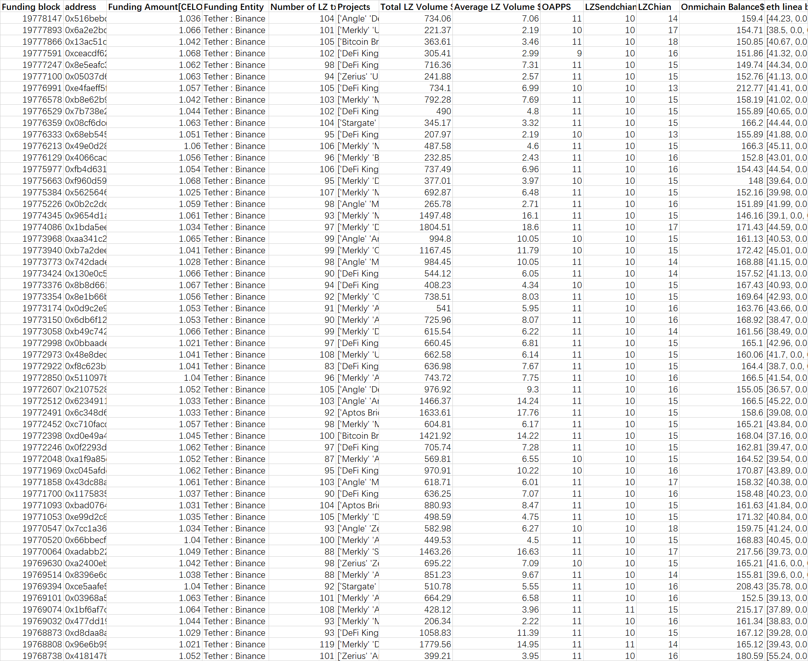
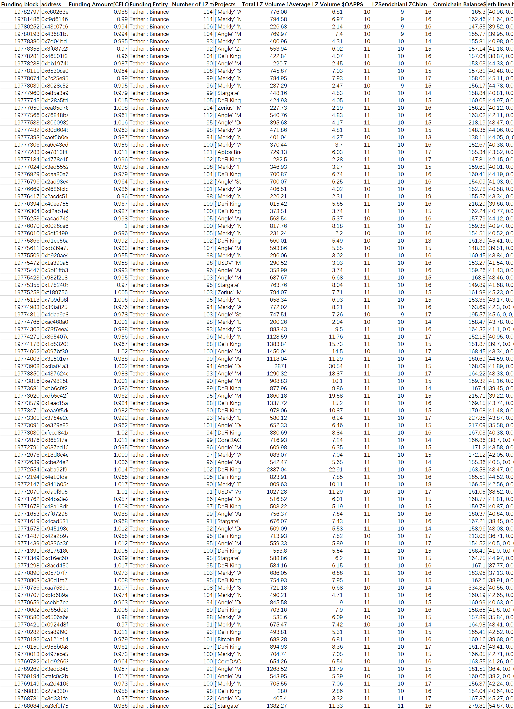
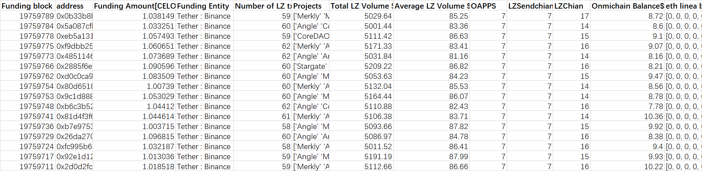
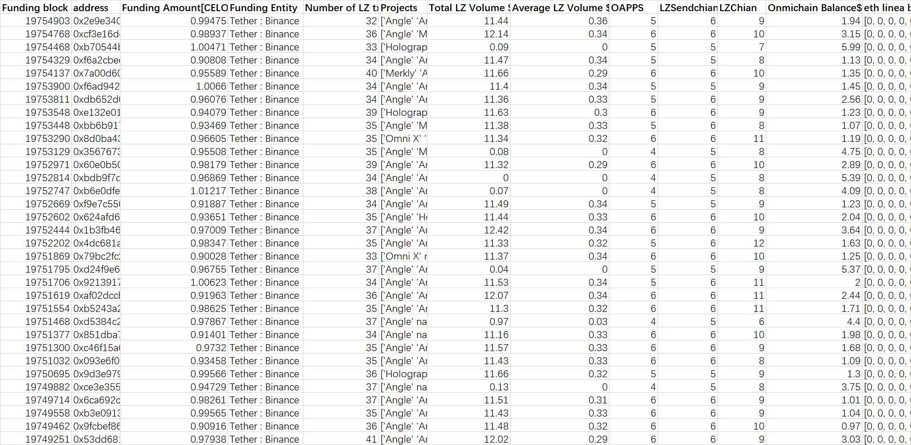
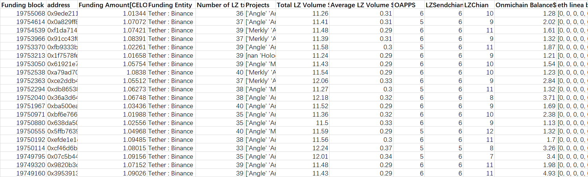
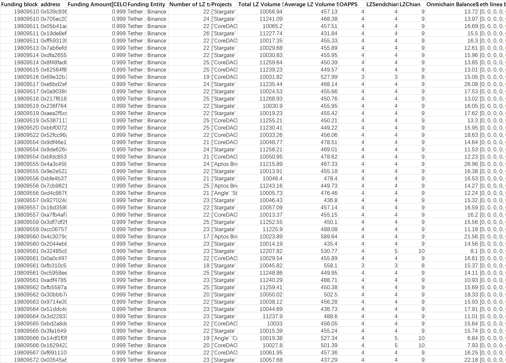
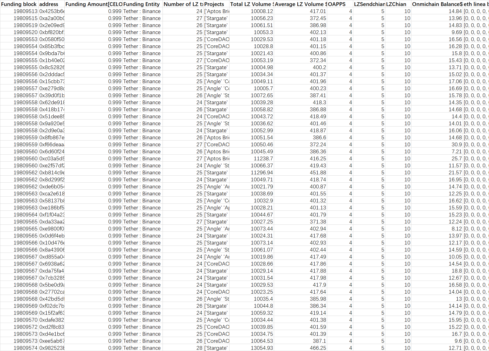
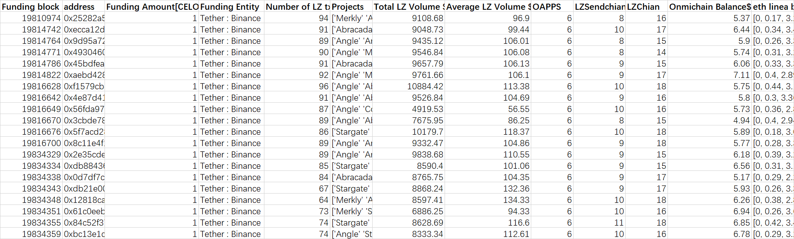
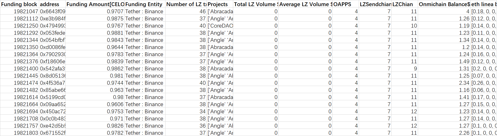
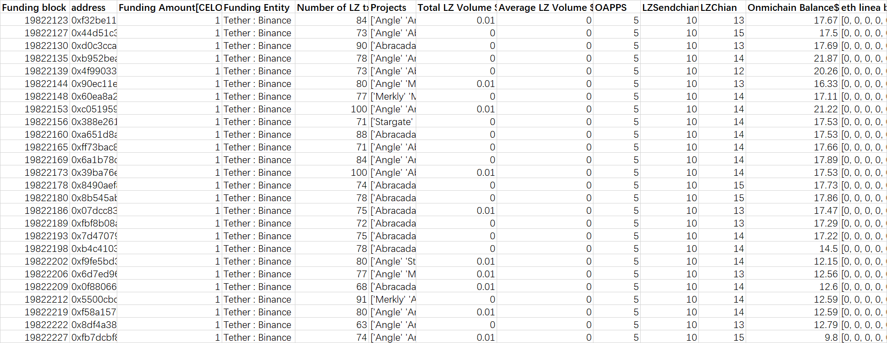

# Reported Addresses

This is second batches(batch11-20) I submit, the , ,  one is here.

```
0x516bebd81d9d91047be0f8c806117cd384473b0e
0x6a2e2bc20e7fbdea223b263e3de41b8ff30320b3
0x13ac51d4df53a6ddf1ed91d7fc2142db958aabfa
0xceacdf623254c45f5fadf4e3e2bb4b585f1aa5e7
0x8e5eafc3a16c7736147ab2dd22705ddbcc3cb45b
0x05037d67c003613db87b19cb32e28db226be059c
0xe4faeff5fc79a1e007bfef41398a5eb8bde252b0
0xb8e62b9ca765e9c2aed2465d82e6d5cb5c27d348
0x7b738e2c0b58800a1afb0ceeb9ff1d8f4ca62379
0x08cf6dce57920100e973d808676621f9942cade6
0x68eb5456cb8a75b07640620eb289fa5c78fb44c9
0x49e0d2847c36c30f3d99d01d8f61baf42a6cdaea
0x4066cad6724cf2bbb20541c2d927bab5fc426d0a
0xfb4d631cc0a7892ea08c9ecce952eddc07a4c7a3
0xf960d59287bcb7598c80c479606d7aa1838dab19
0x562564630ad6ad5f7e9a24c6a44ea4fbeea9c53b
0x0b2c2dc7fdb50f9355e69aa00ab5acc42058103e
0x9654d1ac15a24a15ea0168535f1e3415bc29578d
0x1bda5eec06bf8c1eb9841be9a437106563737ec5
0xaa341c2224e1151ed756cc9eeda80905ad44e0ac
0xb7a2dee46c6a36dcf676a73fb85e860a2e682f19
0x742dade2aed9dbc46742f6f5ebac4335c727e6df
0x130e0c5722c1740b66617997a5f439bf0e277c8a
0x8b8d6617d359668958d5910e3066a4419df85834
0x8e1b66bbaba9eb3657409d7fbb35b2db56dc481c
0x0d9c2e9dbcac3f90d98579a3d7042862fae181dc
0x6db6f1273b414fd18cdd10630c1c9d2f5410942f
0xb49c742f6137f9994e50f3046b3b83e3d963e331
0x0bbaade0a83870e978475b58d108f6a3d52936ba
0x48e8dede65082ecf24ce130a97729a7dc53444bb
0xf8c623b5092b3030aba4230aa7e8f70dd4f5a332
0x511097b6d5963759a41be5b888ee603b70f51439
0x21075280aade2758061e82a57d908e24b15dd5a9
0x62349116a1ea92eb3a1f82ce0f9870734d818780
0x6c348d6f22df097f4cb14e797c756dd5a1509c5e
0xc710facc344fd0630bd3d7f8bb84e5395aec10e5
0xd0e49a43abca27857f24e37b2f1dcb8ffbe83c31
0x0f2293d539d235457f43d91133430e691a927808
0xa1f9a85e7c19af079e4e5d70d7602e221b506b3f
0xc045afdc7eebf5c2086c7f963e7a89b6b613b935
0x43dc88a630703760c97ce87ccc94af6ba517e21f
0x1175835823654a098023a6cea8d47595fa116790
0xbad0764ddb46ee344810194f09cdf5f526adc3ad
0xe99d2c8e0ad0b92753bf1aa89387fd5db4ae9b25
0x7cc1a36c6ad17522d302262e4db2228151c46834
0x66bbecfb3b37a965cac5e113be56c51559764fd4
0xadabb2283843b5fad9fb8bbba83825fbcb037352
0xa2400eb04923ca5e59343f750fa9271cd5517ec4
0x8396e6ca931c3758ffec00d749da3d5f8e1638c3
0xce5aafe52e42707adb4ba7becde31f0199cf053f
0x03968a57e918d2f94c93491bbd9835f0c5fe5e27
0x1bf6af7d4bec09fd41f36a3e5dcf9c8f1679afd8
0x477dd19b768e3b413dbf97f44803b7223f88280e
0xd8daa8a6f99f00aead4b26aff5a34fbe47f22828
0x96e6b9540276d013b03bf8b0eacfb6066bd56136
0x418147b463b879720d686aba4d0994d6a4759b80

0xc60263e891c30e90bc282b8bc9fba904405d3854
0xf9d6146e167c762e455d42c9be9e17245920fa4c
0x43c07c67b2c7be0feee129f672c75b23132b801a
0x43681b73ad5d534ef9f376695a0158c7f1048e73
0x7d04bd19de61eebd745172a86231dc01b3e07852
0x3f687c236d7503c87d38608a868b8a5ee2b9a586
0x46501f3f497fe2417c00d6a8e8f29af611f36599
0xbb1974056259d1677fd463a8e199c869623adad0
0x6530ce0649d2336dbfe4d4a044f16c7bfbe4a97a
0x2c25e95924211a2c115540b1ea52955c0401dc8e
0x8028c52a3167d97f2a8e4396d333d443408ce623
0xe85e3a9704fdd25af3b95bfd9761f9cb46cd55ed
0xb28a5fd708c1c6844305f7f7c5b82c39e2cbf61f
0xea85d7879cbd70a7809532ff6652312ac03c2b14
0x76848bae2c275c946d38afff88e95bccde35f652
0x3060932e80c58004b329b46259a6e61e31a36cab
0x80d6048892178f5ec96804c3a2e95a2625cef368
0xaef5b0ee01358c830bec4a0ddcbad7cc63e9d2ca
0xa6c43edfee468e719f9311ee4619b7bcef501426
0xe7813ff05a39e3fe758f816b85937b79254a543a
0x4778e150d1ea9a6e81aaa855f3acf1311464e45c
0x3ed5552d0f5eba779842dd8385262c8555567d01
0xdaa80a64409f44cf93f1f80f5977729c1d44c676
0x2ad93e464bc545b30e9ec572f8af1fb9fb9c61c5
0x9686fcfdc3e1bff7765ddcd7020268ec8f8b93f8
0x2acdc515041fe9bd87cea016d4ee4853c62225d9
0x40ee755be2aeb4648d9d6bba3297b967c263b3e6
0xcf2ab1e91307cf601a257001029d10a5d83cdf9a
0xa4ad7422d96fb03ceffa566541a4e2cc71935425
0x0026ce635b36e4202eba629b922496826c632c13
0x5df54991532c0de0cd3b571c02f178295ffe09f3
0xd1ee56ae81ddfa8f86d42c6961311fc3854594ec
0xdb39e77a2d817450ecc329ce8d6aca71702b0262
0xb920ae4c5a649e1ca94ef0ec5f54e01a5a42e3c0
0x1a390a5ade90ebe115faec67668d2eba5de1f1c0
0x5bf1ffb396eb371e9f2116dae759bf4443f55475
0x982f218943ac1f451e9cc35dbdae6ac3acc05f6b
0x17524051abeb19224b196f9db513b24782ac70f3
0xf189756056a5cc53d01f1f54907f1c74d7acbc34
0x7b9db8be2e1cabbb9e8dd3314c69a1aef3c33c59
0x3f3a825d55c880daaf6f9a44d9bb1ca7a025621c
0x4daa9a8cea31cec4ba5a6b48fddd134bc019d0e1
0xac468a0da4b95f965fdb8e2e8f53c5093d4789af
0x78f7eea2d50b946003d64eec106d5eaccf077b11
0x365407d03669a05ccc18a7ba9caa7380addb03c3
0x1d532082c37a98046ab4d941f60e5b0cc28793b4
0x097bf303222170dc3c6978841842470e757ee778
0x31501e7c731b32020c7bfccb3262bcb08fc7195d
0xc8a04a365d4a09fd69af6e692fe974e7a2aa83bd
0x437624d1dc844dd5da357c2d2c7ba357564c8424
0xe7982583188ab38601e6356924c901b39df70c05
0xbb6c9f2a96f69b9aee590c24cf5482ecd3de2b7d
0xdb5c42f997841dee92a31988b812c431988fb9a8
0x1eac15a90102e5ba680a009ec9d8c790b599becb
0xeaa9f5dde7c4cc691d6c5a7f0761529d6a0723be
0x3764e2da38b6a826d920f01db73508c17f936fbd
0xe329e838c9e84b5ab79e29060d055899fd618129
0xfecd841d6a5430efda38d012a6040c96bf32c0c1
0x8652f7a3b29f03149c6a59e31f80c4534ef3742c
0x637ed15a58db0923d6f3bc893aaa45f559d4507f
0x18d8c4ea8e380192b2a6428c445372bb45cba86b
0xcbe24e26442e38fc365be98f21157c843f18dcf2
0xaba92f97d0004a1216f7a90a6d552ea519e7661b
0x4e10fda063776c96bf9250aae8f546e23341110f
0x841b05c3dbaeffe6d4615197274af6a45f9bc400
0xda0f305a01e3ebe719a4b90c16ae17b6a8182a64
0x94ba3e20b93a7a0978591180add7ec201d7e5fda
0x48a18dbde7fd652dc6ab61f1bd56072255ecbad5
0x7f672961e00299c529bc8b7402d3585e2cc44a0d
0x4cad531619406893205d32128d5301ef1a4e3ee8
0x945198d1959ca21310cb9527f5c835f774b240c2
0x42a2b978ece241696afb220cd7f9e8501fc6a05b
0x0336a39ee6dc522dae2419b1ad44ba5af624ccf6
0x8176180fbac549d27f0deb8caae1204e7d91b4dd
0xc16ec608114fe92736e038225e13b233ac03d680
0x8acd4504515c16bce13563a2be2e74a395fd7b5d
0x05707f7f00776e52ce60d201b3410faa6c221094
0x30d1fa7950507adf58c4e6bd6e9370ced6606a88
0xaa7539e573e559bc0483f27ec76535f8646ca056
0xbfd689a02a58cb8beada924d9a9cbc1673b358fb
0xcebb7ed0535612ea08762b397f1e75965c239b1e
0xd65d0203bed12214b6bff495c68af7ea8c86e3f5
0x6506a6e2b6ab4c25ead1b7b052aa82ec95c8a006
0x0924d8f6f6ef2673cd0bc33eda6d02e3ae370e5a
0x5a89f90d310aaa289d09cef1dd401d7cddbe9cd4
0xa121c14a85c83290e0e279f237fbc2404a7b8555
0x958b0a8fe5753c49fac7b8d3efbcf14c794feeb5
0x497ece50ee64c38c34529132cfba37d8aef4c3a1
0x1d92668b61002adee40a23b43077c41aa5263bde
0x3edc848bce8dc8af071f1400a1f79ee587667462
0xfafc0c2b171d70b46ed14bcd144a4c80ae23c788
0xa2d4105352589cc7d617543b0a2efdcbaf52753a
0x27a330745ac70723949ef3d27ca0fa9e8aefda10
0x3d331fece194eb30a0ef7198236217b3fa62843f
0xa3cf0f7533c4df84cbd5ef6384fbcd1a0fe3fa41

0x0b33b8b05c0b0ce71cbec75a306159adfedf6201
0x5a087cfb86d9833f8ade192d6edad92268751f7b
0xeb5a1315fc867bead3741320f5752628db42c7e5
0xf9dbb259634058026cfaf6f49e8a54755f33aa37
0x4851146da5fa48165f366864980724cfeff4c878
0x2885f6ec9617c502c93547c95d235ffb14b0b076
0xd0c0ca92d23e06b0b02383d4f53248c5cdb6ce86
0x80d65182fdab3276e4e5624263b34e8daea762ed
0x9c1d8886e6140468568aca8cdfe07affbdf5d063
0xb6c3b52565075b17a99e40fa00f304b5b7ca1692
0x81d4f3f6ab1c7b63e1376c33add2fbd976b59b9e
0xb7e9753cc89560006ab8eefa499a72367efe5de3
0x26da2700a4f8d7a07d92309800bfc04993262007
0xfc995b61f8a6b5d512cf124d3d0a0900cfbf8078
0x92e1d1217eadf34ca9058722e6e5f89909c56911
0x2d0d2fc4e1f84d71490865d29478ec5771ec99bc

0x2e9e34022cebf3a43b99fd36d1de2a0348aa274f
0xcf3e16ddedebd3f3d9f090cdb742a0d96a70d194
0xb70544b39c05c9cbdcf4af817df6ab1e632d646f
0xf6a2cbedd3447738ae9bb1cce036a55f33790462
0x7a00d60b4e03c2e8c1441bfec1eceb05a88801ed
0xf6ad94285d2f6706f43c0ecc9957fa46c91d83e1
0xdb652d004dffef5e4a8ac50555831baff7580266
0xe132e0106fc03464c0e5b6403ebc5d550f1f7f3c
0xbb6b9176b0185ad146eeb8c9194c0e1ae43f272b
0x8d0ba431386f13b9616d8bc50b488e3b78d4ff90
0x3567673e8b83e6a11f7f262ffd293b590dc2e3c8
0x60e0b503a3530cffa8e61d6eafec36a278447f41
0xbdb9f7d3f1f12e8047629b1406eeaaf475fac1d7
0xb6e0dfe664cddd4e8e15538451cfda6cf5c79f6a
0xf9e7c5507aa4c8e8e9dac029c37b3eb0fa16053a
0x624afd68e1df97a4dab1a674b49203a8ba3b1b19
0x1b3fb46f46e90865085d999917ff632fc1a8dbe1
0x4dc681abc7e41de7bcdd8516f01b0765b5a03eea
0x79bc2fc2ce282ba99b0f352033682ccefa1483a9
0xd24f9e6ecfff9a1dc8110e11f21921839d4fffa3
0x9213917c46432a2f986dd67ef8ed70015d81162b
0xaf02dccb9941a1646cadb9fb8a8fd60e87fb81e9
0xb5243a2f44abedfe1dbd7efb1eb1bf0ec0c8c35d
0xd5384c28aaaf27ba7e9cbf3680f2a473bd8e4432
0x851dba7ecdf05a318e137b0c78e8b739e8d9a107
0xc46f15a0fad6c83cb8f64441319fcdb9165ed44a
0x093e6f09630e369f77c1cb7a0032d3972e35678c
0x9d3e979e7ae119ee872042eaf12ae33579e34c17
0xce3e35559bcc46c29d8631da56b95f825a8e30cc
0x6ca692c5d3e775f9371036df160cc679fdd67050
0xb3e09137c90f31fd86b6a94227e750924008932a
0x9fcbef865e229b3f5c52a1cdea0a9e847f4cba61
0x53dd68143cdf38246cc730b72249ded7e8793437

0x9ede211bed55221a46f37cd9d03ff6a5ee761942
0x0a829ff8c9e6d160391467fab73685021882980d
0xf1da714e22fb92199baa84698055e05c6b54aa9f
0x91cc43f01dd904f0d69c550ee0592f9380abf916
0xfb9333bfe432beb5c1cde9a875c53f4d1b18b860
0x1f7578fe20043156b8b7403979709cbcb287a3bd
0x61921e72cc41ffbc87bd680f7a1d9b43c4fdf13c
0xa79ad7009bf64c1ccf68c8e6a305313df5848085
0xce2ddb463a477253d18ba2adcf7642078c05f699
0xdb86538be79ab4b448aba6fe4575cacf98fbe6a4
0x36a3d641d75e62b7ae8aa7cc0b4538abba4fb36d
0xba500ea4fe161d123f084e10c52cd922f4f6dbb0
0xbf6e7662bc0ee3a97293cd2ca5228cd984911299
0x638da501e7fdb7603bc779bd4db3aff371a4d077
0x5ffb76395b72ce8e6d2908f006a602734fd233cd
0xefde1e1cfb0faac74269473572f879f66b911ae0
0xcf46d6b3bca3ed0455bb65e2f18a3345efddd3cb
0x07c5b44ba7d65eb87902558bf0d0f98c794211bf
0x9820b3d25e72f7b3a4ccffbcb4bfd06294d19664
0x3953913634dc925053c6e5afa82d87a2a5ed1586

0x539c936c075cee9e46cdb3d857c1dc549feca0d7
0x705ec2039a269904add133b1ad300692b7cfedc9
0x05b41ad8a3a6c6c9cd7211bd71f197982e6e77c8
0x19de8efead78f9b06f8523d5ceacb6f5ce9bc8ee
0xff593139e2ba94f549172b65c9193e348f1f37d0
0x7ab6efd57957ceb78c388a99948504007c754771
0xdfa2655f7d02ff35dd0438e2924959eb191445d6
0x8f48fadb6932e1f53a7c117f5d9591cbb84a8579
0x62564f8759718d3b98f789b0b4de52e66e9ab64c
0x69e32b163738ebe7895998a9d2bc6e90219640fc
0xe6bd2eff615bb2be087433ba078efa9ee88d0460
0x0a9038457e2212c99ff8336890fd8b15caeff7c4
0x217f618794b55566ecbf85067e05d5ae85563ffd
0x236f7646f72da4fab883c5f74537cb097e0d7cdc
0xaea2f5cde4c78cecadfe215e34f496b8ee1acfa2
0x5387113f87d1514140e3a45e73043e3b7fd3673e
0xbbf0072d2f45aa0bc7b6e665937ddad0c072ebb1
0x52fcc96ad61f1bb5a581a8f45d4788749a8555e1
0x9df46e11ac20b3f02cf1e1fb938af6434fa7088a
0x9de6264fee71034720e18e795d7ffe42128a10a5
0xbfdc8530c6c391ee3f805f59c759b1ed7b802eec
0x4a3c45bfc140298ee97ee44e3ecb3e009d3c76bc
0x9e2e5228af98725f13633876b2c994dc5c2f72b9
0xbfe4b37e182bcc7ba21bfed70addcbcc3a1f10a9
0x7cb98218d58d601ab9cf531b4ceaa8ef46bd4d1a
0xd4c8676fe600285306d668b06531d80119e1dff5
0x927024ddba5bd05598252b1a70c04bcacf16a970
0x16d3580f7cfaf68a6b86ac8a9bfc17230431222a
0xa7fb4af7017bc886c012ef26c7899e5fd3303849
0x3df7df2fbf94e126592d679cfd8907e2c0f75d30
0xcc0675761e7068628175de1b40038f9480f52991
0x4c3079da29c6da89e376449722f85517435a4ab1
0x2044ebbedbf1cfc8dc9e1ac8f69eeea0ad1e9a0a
0x32485c826aa895097c27312137c4b0f96b7a0610
0x0a0c4972dc82e9f91e0f9ecdb0728a250b6da2ca
0xfb310c5f8a27b95963c35ad9a5eba41f71294d10
0xc5958eee05299931e5ae909545c20562b0c1b613
0xadf47858a225e9336f18f62b376f508879a1e199
0xfb5587a639a0001cf151f47edc0c75cc5c69d580
0x30bbb7e75e5896a9178611f07c5e6ac2e12c511e
0x9714e39ab0b43334e7bb288aad9f43167ac98cf8
0x51ddc4cabc88947894460b7b39d7b3f1b6dfb77b
0x3d2283376ecc9838ce0c1a8406f4207b8181a89b
0xbd2a8ddf0709f1884f9a42e3ffd44f4e52197531
0x3fa1649cf2252753d26ab016d6798a3cff726c55
0x14df1f0fecc09a0d320ab77745314b5b9877b813
0x1629422b54c8b18f895f0d9cbca136e87f60ac41
0xf691110dd8733dfb8c561ab5076d0d62563df4b9
0x03545a5ec8924e06498e790dfbc0196fe51cfaa5

0x4253b6e79eeb3b39f7f837f00a551b96785b0b34
0xa2a00b08bfe5645bb570fa26ef3a94e43d23d54a
0x2e09ed93247d226cf659ac9ca52e4ecd075e0e63
0xbf820bf147a8a0b353ebf1afb9227be4450f5583
0x0580f50aaa2012ad727ffb822309ba93d74c88a2
0x85b3fbcec339c4a7711e7cfac5583932705f6598
0x9bda7b637bc3b938930222f859a01d39509d604d
0x1b40e025ae325dff8d7acc18ac0285f23bb86017
0x8c52826befb1fa82e5a8f0fa4e2eb85eb84aa7a1
0x2dddac58b6605557440d3209e8d2ef2d3045f697
0x15cbb730c7f92d4ce0fe0a511b538e6e738015e0
0xe279d8c9cace0d0f031558ad5821864bee2653dd
0x39d0f1b4f70ff03ae5fae3e7b70eed3dc1eb9f79
0x62de918c073e66dcebe9cd1122a97ceb3bf81a4c
0x418b174d48fc70f7422eff2e35eafe20652052a1
0x51dee851331e2f3cc48c65471b72cfa5e2b9226e
0x9a920e53e52da28541a2abf312244da16b752c9a
0x2d9e0a3666dd5e3c8b0395274e072d5c5b35236b
0x8fb867ed10579d5a8342efee6a7567bef86a939e
0xf66deaaa2a80579fa43c568b30e9096f34b1c93f
0x6d60f245f8fc10d375406d22068313c9aba4caed
0xc03a5d56347a849af2d89e77b129e08b9b7fa700
0xe2f57df29cd277a13cd5099a2a47f719020a5dd2
0xb814c9ecc35fd43f702852b9c4ec9799236bdc06
0x8d299f214ba6f1a5cc0e15c6d5fbe236b79ee10a
0xde6b054df28d6be0764696cac904ba4aea26e9ac
0xca2e618a0c918cd5da5bc9060e6dfb0cca90f8de
0x58137b851a010d6d8d91c9bd6587337f10dbc7fa
0xe186bf5fda4716abd5f27dc4268301f7ccd5693e
0xf1f04a23556923c70016b5867baec60f872d73a6
0xda33aa2ea486c7d89a33f6b55c9a60db7993a635
0xe9800f0866e9bc937e1ef91c2d0c1d8f413a2e84
0x0d6f4eb96268f14f6eb2dfe0d53155a274949155
0x10d476efa71342209a1c2f057d3a6abfce794f08
0x8a4390649869cf349b08f9800fce5c15c1fffe88
0xd855a04e3ab346b9fa7896815a821e40e0182043
0x6938a628b06163a20fab0f905f249a886326dd8b
0xda75fa41229159c53f76fac239c5a3cedd7ac4ce
0x7cb328512f7834b83dc2477d9eb06cc59c8e20e2
0x5be0d9a71cefc00fd175ff73e14bac5388de75cf
0x27702ca4fd560a8b0a9c7c2881aa278b56751746
0x42bd5df0fa2c4861d57f6859f6d8affb12effbe1
0xf02dc7bc2180b1dded7e44c034694f110aeece9c
0x15f2af637f8b557b3eb0515144005cc9d0fd93bb
0xdafe3825abefb1da9fdbb9e9ebac478f8b9c865f
0xd2f8c836474e02b9e486461fb95069c6254525e5
0xd4e1bc66f6bb2c3dea8030dce93a777237682021
0xee5ab67597ea5dd7a28611ce1684659130fcfc44
0x982523b1073eeeb7f7cca6aa3a0c4e5b534ac775

0x25282a53840db9aa52e24b0da5dbf417c896037a
0xecca12de1b6bc9523437e9d292c5fa7cf7c357f0
0x9d95a7224fc641cd15ab62c6d46dad74cee6a6de
0x493046076c1259ac7b7cfd26241085571fc46233
0x45bdfea87fe61272e5f6b148369ad9c5473dae19
0xaebd428a629e9a2af71f71e2de0ce898596f24f0
0xf1579cb384614edf3457cf7bc88dc0f626cf93ea
0x4e87d41c21b90b9c1e340db0cc0bc9015b1cf32b
0x56fda97875d7bda2aee5fdaaaa9dcabbe6ddabdb
0x3cbde78ab7b6803815d6c6148942d3d0ed3c9a39
0x5f7acd28fb5d0c106d904a16bfd83d06167c4e19
0x8c11e4f15b362b33001ace50cdbe149377958945
0x2e35cdec49c9a898dd1c65f0dde47cd43f2c0cf5
0xdb88436849a300849ebd5e0c5b5cf8299a4b15b6
0x0d7df7c6ef29ba6c57ebe7004e8f921f8ee16f5b
0xdb21e0040bc697120858e05587fcf240eb72760d
0x12818ca4361f01b36aa119fda4b0aceb4c482fca
0x61c0eebbbde535036c3f9a1dd96c26a19530dd9e
0x84c52f37d3e328c965dabe605ddfedd75c6f4a50
0xbc13e1ccfdd0716f3c91b1f38e716c586cd4a7cb

0x6643f09620bed03d834ac582a7b1585d95c86624
0xe3b984f2a3b41a0e6cf2289ab4871678353700a9
0x47949937a936eaf9c57976f212dd1d83be596b65
0x053fede8f73b1d701c370970dae7022abff762bf
0x054bfbf7ac9c0aa86d37375f2299eb63e3aeca9d
0xd0086fea5abdd4f530c3865b633e7cd2a56e024e
0x7902930ca9783769f748bf6f7637ed3055210ac4
0xf18606e6cc71da580d113d26d2989d5a3b5b243d
0x542afa3f045a93470f14eafec55a78fdee6b26ab
0x8d05136d93e6ef9e4dc680e7620dc203eb8ea198
0x4f536a70a4dc6d035994c5a7c0abacea176cf780
0x85abe664908262d9707b02aef8faaaad363535e6
0x5199cd00623301303ae2a52cd5a6816f8879cbe9
0x09aa652fbe26cfadf5671609250aaeb3b469156e
0x450ac72018d900db843f4b3b8fb9086ee9aa0fbf
0x0c0b4838dbe640e58647be8f4f94688075bf07b3
0xe42d5b5120b8315eec72b9596c3a09c81112d046
0x671552f0e3f84e20f625795e2dbdad282249caf5

0xf32be11c1f08570c6b4ab78e8802a11bbeeb4257
0x44d51c3a840267b0ae52028e4ec8f58de6c1faeb
0xd0c3ccafbbf102cf97a20748c541404ef44e6483
0xb952bea82d5afb39103158064fdd75b110fc4669
0x4f990331cace4f0eed153b58bafd639e571c23eb
0x90ec11e39450f6e8296a67dff166803af2a648d2
0x60ea8a2045fc0c5605ebf40fb081600e5e136c6d
0xc051959dcc48c2e5366da3949bb7b2be8ceb4378
0x388e261174c981865edaa532f4615eace216c4ba
0xa651d8a167d3ca7e93c40ce464d034c318cb59b5
0xff73bac812096ea4c6aba6d4b12f022e65e68eef
0x6a1b78cab7fb9cf83b5f8ebd5ca541b6d490aeba
0x39ba76e6edd68e8c19c8577a9b4ae572fdaedb94
0x8490aef8c9f26bc7e73d97278621d9df91ba9d1e
0x8b545abab6c99231e4b2f3ae29328c6777299e2a
0x07dcc832c24749683120f58ca3e5060aaaffc4df
0xfbf8b08a221a1b17a841c0dd071efccfb65f0cc6
0x7d47079508f9d5093d4d40f91fc5712211551915
0xb4c410380787191cd70f1cacebb6c97cf01832d2
0xf9fe5bd3217b7a1e84d46b658adbe8ac3b8409b5
0x6d7ed960075387496c02f8959fb3c4b265ffe594
0x0f880668e677657abcbc25fde42149eaba22a113
0x5500cbc000b0affb1b043e95a38632b54338129e
0xf58a1570b2d495fe854ca3593aaf739bde3c6345
0x8df4a389b1a679cde6ed60de7e2f72c1cdac5a5a
0xfb7dcbf89979ca9a81056a4f892be4fca34f5b64
```

# Description
The Affinity Propagation algorithm is used to filter suspicious data four times, strictly reducing false positive samples, and the filtered cluster address data is highly similar. In order to be sufficiently convincing, evidence of the homogenization operation of each cluster address on the entire chain is also provided.

# Detailed Methodology & Walkthrough
Affinity Propagation is a clustering algorithm that identifies exemplars by passing "responsibility" and "availability" messages between data points. It automatically determines the number of clusters based on a preference parameter and similarity matrix, without requiring the number of clusters to be specified beforehand.I have tried many cluster analysis methods and found this method to be the most useful and effective.

## Dataset

**Note: The multichain wallet balance$ snapshot on around May-20-2024 00:30PM UTC+8, data get from debank api**

By monitoring the withdrawal operations from the Binance exchange on the CELO chain, I found that a large number of abnormal behaviors occurred on the chain from June 10th to June 16th (withdrawing ~CELO from the exchange, and then conducting layerzero transactions). I set the filter conditions to this time period, the sender is Tether-Binance, the transaction amount is 0.9-1.1CELO, and I got about 6,000 pieces of data.

Next, I used the transaction data provided by Layerzero to obtain the _'Number of LZ tx' 'Projects' 'Total LZ Volume $' 'Average LZ Volume $' 'Number of OAPPS' 'Number of Sendchian' 'Number of Chian'_ and **the _multichain wallet balance_ of each address were obtained through Debank**. You can see the .

## Data processing
In the data processing, I used the affinity propation algorithm four times to identify the data. After each identification, clusters with less than 20 samples were eliminated, and each identification and filtering process had different goals.

### First filter(initial filter)
The set Affinity Propagation feature parameters are
```python
features = ['Number of LZ tx', 'Average LZ Volume $', 'Number of OAPPS', 'Number of Chian', 'Onmichain Balance$']
```
After obtaining the clustering results, if the number of a certain cluster is less than 20, the cluster will be deleted. This step resulted in the deletion of addresses that had not traded layerzero and real-person accounts that had no problems at all.

### Second filter
The set Affinity Propagation feature parameters are
```python
features = ['Number of LZ tx', 'Total LZ Volume $', 'Average LZ Volume $', 'Number of OAPPS', 'Number of Sendchian','Number of Chian', 'Onmichain Balance$']
```
This is the first comprehensive cluster analysis. After the analysis, clusters with less than 20 counts are again eliminated.

### Third filter
The set Affinity Propagation feature parameters are
```python
features = ['Number of Sendchian','Number of Chian', 'Onmichain Balance$']
```
This clustering analysis reduces the dimensionality of the input parameters, especially focusing on wallet balances. By eliminating clusters with less than 20 counts, this step will eliminate real users whose wallets have larger balances (even though they may not be trustworthy). ). The consideration for this step is that Witch accounts generally do not hold large balances.

### Fourth filter(final filter)
The set Affinity Propagation feature parameters are
```python
features = ['Funding block','Funding Amount[CELO]','Number of LZ tx','Total LZ Volume $','Average LZ Volume $','Number of OAPPS','Number of Sendchian','Number of Chian', 'Onmichain Balance$','Onmichain Balance$']
```
The input of the last clustering algorithm is all available parameters of the data set, and it attempts to divide the data set into as many clusters as possible. Similarly, clusters with less than 20 internal members will be deleted. **Thanks to the efforts of Layerzero and its partners in the previous phase, I filtered out nearly 4,000 addresses and nearly 2,000+ addresses were flagged as known witches.** At this point, we have the final data, see . To provide further evidence, I will provide each cluster address with a large-scale homogenization operation different from this data set (such as a large-scale homogenization withdrawal from the exchange again)

### More ways to remove false positive samples
When verifying the evidence I provided, I used random sampling to verify, and paid special attention to the data at the edge of the cluster. Moreover, among the submitted clusters, I artificially excluded clusters whose features did not appear to be particularly obvious. The final cluster had almost no possibility of false positives.

---
## Sybil address batches and extra evidence

**batch11**
```
0x516bebd81d9d91047be0f8c806117cd384473b0e
0x6a2e2bc20e7fbdea223b263e3de41b8ff30320b3
0x13ac51d4df53a6ddf1ed91d7fc2142db958aabfa
0xceacdf623254c45f5fadf4e3e2bb4b585f1aa5e7
0x8e5eafc3a16c7736147ab2dd22705ddbcc3cb45b
0x05037d67c003613db87b19cb32e28db226be059c
0xe4faeff5fc79a1e007bfef41398a5eb8bde252b0
0xb8e62b9ca765e9c2aed2465d82e6d5cb5c27d348
0x7b738e2c0b58800a1afb0ceeb9ff1d8f4ca62379
0x08cf6dce57920100e973d808676621f9942cade6
0x68eb5456cb8a75b07640620eb289fa5c78fb44c9
0x49e0d2847c36c30f3d99d01d8f61baf42a6cdaea
0x4066cad6724cf2bbb20541c2d927bab5fc426d0a
0xfb4d631cc0a7892ea08c9ecce952eddc07a4c7a3
0xf960d59287bcb7598c80c479606d7aa1838dab19
0x562564630ad6ad5f7e9a24c6a44ea4fbeea9c53b
0x0b2c2dc7fdb50f9355e69aa00ab5acc42058103e
0x9654d1ac15a24a15ea0168535f1e3415bc29578d
0x1bda5eec06bf8c1eb9841be9a437106563737ec5
0xaa341c2224e1151ed756cc9eeda80905ad44e0ac
0xb7a2dee46c6a36dcf676a73fb85e860a2e682f19
0x742dade2aed9dbc46742f6f5ebac4335c727e6df
0x130e0c5722c1740b66617997a5f439bf0e277c8a
0x8b8d6617d359668958d5910e3066a4419df85834
0x8e1b66bbaba9eb3657409d7fbb35b2db56dc481c
0x0d9c2e9dbcac3f90d98579a3d7042862fae181dc
0x6db6f1273b414fd18cdd10630c1c9d2f5410942f
0xb49c742f6137f9994e50f3046b3b83e3d963e331
0x0bbaade0a83870e978475b58d108f6a3d52936ba
0x48e8dede65082ecf24ce130a97729a7dc53444bb
0xf8c623b5092b3030aba4230aa7e8f70dd4f5a332
0x511097b6d5963759a41be5b888ee603b70f51439
0x21075280aade2758061e82a57d908e24b15dd5a9
0x62349116a1ea92eb3a1f82ce0f9870734d818780
0x6c348d6f22df097f4cb14e797c756dd5a1509c5e
0xc710facc344fd0630bd3d7f8bb84e5395aec10e5
0xd0e49a43abca27857f24e37b2f1dcb8ffbe83c31
0x0f2293d539d235457f43d91133430e691a927808
0xa1f9a85e7c19af079e4e5d70d7602e221b506b3f
0xc045afdc7eebf5c2086c7f963e7a89b6b613b935
0x43dc88a630703760c97ce87ccc94af6ba517e21f
0x1175835823654a098023a6cea8d47595fa116790
0xbad0764ddb46ee344810194f09cdf5f526adc3ad
0xe99d2c8e0ad0b92753bf1aa89387fd5db4ae9b25
0x7cc1a36c6ad17522d302262e4db2228151c46834
0x66bbecfb3b37a965cac5e113be56c51559764fd4
0xadabb2283843b5fad9fb8bbba83825fbcb037352
0xa2400eb04923ca5e59343f750fa9271cd5517ec4
0x8396e6ca931c3758ffec00d749da3d5f8e1638c3
0xce5aafe52e42707adb4ba7becde31f0199cf053f
0x03968a57e918d2f94c93491bbd9835f0c5fe5e27
0x1bf6af7d4bec09fd41f36a3e5dcf9c8f1679afd8
0x477dd19b768e3b413dbf97f44803b7223f88280e
0xd8daa8a6f99f00aead4b26aff5a34fbe47f22828
0x96e6b9540276d013b03bf8b0eacfb6066bd56136
0x418147b463b879720d686aba4d0994d6a4759b80
```

**Extra evidence**

batch11 is liking batch4, batch5 and batch9. In addition to accepting CELO in batches on the CELO chain on June 13th. This batch of addresses also accepted approximately 0.01ETH sent by OKX on the Ethereum on around Aug-25-2023 11:17:35 PM +UTC and and 0.005arbETH on around Jun-20-2023 01:46:18 PM +UTC

**Data at a glance**


---
**batch12**
```
0xc60263e891c30e90bc282b8bc9fba904405d3854
0xf9d6146e167c762e455d42c9be9e17245920fa4c
0x43c07c67b2c7be0feee129f672c75b23132b801a
0x43681b73ad5d534ef9f376695a0158c7f1048e73
0x7d04bd19de61eebd745172a86231dc01b3e07852
0x3f687c236d7503c87d38608a868b8a5ee2b9a586
0x46501f3f497fe2417c00d6a8e8f29af611f36599
0xbb1974056259d1677fd463a8e199c869623adad0
0x6530ce0649d2336dbfe4d4a044f16c7bfbe4a97a
0x2c25e95924211a2c115540b1ea52955c0401dc8e
0x8028c52a3167d97f2a8e4396d333d443408ce623
0xe85e3a9704fdd25af3b95bfd9761f9cb46cd55ed
0xb28a5fd708c1c6844305f7f7c5b82c39e2cbf61f
0xea85d7879cbd70a7809532ff6652312ac03c2b14
0x76848bae2c275c946d38afff88e95bccde35f652
0x3060932e80c58004b329b46259a6e61e31a36cab
0x80d6048892178f5ec96804c3a2e95a2625cef368
0xaef5b0ee01358c830bec4a0ddcbad7cc63e9d2ca
0xa6c43edfee468e719f9311ee4619b7bcef501426
0xe7813ff05a39e3fe758f816b85937b79254a543a
0x4778e150d1ea9a6e81aaa855f3acf1311464e45c
0x3ed5552d0f5eba779842dd8385262c8555567d01
0xdaa80a64409f44cf93f1f80f5977729c1d44c676
0x2ad93e464bc545b30e9ec572f8af1fb9fb9c61c5
0x9686fcfdc3e1bff7765ddcd7020268ec8f8b93f8
0x2acdc515041fe9bd87cea016d4ee4853c62225d9
0x40ee755be2aeb4648d9d6bba3297b967c263b3e6
0xcf2ab1e91307cf601a257001029d10a5d83cdf9a
0xa4ad7422d96fb03ceffa566541a4e2cc71935425
0x0026ce635b36e4202eba629b922496826c632c13
0x5df54991532c0de0cd3b571c02f178295ffe09f3
0xd1ee56ae81ddfa8f86d42c6961311fc3854594ec
0xdb39e77a2d817450ecc329ce8d6aca71702b0262
0xb920ae4c5a649e1ca94ef0ec5f54e01a5a42e3c0
0x1a390a5ade90ebe115faec67668d2eba5de1f1c0
0x5bf1ffb396eb371e9f2116dae759bf4443f55475
0x982f218943ac1f451e9cc35dbdae6ac3acc05f6b
0x17524051abeb19224b196f9db513b24782ac70f3
0xf189756056a5cc53d01f1f54907f1c74d7acbc34
0x7b9db8be2e1cabbb9e8dd3314c69a1aef3c33c59
0x3f3a825d55c880daaf6f9a44d9bb1ca7a025621c
0x4daa9a8cea31cec4ba5a6b48fddd134bc019d0e1
0xac468a0da4b95f965fdb8e2e8f53c5093d4789af
0x78f7eea2d50b946003d64eec106d5eaccf077b11
0x365407d03669a05ccc18a7ba9caa7380addb03c3
0x1d532082c37a98046ab4d941f60e5b0cc28793b4
0x097bf303222170dc3c6978841842470e757ee778
0x31501e7c731b32020c7bfccb3262bcb08fc7195d
0xc8a04a365d4a09fd69af6e692fe974e7a2aa83bd
0x437624d1dc844dd5da357c2d2c7ba357564c8424
0xe7982583188ab38601e6356924c901b39df70c05
0xbb6c9f2a96f69b9aee590c24cf5482ecd3de2b7d
0xdb5c42f997841dee92a31988b812c431988fb9a8
0x1eac15a90102e5ba680a009ec9d8c790b599becb
0xeaa9f5dde7c4cc691d6c5a7f0761529d6a0723be
0x3764e2da38b6a826d920f01db73508c17f936fbd
0xe329e838c9e84b5ab79e29060d055899fd618129
0xfecd841d6a5430efda38d012a6040c96bf32c0c1
0x8652f7a3b29f03149c6a59e31f80c4534ef3742c
0x637ed15a58db0923d6f3bc893aaa45f559d4507f
0x18d8c4ea8e380192b2a6428c445372bb45cba86b
0xcbe24e26442e38fc365be98f21157c843f18dcf2
0xaba92f97d0004a1216f7a90a6d552ea519e7661b
0x4e10fda063776c96bf9250aae8f546e23341110f
0x841b05c3dbaeffe6d4615197274af6a45f9bc400
0xda0f305a01e3ebe719a4b90c16ae17b6a8182a64
0x94ba3e20b93a7a0978591180add7ec201d7e5fda
0x48a18dbde7fd652dc6ab61f1bd56072255ecbad5
0x7f672961e00299c529bc8b7402d3585e2cc44a0d
0x4cad531619406893205d32128d5301ef1a4e3ee8
0x945198d1959ca21310cb9527f5c835f774b240c2
0x42a2b978ece241696afb220cd7f9e8501fc6a05b
0x0336a39ee6dc522dae2419b1ad44ba5af624ccf6
0x8176180fbac549d27f0deb8caae1204e7d91b4dd
0xc16ec608114fe92736e038225e13b233ac03d680
0x8acd4504515c16bce13563a2be2e74a395fd7b5d
0x05707f7f00776e52ce60d201b3410faa6c221094
0x30d1fa7950507adf58c4e6bd6e9370ced6606a88
0xaa7539e573e559bc0483f27ec76535f8646ca056
0xbfd689a02a58cb8beada924d9a9cbc1673b358fb
0xcebb7ed0535612ea08762b397f1e75965c239b1e
0xd65d0203bed12214b6bff495c68af7ea8c86e3f5
0x6506a6e2b6ab4c25ead1b7b052aa82ec95c8a006
0x0924d8f6f6ef2673cd0bc33eda6d02e3ae370e5a
0x5a89f90d310aaa289d09cef1dd401d7cddbe9cd4
0xa121c14a85c83290e0e279f237fbc2404a7b8555
0x958b0a8fe5753c49fac7b8d3efbcf14c794feeb5
0x497ece50ee64c38c34529132cfba37d8aef4c3a1
0x1d92668b61002adee40a23b43077c41aa5263bde
0x3edc848bce8dc8af071f1400a1f79ee587667462
0xfafc0c2b171d70b46ed14bcd144a4c80ae23c788
0xa2d4105352589cc7d617543b0a2efdcbaf52753a
0x27a330745ac70723949ef3d27ca0fa9e8aefda10
0x3d331fece194eb30a0ef7198236217b3fa62843f
0xa3cf0f7533c4df84cbd5ef6384fbcd1a0fe3fa41
```

**Extra evidence**

batch12 is liking batch4, batch5, batch9 and batch11. In addition to accepting CELO in batches on the CELO chain on June 13th. **This batch of addresses also accepted approximately 0.01ETH sent by OKX on the Ethereum on around Aug-25-2023 11:17:35 PM +UTC and and 0.005arbETH on around Jun-20-2023 01:46:18 PM +UTC**

**Data at a glance**


---
**batch13**
```
0x0b33b8b05c0b0ce71cbec75a306159adfedf6201
0x5a087cfb86d9833f8ade192d6edad92268751f7b
0xeb5a1315fc867bead3741320f5752628db42c7e5
0xf9dbb259634058026cfaf6f49e8a54755f33aa37
0x4851146da5fa48165f366864980724cfeff4c878
0x2885f6ec9617c502c93547c95d235ffb14b0b076
0xd0c0ca92d23e06b0b02383d4f53248c5cdb6ce86
0x80d65182fdab3276e4e5624263b34e8daea762ed
0x9c1d8886e6140468568aca8cdfe07affbdf5d063
0xb6c3b52565075b17a99e40fa00f304b5b7ca1692
0x81d4f3f6ab1c7b63e1376c33add2fbd976b59b9e
0xb7e9753cc89560006ab8eefa499a72367efe5de3
0x26da2700a4f8d7a07d92309800bfc04993262007
0xfc995b61f8a6b5d512cf124d3d0a0900cfbf8078
0x92e1d1217eadf34ca9058722e6e5f89909c56911
0x2d0d2fc4e1f84d71490865d29478ec5771ec99bc

```

**Extra evidence**

In addition to accepting CELO in batches on the CELO chain on June 13th. **This batch of addresses also accepted approximately 0.1CELO(0.1$) sent by Binance on the Celochain, and then use merkly to bridge gas(0.05$)** on around Nov-05-2023 12:49:28 PM +UTC

**Data at a glance**


---
**batch14**
```
0x2e9e34022cebf3a43b99fd36d1de2a0348aa274f
0xcf3e16ddedebd3f3d9f090cdb742a0d96a70d194
0xb70544b39c05c9cbdcf4af817df6ab1e632d646f
0xf6a2cbedd3447738ae9bb1cce036a55f33790462
0x7a00d60b4e03c2e8c1441bfec1eceb05a88801ed
0xf6ad94285d2f6706f43c0ecc9957fa46c91d83e1
0xdb652d004dffef5e4a8ac50555831baff7580266
0xe132e0106fc03464c0e5b6403ebc5d550f1f7f3c
0xbb6b9176b0185ad146eeb8c9194c0e1ae43f272b
0x8d0ba431386f13b9616d8bc50b488e3b78d4ff90
0x3567673e8b83e6a11f7f262ffd293b590dc2e3c8
0x60e0b503a3530cffa8e61d6eafec36a278447f41
0xbdb9f7d3f1f12e8047629b1406eeaaf475fac1d7
0xb6e0dfe664cddd4e8e15538451cfda6cf5c79f6a
0xf9e7c5507aa4c8e8e9dac029c37b3eb0fa16053a
0x624afd68e1df97a4dab1a674b49203a8ba3b1b19
0x1b3fb46f46e90865085d999917ff632fc1a8dbe1
0x4dc681abc7e41de7bcdd8516f01b0765b5a03eea
0x79bc2fc2ce282ba99b0f352033682ccefa1483a9
0xd24f9e6ecfff9a1dc8110e11f21921839d4fffa3
0x9213917c46432a2f986dd67ef8ed70015d81162b
0xaf02dccb9941a1646cadb9fb8a8fd60e87fb81e9
0xb5243a2f44abedfe1dbd7efb1eb1bf0ec0c8c35d
0xd5384c28aaaf27ba7e9cbf3680f2a473bd8e4432
0x851dba7ecdf05a318e137b0c78e8b739e8d9a107
0xc46f15a0fad6c83cb8f64441319fcdb9165ed44a
0x093e6f09630e369f77c1cb7a0032d3972e35678c
0x9d3e979e7ae119ee872042eaf12ae33579e34c17
0xce3e35559bcc46c29d8631da56b95f825a8e30cc
0x6ca692c5d3e775f9371036df160cc679fdd67050
0xb3e09137c90f31fd86b6a94227e750924008932a
0x9fcbef865e229b3f5c52a1cdea0a9e847f4cba61
0x53dd68143cdf38246cc730b72249ded7e8793437
```

**Extra evidence**

In addition to accepting CELO in batches on the CELO chain on June 11th. **This batch of addresses also accepted approximately 0.75CELO sent by Binance Sep-09-2023 06:17:31 PM +UTC or 0.38CELO on around Jul-21-2023 05:12:21 PM +UTC**

**Data at a glance**


---
**batch15**
```
0x9ede211bed55221a46f37cd9d03ff6a5ee761942
0x0a829ff8c9e6d160391467fab73685021882980d
0xf1da714e22fb92199baa84698055e05c6b54aa9f
0x91cc43f01dd904f0d69c550ee0592f9380abf916
0xfb9333bfe432beb5c1cde9a875c53f4d1b18b860
0x1f7578fe20043156b8b7403979709cbcb287a3bd
0x61921e72cc41ffbc87bd680f7a1d9b43c4fdf13c
0xa79ad7009bf64c1ccf68c8e6a305313df5848085
0xce2ddb463a477253d18ba2adcf7642078c05f699
0xdb86538be79ab4b448aba6fe4575cacf98fbe6a4
0x36a3d641d75e62b7ae8aa7cc0b4538abba4fb36d
0xba500ea4fe161d123f084e10c52cd922f4f6dbb0
0xbf6e7662bc0ee3a97293cd2ca5228cd984911299
0x638da501e7fdb7603bc779bd4db3aff371a4d077
0x5ffb76395b72ce8e6d2908f006a602734fd233cd
0xefde1e1cfb0faac74269473572f879f66b911ae0
0xcf46d6b3bca3ed0455bb65e2f18a3345efddd3cb
0x07c5b44ba7d65eb87902558bf0d0f98c794211bf
0x9820b3d25e72f7b3a4ccffbcb4bfd06294d19664
0x3953913634dc925053c6e5afa82d87a2a5ed1586

```

**Extra evidence**

batch15 is liking batch14. n addition to accepting CELO in batches on the CELO chain on June 11th. **This batch of addresses also accepted approximately 0.75CELO sent by Binance Sep-09-2023 06:17:31 PM +UTC or 0.38CELO on around Jul-21-2023 05:12:21 PM +UTC**

**Data at a glance**


---
**batch16**
```
0x539c936c075cee9e46cdb3d857c1dc549feca0d7
0x705ec2039a269904add133b1ad300692b7cfedc9
0x05b41ad8a3a6c6c9cd7211bd71f197982e6e77c8
0x19de8efead78f9b06f8523d5ceacb6f5ce9bc8ee
0xff593139e2ba94f549172b65c9193e348f1f37d0
0x7ab6efd57957ceb78c388a99948504007c754771
0xdfa2655f7d02ff35dd0438e2924959eb191445d6
0x8f48fadb6932e1f53a7c117f5d9591cbb84a8579
0x62564f8759718d3b98f789b0b4de52e66e9ab64c
0x69e32b163738ebe7895998a9d2bc6e90219640fc
0xe6bd2eff615bb2be087433ba078efa9ee88d0460
0x0a9038457e2212c99ff8336890fd8b15caeff7c4
0x217f618794b55566ecbf85067e05d5ae85563ffd
0x236f7646f72da4fab883c5f74537cb097e0d7cdc
0xaea2f5cde4c78cecadfe215e34f496b8ee1acfa2
0x5387113f87d1514140e3a45e73043e3b7fd3673e
0xbbf0072d2f45aa0bc7b6e665937ddad0c072ebb1
0x52fcc96ad61f1bb5a581a8f45d4788749a8555e1
0x9df46e11ac20b3f02cf1e1fb938af6434fa7088a
0x9de6264fee71034720e18e795d7ffe42128a10a5
0xbfdc8530c6c391ee3f805f59c759b1ed7b802eec
0x4a3c45bfc140298ee97ee44e3ecb3e009d3c76bc
0x9e2e5228af98725f13633876b2c994dc5c2f72b9
0xbfe4b37e182bcc7ba21bfed70addcbcc3a1f10a9
0x7cb98218d58d601ab9cf531b4ceaa8ef46bd4d1a
0xd4c8676fe600285306d668b06531d80119e1dff5
0x927024ddba5bd05598252b1a70c04bcacf16a970
0x16d3580f7cfaf68a6b86ac8a9bfc17230431222a
0xa7fb4af7017bc886c012ef26c7899e5fd3303849
0x3df7df2fbf94e126592d679cfd8907e2c0f75d30
0xcc0675761e7068628175de1b40038f9480f52991
0x4c3079da29c6da89e376449722f85517435a4ab1
0x2044ebbedbf1cfc8dc9e1ac8f69eeea0ad1e9a0a
0x32485c826aa895097c27312137c4b0f96b7a0610
0x0a0c4972dc82e9f91e0f9ecdb0728a250b6da2ca
0xfb310c5f8a27b95963c35ad9a5eba41f71294d10
0xc5958eee05299931e5ae909545c20562b0c1b613
0xadf47858a225e9336f18f62b376f508879a1e199
0xfb5587a639a0001cf151f47edc0c75cc5c69d580
0x30bbb7e75e5896a9178611f07c5e6ac2e12c511e
0x9714e39ab0b43334e7bb288aad9f43167ac98cf8
0x51ddc4cabc88947894460b7b39d7b3f1b6dfb77b
0x3d2283376ecc9838ce0c1a8406f4207b8181a89b
0xbd2a8ddf0709f1884f9a42e3ffd44f4e52197531
0x3fa1649cf2252753d26ab016d6798a3cff726c55
0x14df1f0fecc09a0d320ab77745314b5b9877b813
0x1629422b54c8b18f895f0d9cbca136e87f60ac41
0xf691110dd8733dfb8c561ab5076d0d62563df4b9
0x03545a5ec8924e06498e790dfbc0196fe51cfaa5
```

**Extra evidence**

In addition to accepting CELO in batches on the CELO chain on June 12th. **This batch of addresses also accepted approximately 0.004arbETH sent by OKX and use stargate(~5USD) on around May-14-2023 03:47:47 AM +UTC**

**Data at a glance**


---
**batch17**
```
0x4253b6e79eeb3b39f7f837f00a551b96785b0b34
0xa2a00b08bfe5645bb570fa26ef3a94e43d23d54a
0x2e09ed93247d226cf659ac9ca52e4ecd075e0e63
0xbf820bf147a8a0b353ebf1afb9227be4450f5583
0x0580f50aaa2012ad727ffb822309ba93d74c88a2
0x85b3fbcec339c4a7711e7cfac5583932705f6598
0x9bda7b637bc3b938930222f859a01d39509d604d
0x1b40e025ae325dff8d7acc18ac0285f23bb86017
0x8c52826befb1fa82e5a8f0fa4e2eb85eb84aa7a1
0x2dddac58b6605557440d3209e8d2ef2d3045f697
0x15cbb730c7f92d4ce0fe0a511b538e6e738015e0
0xe279d8c9cace0d0f031558ad5821864bee2653dd
0x39d0f1b4f70ff03ae5fae3e7b70eed3dc1eb9f79
0x62de918c073e66dcebe9cd1122a97ceb3bf81a4c
0x418b174d48fc70f7422eff2e35eafe20652052a1
0x51dee851331e2f3cc48c65471b72cfa5e2b9226e
0x9a920e53e52da28541a2abf312244da16b752c9a
0x2d9e0a3666dd5e3c8b0395274e072d5c5b35236b
0x8fb867ed10579d5a8342efee6a7567bef86a939e
0xf66deaaa2a80579fa43c568b30e9096f34b1c93f
0x6d60f245f8fc10d375406d22068313c9aba4caed
0xc03a5d56347a849af2d89e77b129e08b9b7fa700
0xe2f57df29cd277a13cd5099a2a47f719020a5dd2
0xb814c9ecc35fd43f702852b9c4ec9799236bdc06
0x8d299f214ba6f1a5cc0e15c6d5fbe236b79ee10a
0xde6b054df28d6be0764696cac904ba4aea26e9ac
0xca2e618a0c918cd5da5bc9060e6dfb0cca90f8de
0x58137b851a010d6d8d91c9bd6587337f10dbc7fa
0xe186bf5fda4716abd5f27dc4268301f7ccd5693e
0xf1f04a23556923c70016b5867baec60f872d73a6
0xda33aa2ea486c7d89a33f6b55c9a60db7993a635
0xe9800f0866e9bc937e1ef91c2d0c1d8f413a2e84
0x0d6f4eb96268f14f6eb2dfe0d53155a274949155
0x10d476efa71342209a1c2f057d3a6abfce794f08
0x8a4390649869cf349b08f9800fce5c15c1fffe88
0xd855a04e3ab346b9fa7896815a821e40e0182043
0x6938a628b06163a20fab0f905f249a886326dd8b
0xda75fa41229159c53f76fac239c5a3cedd7ac4ce
0x7cb328512f7834b83dc2477d9eb06cc59c8e20e2
0x5be0d9a71cefc00fd175ff73e14bac5388de75cf
0x27702ca4fd560a8b0a9c7c2881aa278b56751746
0x42bd5df0fa2c4861d57f6859f6d8affb12effbe1
0xf02dc7bc2180b1dded7e44c034694f110aeece9c
0x15f2af637f8b557b3eb0515144005cc9d0fd93bb
0xdafe3825abefb1da9fdbb9e9ebac478f8b9c865f
0xd2f8c836474e02b9e486461fb95069c6254525e5
0xd4e1bc66f6bb2c3dea8030dce93a777237682021
0xee5ab67597ea5dd7a28611ce1684659130fcfc44
0x982523b1073eeeb7f7cca6aa3a0c4e5b534ac775
```

**Extra evidence**

batch17 is liking batch16. In addition to accepting CELO in batches on the CELO chain on June 12th. **This batch of addresses also accepted approximately 0.004arbETH sent by OKX and use stargate(~5USD) on around May-14-2023 03:47:47 AM +UTC**

**Data at a glance**


---
**batch18**
```
0x25282a53840db9aa52e24b0da5dbf417c896037a
0xecca12de1b6bc9523437e9d292c5fa7cf7c357f0
0x9d95a7224fc641cd15ab62c6d46dad74cee6a6de
0x493046076c1259ac7b7cfd26241085571fc46233
0x45bdfea87fe61272e5f6b148369ad9c5473dae19
0xaebd428a629e9a2af71f71e2de0ce898596f24f0
0xf1579cb384614edf3457cf7bc88dc0f626cf93ea
0x4e87d41c21b90b9c1e340db0cc0bc9015b1cf32b
0x56fda97875d7bda2aee5fdaaaa9dcabbe6ddabdb
0x3cbde78ab7b6803815d6c6148942d3d0ed3c9a39
0x5f7acd28fb5d0c106d904a16bfd83d06167c4e19
0x8c11e4f15b362b33001ace50cdbe149377958945
0x2e35cdec49c9a898dd1c65f0dde47cd43f2c0cf5
0xdb88436849a300849ebd5e0c5b5cf8299a4b15b6
0x0d7df7c6ef29ba6c57ebe7004e8f921f8ee16f5b
0xdb21e0040bc697120858e05587fcf240eb72760d
0x12818ca4361f01b36aa119fda4b0aceb4c482fca
0x61c0eebbbde535036c3f9a1dd96c26a19530dd9e
0x84c52f37d3e328c965dabe605ddfedd75c6f4a50
0xbc13e1ccfdd0716f3c91b1f38e716c586cd4a7cb

```

**Extra evidence**

In addition to accepting CELO in batches on the CELO chain on June 12th. **This batch of addresses also accepted approximately 1.05CELO sent by Binance and use merkly to bridge gas(3*0.02$) on around Nov-18-2023 04:03:47 PM +UTC**

**Data at a glance**


---
**batch19**
```
0x6643f09620bed03d834ac582a7b1585d95c86624
0xe3b984f2a3b41a0e6cf2289ab4871678353700a9
0x47949937a936eaf9c57976f212dd1d83be596b65
0x053fede8f73b1d701c370970dae7022abff762bf
0x054bfbf7ac9c0aa86d37375f2299eb63e3aeca9d
0xd0086fea5abdd4f530c3865b633e7cd2a56e024e
0x7902930ca9783769f748bf6f7637ed3055210ac4
0xf18606e6cc71da580d113d26d2989d5a3b5b243d
0x542afa3f045a93470f14eafec55a78fdee6b26ab
0x8d05136d93e6ef9e4dc680e7620dc203eb8ea198
0x4f536a70a4dc6d035994c5a7c0abacea176cf780
0x85abe664908262d9707b02aef8faaaad363535e6
0x5199cd00623301303ae2a52cd5a6816f8879cbe9
0x09aa652fbe26cfadf5671609250aaeb3b469156e
0x450ac72018d900db843f4b3b8fb9086ee9aa0fbf
0x0c0b4838dbe640e58647be8f4f94688075bf07b3
0xe42d5b5120b8315eec72b9596c3a09c81112d046
0x671552f0e3f84e20f625795e2dbdad282249caf5

```

**Extra evidence**

In addition to accepting CELO in batches on the CELO chain on June 12th. **This batch of addresses also accepted approximately 0.12CELO(0.1$) sent by Binance on around Dec-23-2023 09:24:59 PM +UTC and use merkly to bridge gas(0.05$)**

**Data at a glance**


---
**batch20**
```
0xf32be11c1f08570c6b4ab78e8802a11bbeeb4257
0x44d51c3a840267b0ae52028e4ec8f58de6c1faeb
0xd0c3ccafbbf102cf97a20748c541404ef44e6483
0xb952bea82d5afb39103158064fdd75b110fc4669
0x4f990331cace4f0eed153b58bafd639e571c23eb
0x90ec11e39450f6e8296a67dff166803af2a648d2
0x60ea8a2045fc0c5605ebf40fb081600e5e136c6d
0xc051959dcc48c2e5366da3949bb7b2be8ceb4378
0x388e261174c981865edaa532f4615eace216c4ba
0xa651d8a167d3ca7e93c40ce464d034c318cb59b5
0xff73bac812096ea4c6aba6d4b12f022e65e68eef
0x6a1b78cab7fb9cf83b5f8ebd5ca541b6d490aeba
0x39ba76e6edd68e8c19c8577a9b4ae572fdaedb94
0x8490aef8c9f26bc7e73d97278621d9df91ba9d1e
0x8b545abab6c99231e4b2f3ae29328c6777299e2a
0x07dcc832c24749683120f58ca3e5060aaaffc4df
0xfbf8b08a221a1b17a841c0dd071efccfb65f0cc6
0x7d47079508f9d5093d4d40f91fc5712211551915
0xb4c410380787191cd70f1cacebb6c97cf01832d2
0xf9fe5bd3217b7a1e84d46b658adbe8ac3b8409b5
0x6d7ed960075387496c02f8959fb3c4b265ffe594
0x0f880668e677657abcbc25fde42149eaba22a113
0x5500cbc000b0affb1b043e95a38632b54338129e
0xf58a1570b2d495fe854ca3593aaf739bde3c6345
0x8df4a389b1a679cde6ed60de7e2f72c1cdac5a5a
0xfb7dcbf89979ca9a81056a4f892be4fca34f5b64
```

**Extra evidence**

In addition to accepting CELO in batches on the CELO chain on June 14th. **This batch of addresses also accepted exactly 0.1avax sent by Binance and use stargate to bridge stg on around Jun-19-2023 01:51:00 PM +UTC**

**Data at a glance**



# Reward Address (If Eligible)
0xfa8d0fc1c3fc17396ace8758079b42ec2dc7bd79

# Appendix
**Affinity propation code and filter**
```python

import numpy as np
import matplotlib.pyplot as plt
from sklearn.cluster import AffinityPropagation
from sklearn.metrics import pairwise_distances_argmin
import pandas as pd
from sklearn.preprocessing import StandardScaler

def affinity(features, df1):
    X = df1[features].values
    scaler = StandardScaler()
    X = scaler.fit_transform(X)

    af = AffinityPropagation(damping=0.8).fit(X)
    cluster_centers_indices = af.cluster_centers_indices_
    labels = af.labels_

    n_clusters_ = len(cluster_centers_indices)
    print(f"Estimated number of clusters: {n_clusters_}")

    df1['affinity'] = labels
    return df1

def filter(df2):
    affinity_counts = df2['affinity'].value_counts()
    valid_affinity_values = affinity_counts[affinity_counts >= 20].index
    filtered_df = df2[df2['affinity'].isin(valid_affinity_values)]
    return filtered_df

csv_file = 'dataset.csv'
output_file = 'final_aff_result.csv'
df = pd.read_csv(csv_file)
df = df.fillna(0)

features1 = ['Number of LZ tx', 'Average LZ Volume $', 'Number of OAPPS', 'Number of Chian', 'Onmichain Balance$']
df = affinity(features1, df)
df = filter(df)

features2 = ['Number of LZ tx', 'Total LZ Volume $', 'Average LZ Volume $', 'Number of OAPPS', 'Number of Sendchian','Number of Chian', 'Onmichain Balance$']
df = affinity(features2, df)
df = filter(df)

features3 = ['Number of Sendchian','Number of Chian', 'Onmichain Balance$']
df = affinity(features3, df)
df = filter(df)

features4 = ['Funding block','Funding Amount[CELO]','Number of LZ tx','Total LZ Volume $','Average LZ Volume $','Number of OAPPS','Number of Sendchian','Number of Chian', 'Onmichain Balance$','Onmichain Balance$']
df = affinity(features4, df)
df = filter(df)

df.to_csv('final_output',index=False)
```

**A schematic diagram of one result of affinity propagation algorithm**

The z-axis is the multichainwallet balance, and all axis data have been standardized.


**Dune SQL**
```SQL
SELECT
  date_trunc('day', block_time) AS time,
  COUNT(*) AS transaction_count,
  COUNT(DISTINCT "to") AS receiving_addresses
FROM celo.transactions
WHERE
  block_time BETWEEN TRY_CAST('2023-4-1 00:00:00.000 UTC' AS TIMESTAMP) AND TRY_CAST('2024-4-1 23:59:59.999 UTC' AS TIMESTAMP)
  AND "from" = FROM_HEX('f6436829Cf96EA0f8BC49d300c536FCC4f84C4ED')
  AND value BETWEEN TRY_CAST(0.9 * 1e18 AS DECIMAL(38, 0)) AND TRY_CAST(1.1 * 1e18 AS DECIMAL(38, 0))
GROUP BY 1
ORDER BY
  1 ASC
```
This figure shows 0.9-1.1CELO sent by binance from 2023-4-1 to 2024-4-1, Display a large number of witch activities at the extreme point.


