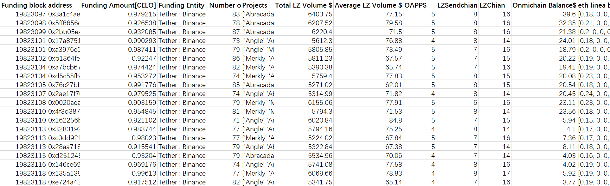
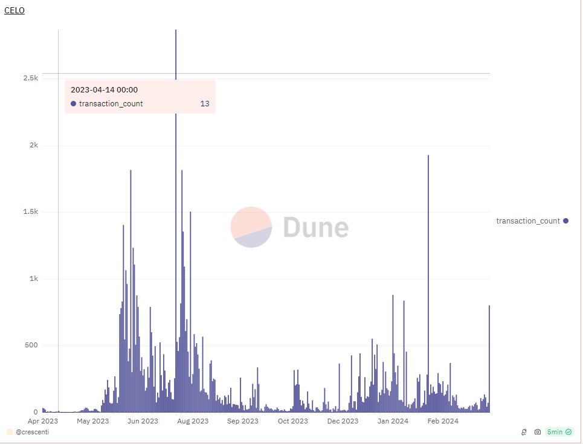

# Reported Addresses

This is third batches(batch21-30) I submit, the , ,  one is here.

```
0x311dded4b7216797bec932225ca26d2c13fdaccc
0x73d99cb503166551ec469e607caaf389de4293a2
0xc8dd257777cc766943661dd831265c9a07167751
0xc006bb8de5b7a16f9a3e53935ca8e655c52ff75b
0xd806c512d3adde6c6206ce69e87c9e1e0da22aab
0xb37437271169921469a5eccafa17cc78a2ba951d
0x2fd7e726a15411ac670c815a899d19f7f3a1d840
0x61c921b346f512fa11a87bc70b9c18669d1333da
0xf9eeeaac6ff9dd42af5eb28ce9a5d87582fbab9f
0x305a2ec0ac8ab8dc6970ca4c622c8fae22b2d2eb
0xaa3cd0a05ad40cdff6be2ac7c9cda2d03f40b87e
0x049387457e196e1ea7aff19d8fd8236bfa947b7b
0x5c2d3f61c7ad51db16d052c72d20397067f20a6d
0xdbaa4d2fbdb415eb8da2b8f9b9fd117022450be5
0x87fcaa96cbd7b45bc7cdb8e86cfda197ed12ed80
0x04e7d9c99fe310be91be1cdc423d366e84a5cbf3
0x7ae4ca82317f462d8ed56edee550117965930c60
0x548d5806549d1539254f59f0a542d65c185dffcf
0xa616e2f1179b65e8401125fe57b00f360f058d6a
0x4ffe76b9719e6dd917073e25cc124cb9f34e1315
0xd344a01aa9ca57b624880eb4d12c6af64990c166
0x51537d4a708e2fd90a7c1c50f59fa6c529266510
0xb43c9b00638af57e06f6a2e6b68fa0be973e0098
0x0f3fee5e4a6673436113761344e208893095145b
0x9df6df85603708c83b679ba14ef9b112db5d8fdb
0xe53bc4715aafdcdaae71f6f5c462b9f1c526e058
0xe6279c9cf09d1ed4d0b215ef230c7c0bbfde2557
0x26407af2c1347230497dbdd85e80b675ebfafbd7
0xf9a03488bc245cc4615c059b24db5b1a6c6deb3e
0x07746e26d8d53333a358ccd574ba552ae40fd0ab
0x81b741a625d3bcea2a2c531945e7895671b17e06
0xca972dc929675622d213872aa0dea39d3fc4c5c8
0x3a691faca6d5d2b5802d35fd57d1aa7b48761d54
0xa526f6361b45dc8ca68d5704c6748721a3f7b540
0x0f03729ccaef9f8186fd7f55ee902b8e63a29c20
0x2cdb8871bc4f88df23e041c99e4334cfdbaf8091
0x957cfb91c41e8513cdcb95ad440d201a4e8b5558
0x67597852ff9413c18a24207f781f9f4a5003fde4
0x4e753757a2a5bc6400ad659450ef5907cd81e846
0xea655179dc95199ccb42f582f4a925f3b92cc466
0x0eb4e5abaf8a4895c21eda4de50aa5c92fc0fa3c
0x827960071fa2046d6f72aae5c99bdd9b20a4ba47
0xfe13123bc1657b3cda712b3b9e0f76ac654cda37
0x3b3a5d9b55f2d35b13f4eb60118f4c50e464c865
0x4726e2a5b39559670d8df37a7b79eca781ccc05c
0xfe74fb954fdeac4c017a10c6c25d6c9c810d9c49
0x4813800fe9d5cf73f9699697a25e2203bce7b629
0x22b6208f2dfc49d3e071d3b9f0d12e7267c54bc9
0xb8ce39b7b3daec05561eb4f1ac18590b4101a514
0x185c86c5b1959a25f0fe0886d73b0cfead014a5a

0x8a79509c53a9d4e0c0a778408ed2e819c775234d
0x6c7e9050399b6a8090f14c846dc660b9e7cbf2e9
0x136700bf60c3a18b39cad3e2220a54eb3fc62b76
0xd3bf4d8acb28c4db068fc1a307feed47f8f29857
0xd73974db4c34d0787809f4e9d796fe8b565bfd5e
0x0203f201c8eda9a383c2e70f0cfd9324848726e3
0xe2c980d1ca7c65be715e04748038f39bfe3c9aa0
0x3d8f4ba1039a7288193c821cf0870b21cc62b6ff
0xfc5d192d72523702539041996d97e0d759ff47ee
0xc3c25b7ad779f18413bc4399262a7ddc10eb3f82
0x204d5489fc0f3699d5e4b30fc2c2926c44cf1e5f
0x46b91fcbb3c9ce1653385e88409c95f800582750
0xb0e37c9c6bee2b01a493e577f019b539d054033d
0x2ef6b1ffcf46ba80cf7b9760f7da991796607648
0x062a1a9f2fd0df3b8641f0d05651f8ff271a8d39
0x14687956039f285ee18d06a2fc3fdb5439b49da5
0x5d1040e8b506b603a0e72bb5052c5bed52e6e564
0x14192018cd03ad904b72b9afd6d85b03cf241e80
0x28c0e994bdda1c39f76243258655c7f48e062a39
0xb4fbf867919f4494eb8f14634663186de8126515
0x6fdd14f622430b2466526aa9044bec3522818070
0x776e865fb7f6d7d32dcd1789f1be167e31a4449d
0x5f758e00f9fbc298d0f3f7ff2a19447de80fbdc5
0x5a2f1b42c299f550aa9118d6a241dd8b38190077
0x31acba9b6c3471ba819695398146853f1398eee2
0x9be779ac85092f6b6302fa6bf7c9d2f356524d19
0x7db92cd4b456fcc9fc81b33d6cd07c38bc2089ec
0x98ede8158b5b99207a6756f81c121fac19669eb8
0x81a4699405c09a419e0506d711b868e69cbca56a
0x0eeb8763b7df45eefba90ac03a2b1bac569a38c1

0xe51379e27fd6ebbea66ab22577963f3e56746cb8
0x8e86afdb6684de61d7c12c17fc00ca4cbd4fd7e9
0x35fc82d7dd47ce839563ea038c25a50b555b2bfb
0x7f6d13257adfdadd93d2d0aa282fa9e7e3f49302
0x06a9565116d93dfc7af9c65ff2b3f3a574953e2f
0x3765956cab6e9f798ee60a513af188af4d178e64
0x6838e6e0b737c8cc1bb6f67f9339d1670c9e7753
0x38e704d6438ac0ac5d185476d7b49ef8d61abbee
0x094142ee986f2b8558f69e4d4cbe20896a30a8a5
0xb813efaaf4b5ffd1f644c114e9c6fe69272158a5
0x21efe8874f8d0a55a1b3d5317055367ba4a040c1
0x5ee8ff8b3a3fd5f7d502be161290f845ad574b0c
0x73259501c0adf6c04ad495bf9d726bcf6fa237a8
0x2fdc2967290b1f47587c3b87f3eb004dbeee0723
0xe80773dcb60ed7636219f6a3a1731e66e82521d5
0xd2feae7d81bdcf9a386d054b70d914092e4ef0bd
0x2340beecee9090ed6ac076c4dadb7b1c14064dee
0xaae7c69f124f37e2a6af001444a6e8f9a01a9d21
0xbc005ef8bc22b61358e4dfa8da96bb14829f35d0

0x7a6bb76452d199b2b1d952ab73cd24063f18dc17
0xb5bdb9f0213f7bc9e0133457466522f09e5257b1
0x47afe6de2633de7d3e5f682a97cd394515440aa6
0x3fa9e7c8a4e941f1bf45ad0ba5aaaa43b0c85980
0x9e5cc66aa8d3c5bafdd8af7640505ca48b050fda
0xe8228bee4a18dbd6cd00b65b7c7d922b99b8e32b
0x833c8eb4e698c951594d9917504496c2413db69b
0x7f78c6f72635e7111586f67a863868f3d9646e53
0x852bb5806182c33cf27538e99f80a2371734e0df
0x3535881fd9efa8a853c62bf95187dc4a793215cf
0x0c123435092a2d1abae280ddc9005030103c8e3e
0x0eddf37dccb046bd9b2e55bce5eccff168bfceb6
0xff8b15a37f4ef36c19d59bbe067904e5521aa4b1
0x8877b03994647dc79f6b323f348d1c5760cf4ba3
0x6eef49769bd061fc73632361a9d5d42fc4f406de
0xab70e53b90147536e6998c128c3aead2524f65b3
0x079f7026d2e80ceb5e5cc4ee61f35c778a526884
0x4cbee7fc84e576b19cad340404b37f07b762e2c3
0x29e88b3e9c2f77826298fc1774e4a1e3d04083df
0x3f01120206606f3935e4d2aced7875de1797840b
0x66feb5b78d4ce9131273f78c4078cd3e0ab59c34
0xb5a0dbb76f32f0db2ddb416b0148d16ded745106
0xa4f7e6ac6a5e24d40b7ae388a412fdf323605967
0x9b8c75fbcda2ad71adfc64a31a9f6f19f5227450
0x00b8c0c282cb01370eeda0f46677e732ff9b99c1
0x0b9d4dea6affd289424ab29aef1c496ff2ca091a
0x5212e7888a8b7bfa1aead2e5789518da4ea72438
0x210761303a9a6b6fb36f5fd8a621c54f1c4251a3
0x34e5022f47b251a85dd6f1dd61592b2bb1f79eca
0x8576514482dced8cd3b856c9c914b7228cad1b3b
0x55a2b523feb750b1c9aaaa6b94eff97b306500b9
0xd7a1e1e69020664c354842279dea935478bb1111
0x40dae6c099d8b0d5ef8c9c36dd49542ea87de88c
0x6783785b07a0ceb6734afc36a21a1bb5ef97c29f
0x95af8858ff237fbc0abe25d7f4f5886ba7164ea4
0xae67835940908c09872c1cb5eea2e3c112f901d3
0x9947fdfc90233e6722554037d88c42bdb5cc3c8b
0xe39db15da64a5e7da62664682b3ce17e79a0d33e
0xc9d3f3c3baf9d57d568339d90d95f289f2245ef1
0x5c13df4cf11793a1a996abf6fce5e5fff4e73445
0xb63d0fe3973ed7bb4fff929acfc9d93ffb4c6804
0xe91cfe04483c4714d60ddd282ecb434a50226fae
0x5a76e5d5eea33494aaa6aef40aae79c6526ea9ca
0x97c0e2d8052ee75ac3942cb523bfcbedfa4d52d6
0x628248b244281922955a8d5f12f117b673f44405
0xb37bd00faf3aeda55ba5b2af89f4ee96e4f7bc36
0xe3144e1a12e41fd4febac66386b33e7e12fb0997
0xda216d4d069ac4d4b5ea1762a1a63f5594934d83
0x0d78df3687b8f6a88f8d0903e5cccaacc7dce0e6
0xd13d1585fe850dc2672047c21898379f14699542
0x2e8683833c60620ce2abb2bd9a589b7ff4ece7b8
0xc0bb630b745348dec7f566206af792af7ab2dc04
0xe8ab0bdfa75b37c9fe708969adb4bccf5eb1c116
0xa568ea8b8d0da0ecd2ab082581f678235fc1dd4b
0x105b73adb8dd7d016c47dda1af6f865cb631c429
0xe8a7d3e5589d7eac863522166585f12410f83dc3
0xdd890991f7d812866b2c40dd09a13f5b4e553742
0x9119ad76e08a7666cf8b84fdfba583ca1f2d747e
0xf919cbc1e6edf4506ccb999f7bf98351b3478fc8
0x279902a986e5d1edfd0215c387f02bf58056b2ef
0x5c02214f76c444c3321f49c7f0a6be4e6b86fc3d
0x8cf7236a48aea5e5c38ba87e8bc5408ba85a4f4c
0xf4deb00b5a6f8ee93dfc952d7615e1ce2d0538c1
0x4ee83179e709f3df8c7745aad40115f3cf7680b6
0xe4d88c89ce0466a43735a0c0e94f473c1ee8a17c
0x999d9e4cc67b6dd86172450ca5a1e41632fc69bb
0x4eb3faf5233c6b2a90b9388c53e197590a4438c0
0x904e83a2de6ff665975ce6eee2896da997b28b9e
0xb4b229e93caf69a5a007c6287efebf068fedbf1f
0x764c559566fcce52f12a6e8e4ba8e5d0a9cd6500
0x49432344089d6957908659ffcd45a536d17f3d69
0xe05f162b05baf8381bff90dd505659e29294a76b
0x61089d0a61fa9dcd4962b0e6dddc293405dfe9dd
0x53d72cd8f4034aff1140a387af1b250c9093783f
0xe9b66896822bd32c48973fdf4241a6d5a26765cd
0xe6ae5da4af77d39c9290e94d9a8375a8dbc4973a
0x9ca127a62ee78beb20342072f9dea6d6b264768d
0x8611d415ee83740cec7c621dfdfcb8f75929f43f
0x56b37855b66e09e896215d98284b5b3c046c1293
0x28fc117899e525465c742a9abb575032be611d76
0x7d6a5857f26051e9762f85e8df86e4f0f0e6f476
0x7fd47d334680b3c6d4acb88b57a2622a32bcfaf8
0x39c4720251dbf8178c2edf6a8fdf7492ffe52000
0xd9eacc402c24651358ad2e1c93fa918865dd8af4
0x0f71b9b7b591fffecf1be267f910746376739640
0xa8accbd13e7d589727ba6d068aa777256747523f
0xa6b8da16c3d92483a4ece076cdbb60da2f8cbcb2
0xd7ae3ffaf5553364a387c55916f27ae42f4addbf
0x155f321482aa2fb1affecd84a9a55ee90820d6ea
0xa91e95073b67598054633c7acc6bd308dffaf90d

0x6ddaf92d2a61757997ad51459c527f012253e797
0x3ae829e04852b99845ee15ddf005f170d1d5c202
0x7757e72d5c86c1400c708fdd093aba976c59b7f4
0xb606458a9326bf45e44f34277c164230a5ed5592
0xa47aa1a58383252bae6f316a814cf0f563dd093c
0xe10256db8d3b7e61ac2d07af8c375ca6ec951517
0xc6a94fd68b129273026685daeb23c355c1a78f91
0x7e6e0691b411c4563094d70209731678ee21882c
0x0edabfc0f79e276f3c6223b4cfdec4ea73387101
0xf7cf8d8ba24e38bd2b4e062c582e5a71da853108
0xb859154a35cc8aea60ed2b4884f9f2d87624e339
0x8dc9b8f9f9cdd8e6b550fc237de1c2e5adaa646d
0x320f27ce598ca5bf59f8f038cd6cd8d3283c4d67
0xb1c1702e8aea9668274adca3a9dd8c863511398a
0x7385e608e9e4b5dd9386825712dcc7b3ff115ed0
0x212049da950bcef7864636391d984a81226648bd
0xc2f5c3fd1453a73efe328b4385bc8c7a358a87c8
0x5ee71bbf95d0f881e73217eebef7f7b263048e4c
0x39be851ddedc2ff01aa115e834e1c96412f2dc0b
0x09f336a27a3130aa57ec0bdd55fd6fc3999c7c95
0xada7f936f8744ffa2461ab9bcb487fb2a52ec30c
0x8a6d7329e9ac54a88ffa91171092a13bd0e964d4
0xfcf4c58cf16f4e4821dd630a1ff3fcead8c0d98d
0xb3928010276251f959a047dacac6b3a2bab28682
0xa491cc6b6ef077fbe23851bfbf8bc727988321e1
0x867a0278dc00d682b297ef58f2f792b81cc0c242
0x2bdf249d06459e5a4778f9ae55cd666b7d5dbacd
0xdd554be3d5f4bb22e88787796a2ae08e04f5b5b6
0x47a3d810d07c77904394e3195ed2fefe23b36171
0xb9d9b54a47831dbbf37819544066d14ed15b3647
0xd29bc8243f3700909a63a0466173ecba217a0199
0x7cd372c336c0391ea1f9b5e41302159478d3b33e
0x2387f0ff4881884ef7dbbcd1f87649fdd31361d5
0x09dee8bc52ae3784b1f842253405e08a149a0dc7
0x5edfd4b31e58745ca0850d667bb0c7296455b166
0x60e9e71dd1eb06d942185016f498d65492b5e51c
0x8476c6fa778e0ba6b525c735fa7882ef0eb84eac
0xe62f3353b1d03a8d1f740001bbd947b24228bbc1
0x721d59ba7fa61536f39741dc7120486dd1154930
0xd96c84a6eb83078095d41045992bf2f897e5e625
0x4e15f684dbce63b34507781faddacafcd9844b49

0x41cbd369576179cab8d8cf0ab4ccc9fba17edabd
0xbd660441919f6afcdad5a10c424064c68aa474b4
0x95ac6a13b9b01d5893c7f71ebfb2b24b311b015f
0x17703b789104d731b1861167cecad84c87c803e0
0x9b2b745feb47c7fa7b2c1937ef6194eb060b09cf
0x9a3f34efb69283dfee1759dfd9e05bc541efb777
0x7f901b28b7a84b5c244232344cdd2246c1c1dc2f
0x53506b1d6a7daeb04b1de61045ea7cf27b4bf413
0x359556cac2e7332eea6e9d62d4ad3cf047808b5b
0xa7203222b2b276801f0370dc092511a84c70ffa5
0x6bf03e3c1d259bc218adc2c16063cc300797a6a7
0x8da45aa6586e52fcf2979a8d38d78a4773eb4250
0xdb42d9932036c48c42d61cd20112264bf4355275
0x718aaa9f397ba88658eacdd3c6038ed70adbaefb
0x88b8310de95c9d0d5689f84730b7b5c82762ed60
0xf639ceb23dd4a22995ae6256e76d5137a28baf89
0xfc03ae34a4ac5a8cd259a407ff974692276ae331
0x835a0d1a2ee6c67258bb6ebc2c386121f5f4e8d9
0x2506557a995fc3cd1e3a382cd436328089ea9cac
0xaeabff63efe842385f0f6fd03010fb235008fd6e
0xdf9a7c7233e9a8946865bbd0072c74d88811e7ab
0xf294319ecd7fe9d776d752933034fef8fe50b94b
0xaeda133806da35345eb4141a61d67cfaf62db56b
0xaac0e2079a21743b9c1d4ed0faa4f1fc6811239a
0x48df41603caab7641843740c250edcc829d5dac1
0x3e19d2223793bff0f9015df20b0ac11eea9ba8aa
0x1b9ff5f5e4da4f9d44415ebec1e91c7f7fdbf91a
0x9a508265575a37d01fb37fc31babf151298c3a03
0x7e6a9757a4896e4d3ddbc3913fb53434915f4715
0x3912961b3d28a0963459747b0824354c726709d4
0x1c42e8b65171e57e038aa1b826fed42264f0fc5c
0x4f1ec050f78319f640956c4b64b7095c704c0280
0x20c3b6a71a10b9a16e3e769d84880d48a4dfc8c9
0xb18294df25ede0da2d3da463ae5cb262eee52f0b
0x43a0261d252b72a752d2a5ac7ae899067d4ec5fe
0x4336c3d30786ec7601049c188a4b3177b518307e
0xd301548487eab4f1a2335bed35fd467b6c917fd3
0x0fb7330e1868d9f9e3d2deb3acba28a4309196c7
0xa35e818146b55e058026553933e8a37df270ab45
0x39fff0b212e7a14a77d8afbb45db8b5dc0f5680e
0xb85631e89f8bad5f7955d70fa6031653f0fbf3cd
0xd3e43975fcefbd134d32072b67ec779572a154fc
0x63b92b36ef2dbe1ee907b144563a38510ce1a564
0xa36ea0a3163c0fb50192d3585082bec64863b0ec
0xd2defd69c23ab0dd6afc8841b569a93339702d0e
0x61297919963988eed6a066617945517264207cc8
0x253753da90d310d7373e605c7d28299ab4abfaf9
0x87396367470c21f79672c0050bb5f0502afc6d3a
0x4c4c65400681f9b04453caf516f83eaf8d0cee65
0x2506d04f13e564edcd14d575460cab9afd6660c2
0xb51d80e9557721de75e7e662165af30629862e7b
0xa660366fda7e029ed795940276fd899c5cdacd4c
0x91abfb29fea07cd69f65c77250cd7ba14553ea52
0x1e1a6135a1a420b73042b9929ab297c27567dc33
0x85032924daf8333edc6563c44a208d481a564e22
0x6af1c6def481c6aa60c570d28b2a1c552869f073
0xe5c5d2756846c5b55b457a9a493eefa8955e1983

0xf09fe1d6ded764bf744b474ff44978daeed7ca52
0x65b5f2c92ab00119a78e9d50573b7083912f93f1
0xb8205af5aade123ce089f890cf429f92ecfa9dd7
0xe4548caa21d5091085cbfa47599819492fd0fff7
0xe7d15c5aed43b33fc9afe2d0c0fc16b37961da2d
0x4f195f2278f26c345e8cd9a031bd4fc1f1419a17
0x69c452129c8b3ee5edf0d67a3e81bf920963e7eb
0x03c73a5324ede48170f78cff5630305d4b44e56d
0x6c290ad8b82cd525731ddcf4f278f4a6cfef27c7
0xa135b18ae3aaf9f31d61a623cec4d67e264247e8
0x02fab3cfe8240e36188c5f0bef5be67ffd9e9571
0x650554e9858da261771a3c36d04ee1eecb6e60a6
0xf43cfb87edf9df187ee71d5dcd629d0f83057554
0x60a48fc2262a0b2bcc228eb8312266df2854aa61
0x31dd356f8885d5f1931c11deb1e4c97998d989e0
0xb5cc5667eb2144d86ce299e60b6fab3da0240b30
0x6d3e503b874807f3496ed94613337635067d1584
0xa0b5d2ae36adc66bd32b3a21fd0cfa8e2181b3a1
0x663ede12ec66805d3caddd46b8507e89e7613643
0xb9fa13c491b02f8977355c5d9dbd5a763ece8415
0x54c74e1a7bcec58c310f8b6bb06e9efa25fc5782
0xc1d63d3ddf3cc8cd3355e52d70464656b121b8ed
0x8707eb927d95437acf512f7c82701770adf34248
0xfd32527820e18783a0fe14fa443407246474c774
0x97a89eca3188c6d79e530dc97537f83066db954d
0x7e8394640c137a7303449699265e39b3dd5f7df5
0x10dc76c41b8ee6f777d0a8d7923193205eae60bc
0x09ab9b513891e67ca8b03306699f22d8d77934c8
0x708cce2c898dd8a1e41710b8d4c7a8be88ca733c
0x428a927547357624e4ffba44d24fa151ed9c9d33
0x9df46a16c0c9c6fd3356bced289b7ca4c961632a
0x704382092e5880bafcec75801413dce9060aee64
0x4e0f3d133c3682f7df6b1eec9e3b2376e837d7d1
0x5d1b19b70cc050ee709de0b8eaa7173f7a24cfc4
0xf94f1bea98851dd9571a7967c04aa9e781e602c6
0x480bf7fb5579bf7db0a12c25d95a8354f3451029
0xae0313dbe18af88d0ffd0be65e3cf6a2e1113944
0xa10e4babc09bb406d716feceb39376c3bd0df298
0x2b77aff8b6a1aa625e18b2bac0ed72c26d90c936
0x65e4fbbc0982eed1f32a485e6e8a105e845a4924
0xcbb938918d86e99c5bd501e13b45cc7d4443ece2
0xee3907616d5da13656dc2ea01e017cc9239dc1f2
0x5f5824a5f5967ed1668277002c0c5d0f9ba7342e
0x1952fedf21731a53c543b5ef4473ecac59409ad6
0x0a2f18a20028350dda1be16817f5f95cb6ccd63f
0x0a1bd7c209d971c651a8e1729e6865db761b8580
0x7f3f5ca819af67e4586136ba7bc88259fc4a65c1
0x0cf06673564a04a7783708bbbd0e0eb5237a7e81
0xf18d63aef5ed9b1e49cec1d0e5cb237dc78b548e
0x7a588de0acea05bc527c4208340a922b82ec1a92
0xd58256fbbc3053039ec6af07e17512e9635c9004
0x13302eb4000bb6e496ec7c25c3e2e46a271938e9
0x275a46cd473ebf4a82e49b6a4bf988481384bd3e
0x8597af3590a9cc78485e1c8c690bf1acb08448f9
0xbe33464b6524cff628433638b7cf0690cd8fb600
0xbaf00d7716934583dc369f450db2147e2d05e916
0x8a087bf99655f822e7f7650e869e2b6940423e07
0x649238ef750c15da2c71e86ee6060dc3e9f4d706
0x2d8812fec43ea58e69bf74f5c85ae6e4b40d1b2a
0x1cd8b49da47ac93208a92410bac9d92af4197487
0xf48ed6311b5f2419a3a6ccc5b6bf715c04530571
0x0b56a6eea5a62fda0453beb7718e7d12c4229b6d
0x1bbc42b522b5d090b89384429553a762ad68b05a
0x0a69783ee22029dde2dd4adb95e6d0af9f337ac2
0xa865c23916b35c4c7bfc94afad7884c051dad4e6
0xa447bc57b205298fa775cfa29c2a9bce8444f056
0x322f7a5f445483f84a8ceeedafc98a7c6b87996d
0x15176cfc16a4029ce46c40bb5684cd0e227934ec
0x609c81330617f45f18da26c97e6ed3d8e32c9b43
0x06ca63eeac92c2c826f527e62c30d8d8f5246f2e
0xe30bc34aa160598640e8e314098c4ede0ff21568
0x371112d81ed0ac58ca3f8d2651c0d232c5f2622f
0xf12a2602be1fc81dfbf6e280c1442a889094222a
0xb5487eb59b1302ad0e0a59c9dd075ec4938bb905
0x4a1333b02c17a2cf608fcec4430fb8de71219301
0x1e39303c02310f9adcbbe29a01f840f25b43d80b
0x43949adfec105d563900c113d7452859849b0849
0x50f6bd93f75275c497fb0f8d803ebd0e63bc1e60
0xca3bc9ab21fadd52fa5cda5bf650c89c42d5fc4c
0x4b024ad0429e0ba2279d0cd9f5ef257edc65ac73
0xbbd078920cc5687b6cb85d669fd40a378cdc8e35
0x4e75383991eabb0456baf9fb92d06dadbd85155c
0xd851846c10cc1da5729e58f569bdd9cf3071fec3
0x69bae81cee36c89c0c6cb5e009f0c280f52ded1d
0x4542d439930a7643953ab559a4257bacd4bb47b9
0x0a33bebfd5c2a7c25b86bd01669f3a364769d517
0x75265cd98cf1569bb6ecf7712b476e21fa15c292
0x2dca58516abf9b46ac19cc8671463e755aa12647
0xa91b9464dc0a7bfa98ed6dd4917ab543c57301d7
0x646c5d4d9c75a9475541503b9d98cb2ffc67db1b
0x478c35ad2e60972b205eee2cd200d35add92f800
0xb1a3faa02fc154a013be15068b8a346d15c3e37d
0x952115e008d617545ea31e95dff456df16a26fe6
0x15a9c83b12724a9cc24ce0961863cf052fe39efc
0xc908a280b014703c794b4963ec8e097575878c32
0xd0d2edac31e1051e56fbbb155b7346002ab3b603

0x3a1c4ae64f84733e1ec4ba0d7195af785bc70144
0x5ff6656c4697c117d6e6037b81f9f829c72c6c43
0x2bb05ea771a268317a4fc60fce47384854036abb
0x17a8751870913a2eedc3a2eca5b2f6b00503dc8f
0xa3976e0a51b3a7c17dfc784994eec2e67be9f8ab
0xb1364fec535a5c6e0e288ffb483ad1c9ef00bb79
0xa7bcb67f2e698ad229ceabc93c76963f7cd8f6ac
0xd5c55fbe1d343447da5c3620bd43fd62e8836b7e
0x76c27bb42d37c68d28419d91475bc2fad5656862
0x2ae17f70b27331fd34ef46dda0dd4663f1040d0e
0x0020aeaa975721c818c5ec1bd29ed37732903c84
0x4f3d387cbfb6989e4e37c04bfb5e08db786c5e3f
0x162256b4695bc76a5847603dd6156301446bfa53
0x3283192618f88347450e0dbaf6b1186de226bcab
0xc0dd9215179caac4f90a0a65e8fe98aec1e03187
0x28aa718b9bbaf65f9e4cc45dd357c5ea0438927c
0xd251245067281aaff9b252bd24572b06085f0a72
0x146ce6916f3f5007c49b5cd40e0599a5a23ac0bb
0x135a139c3112afd99577868ccf8149c69b928c81
0xe724a43f266f5f939c866bf04306967f4d0a4e3e

0x0e86ece10117ac75b7aba21f04efb18212018bf3
0x82e88b2e1d40786b981d8e77f483953faf5a8553
0xd12d8e8d59cd6941d4884d8f7a0f7edae5a81ed1
0x9ecc8ee03a0b1abfab3d5e5b45d8070104516f90
0xbedf20d4f96d79f7ccbea631a36c9fcc53ff7f04
0xe27a3e582e748e532e453bf435c028491aae4d46
0x17a553bf3544569db0793d5e618d488aaaed64e5
0x683eafbaeb56fb7fa230a649ea36ac5cd58d6ea2
0x442bbb57a3a8a1a18c35dd82ecf6f06b61653517
0xa9c249039e6831fff8a949234e3689fa8a0a65f3
0xf36a15a14edc4afc622a778f81c560deb6544344
0x54c77d9e8332debf99a5b87cb618a3ebe72ef6dd
0x7352ed51788427a717a684752777f7a947ea9f36
0xb7f9aa1e5c355df17837cbbbcffb45fd256893ae
0xc041cbf1260a16c3052ed823b156cbd5c85bbda9
0x3459f77bebedeaf4ec573a0bfd756394b8e5a82a
0x02cac054f62fd3a494c71a11f44ea0266e3136ac
0xca1f159c5e65f9c250dcdcdb7da5df7ce71a798a
0x9f0a216381820fa69b19822f5c67ba6a79417f76
0x25b71c12174d7fd4ee41200247203d4e801b5b58
0x5104b33c259d2f2b70c6d06103254e45007eb586
0xea58b59f073db1ee1795c8d3b223c1f81ab74005
0xe24d74b21169f284b33fd10a0b5db7ee2cf74378
0xd8e1d9dfe04050e7b08c12149555661bc12e4398
0xba0f38540585f490f233b3626764baf2b9075409
0xa59106462f17126f4fd80231f64ddf345d9a91ef
0x7f1d8b7b1816fd5572a74a592e325a99776de1c4
0x1af35e9e7f6d5e5d12ea4d8cad8aa56c5ff440e0
0xfa08c243462bf09edbb69ce4980eb2a6bb9d873e
0xf6e3d51af796c7b818a18785d3c97dfe33e477bb
0xaea4293462a6cab11068403fb68d862564d5a36a
0x5aa846720179895f2ddfffde997032fa0e2a95a8
0x87a11291c99dcadc41c973598ed185da570354c1
0x7e1f543d7365d8038e3313a00d141686950997dd
0xe5c6bf5c5d4437aa824ad8e46e0d3998342050c9
0x4eefdcec192fa2b229b9011a0da7a64b79c4bfb8
0x708ebcb7f0f006ec129c4744212355155125bf52

0x51ed399267123e647775a332e0ab7be385e7c11e
0xa24752e5a929aa8dd920af6c9c117364fab63c02
0xbb6886bf19d51fb0ea69cacdd2b8a632b348823f
0x6e1112bbe65e36222e730fa2e5768fc3794b67cc
0x7aede2837937f7cb75e3e395061741c797f787da
0xc990bb1377d354b4899f1931a0e10e16bece8e5c
0x891cc3449ae6549c87449eeec43c553aa1e849c0
0x26004ddd6d85016b4914f7df206950a36722c8e2
0xcd4888bb1e8df7962880926a9a6bda0b4be2bb5b
0x6a44f7467eecf48599b280e3a51275b8adb9f0bc
0xd3426835f0ad551d6aea6f0becdcadda7e5c00f1
0x892bc0f18b4dff94bc7ca470eab04ce88a4423fb
0xa556fde6a7df06e0f5c2f0990492d93bbdf6c40e
0xf857c9307bcb67ed4bb2c90cb23894c6703b9fbc
0xa3edc1ff832a4cadbc2da4d968223729f11fe453
0x3a48b48cf0ae1a08d43803862ab64417785d04dc
0x53bf7749381daa4abd0b8d3d30bbae2a04c417f5
0xdd947b7569d676157325c1c6f0b3649a88299eee
0x5fbd22db3c96149064d3ad8dc60ff22b6c5f003a
0xb2134e390ef4548c3e2505a77c65652d4f3ce283
0xdd5ab7f9231a97eb3b2bd1b344fc002b3fe1fa7c
0xd89096d89ff045f854f856476da9ecbbcd3b3839
0x8aeae6edb92ee35536cce94b998ef7e7f40d542d
0x3b1911df4f1af5f5484bf50257b910ad495459fd
0xb4b7f1dba7260a1787a98eb05789886ea71e3949
```

# Description
The Affinity Propagation algorithm is used to filter suspicious data four times, strictly reducing false positive samples, and the filtered cluster address data is highly similar. In order to be sufficiently convincing, evidence of the homogenization operation of each cluster address on the entire chain is also provided.

# Detailed Methodology & Walkthrough
Affinity Propagation is a clustering algorithm that identifies exemplars by passing "responsibility" and "availability" messages between data points. It automatically determines the number of clusters based on a preference parameter and similarity matrix, without requiring the number of clusters to be specified beforehand.I have tried many cluster analysis methods and found this method to be the most useful and effective.

## Dataset

**Note: The multichain wallet balance$ snapshot on around May-20-2024 00:30PM UTC+8, data get from debank api**

By monitoring the withdrawal operations from the Binance exchange on the CELO chain, I found that a large number of abnormal behaviors occurred on the chain from June 10th to June 16th (withdrawing ~CELO from the exchange, and then conducting layerzero transactions). I set the filter conditions to this time period, the sender is Tether-Binance, the transaction amount is 0.9-1.1CELO, and I got about 6,000 pieces of data.

Next, I used the transaction data provided by Layerzero to obtain the _'Number of LZ tx' 'Projects' 'Total LZ Volume $' 'Average LZ Volume $' 'Number of OAPPS' 'Number of Sendchian' 'Number of Chian'_ and **the _multichain wallet balance_ of each address were obtained through Debank**. You can see the .

## Data processing
In the data processing, I used the affinity propation algorithm four times to identify the data. After each identification, clusters with less than 20 samples were eliminated, and each identification and filtering process had different goals.

### First filter(initial filter)
The set Affinity Propagation feature parameters are
```python
features = ['Number of LZ tx', 'Average LZ Volume $', 'Number of OAPPS', 'Number of Chian', 'Onmichain Balance$']
```
After obtaining the clustering results, if the number of a certain cluster is less than 20, the cluster will be deleted. This step resulted in the deletion of addresses that had not traded layerzero and real-person accounts that had no problems at all.

### Second filter
The set Affinity Propagation feature parameters are
```python
features = ['Number of LZ tx', 'Total LZ Volume $', 'Average LZ Volume $', 'Number of OAPPS', 'Number of Sendchian','Number of Chian', 'Onmichain Balance$']
```
This is the first comprehensive cluster analysis. After the analysis, clusters with less than 20 counts are again eliminated.

### Third filter
The set Affinity Propagation feature parameters are
```python
features = ['Number of Sendchian','Number of Chian', 'Onmichain Balance$']
```
This clustering analysis reduces the dimensionality of the input parameters, especially focusing on wallet balances. By eliminating clusters with less than 20 counts, this step will eliminate real users whose wallets have larger balances (even though they may not be trustworthy). ). The consideration for this step is that Witch accounts generally do not hold large balances.

### Fourth filter(final filter)
The set Affinity Propagation feature parameters are
```python
features = ['Funding block','Funding Amount[CELO]','Number of LZ tx','Total LZ Volume $','Average LZ Volume $','Number of OAPPS','Number of Sendchian','Number of Chian', 'Onmichain Balance$','Onmichain Balance$']
```
The input of the last clustering algorithm is all available parameters of the data set, and it attempts to divide the data set into as many clusters as possible. Similarly, clusters with less than 20 internal members will be deleted. **Thanks to the efforts of Layerzero and its partners in the previous phase, I filtered out nearly 4,000 addresses and nearly 2,000+ addresses were flagged as known witches.** At this point, we have the final data, see . To provide further evidence, I will provide each cluster address with a large-scale homogenization operation different from this data set (such as a large-scale homogenization withdrawal from the exchange again)

### More ways to remove false positive samples
When verifying the evidence I provided, I used random sampling to verify, and paid special attention to the data at the edge of the cluster. Moreover, among the submitted clusters, I artificially excluded clusters whose features did not appear to be particularly obvious. The final cluster had almost no possibility of false positives.

---
## Sybil address batches and extra evidence

**batch21**
```
0x311dded4b7216797bec932225ca26d2c13fdaccc
0x73d99cb503166551ec469e607caaf389de4293a2
0xc8dd257777cc766943661dd831265c9a07167751
0xc006bb8de5b7a16f9a3e53935ca8e655c52ff75b
0xd806c512d3adde6c6206ce69e87c9e1e0da22aab
0xb37437271169921469a5eccafa17cc78a2ba951d
0x2fd7e726a15411ac670c815a899d19f7f3a1d840
0x61c921b346f512fa11a87bc70b9c18669d1333da
0xf9eeeaac6ff9dd42af5eb28ce9a5d87582fbab9f
0x305a2ec0ac8ab8dc6970ca4c622c8fae22b2d2eb
0xaa3cd0a05ad40cdff6be2ac7c9cda2d03f40b87e
0x049387457e196e1ea7aff19d8fd8236bfa947b7b
0x5c2d3f61c7ad51db16d052c72d20397067f20a6d
0xdbaa4d2fbdb415eb8da2b8f9b9fd117022450be5
0x87fcaa96cbd7b45bc7cdb8e86cfda197ed12ed80
0x04e7d9c99fe310be91be1cdc423d366e84a5cbf3
0x7ae4ca82317f462d8ed56edee550117965930c60
0x548d5806549d1539254f59f0a542d65c185dffcf
0xa616e2f1179b65e8401125fe57b00f360f058d6a
0x4ffe76b9719e6dd917073e25cc124cb9f34e1315
0xd344a01aa9ca57b624880eb4d12c6af64990c166
0x51537d4a708e2fd90a7c1c50f59fa6c529266510
0xb43c9b00638af57e06f6a2e6b68fa0be973e0098
0x0f3fee5e4a6673436113761344e208893095145b
0x9df6df85603708c83b679ba14ef9b112db5d8fdb
0xe53bc4715aafdcdaae71f6f5c462b9f1c526e058
0xe6279c9cf09d1ed4d0b215ef230c7c0bbfde2557
0x26407af2c1347230497dbdd85e80b675ebfafbd7
0xf9a03488bc245cc4615c059b24db5b1a6c6deb3e
0x07746e26d8d53333a358ccd574ba552ae40fd0ab
0x81b741a625d3bcea2a2c531945e7895671b17e06
0xca972dc929675622d213872aa0dea39d3fc4c5c8
0x3a691faca6d5d2b5802d35fd57d1aa7b48761d54
0xa526f6361b45dc8ca68d5704c6748721a3f7b540
0x0f03729ccaef9f8186fd7f55ee902b8e63a29c20
0x2cdb8871bc4f88df23e041c99e4334cfdbaf8091
0x957cfb91c41e8513cdcb95ad440d201a4e8b5558
0x67597852ff9413c18a24207f781f9f4a5003fde4
0x4e753757a2a5bc6400ad659450ef5907cd81e846
0xea655179dc95199ccb42f582f4a925f3b92cc466
0x0eb4e5abaf8a4895c21eda4de50aa5c92fc0fa3c
0x827960071fa2046d6f72aae5c99bdd9b20a4ba47
0xfe13123bc1657b3cda712b3b9e0f76ac654cda37
0x3b3a5d9b55f2d35b13f4eb60118f4c50e464c865
0x4726e2a5b39559670d8df37a7b79eca781ccc05c
0xfe74fb954fdeac4c017a10c6c25d6c9c810d9c49
0x4813800fe9d5cf73f9699697a25e2203bce7b629
0x22b6208f2dfc49d3e071d3b9f0d12e7267c54bc9
0xb8ce39b7b3daec05561eb4f1ac18590b4101a514
0x185c86c5b1959a25f0fe0886d73b0cfead014a5a
```

**Extra evidence**

In addition to accepting **exactly**1CELO in batches on the CELO chain on June 14th. This batch of addresses also accepted **exactly** 0.0034BNB(1$) sent by Binance on the BSC on around Feb-01-2024 01:05:16 PM +UTC

**Data at a glance**


---
**batch22**
```
0x8a79509c53a9d4e0c0a778408ed2e819c775234d
0x6c7e9050399b6a8090f14c846dc660b9e7cbf2e9
0x136700bf60c3a18b39cad3e2220a54eb3fc62b76
0xd3bf4d8acb28c4db068fc1a307feed47f8f29857
0xd73974db4c34d0787809f4e9d796fe8b565bfd5e
0x0203f201c8eda9a383c2e70f0cfd9324848726e3
0xe2c980d1ca7c65be715e04748038f39bfe3c9aa0
0x3d8f4ba1039a7288193c821cf0870b21cc62b6ff
0xfc5d192d72523702539041996d97e0d759ff47ee
0xc3c25b7ad779f18413bc4399262a7ddc10eb3f82
0x204d5489fc0f3699d5e4b30fc2c2926c44cf1e5f
0x46b91fcbb3c9ce1653385e88409c95f800582750
0xb0e37c9c6bee2b01a493e577f019b539d054033d
0x2ef6b1ffcf46ba80cf7b9760f7da991796607648
0x062a1a9f2fd0df3b8641f0d05651f8ff271a8d39
0x14687956039f285ee18d06a2fc3fdb5439b49da5
0x5d1040e8b506b603a0e72bb5052c5bed52e6e564
0x14192018cd03ad904b72b9afd6d85b03cf241e80
0x28c0e994bdda1c39f76243258655c7f48e062a39
0xb4fbf867919f4494eb8f14634663186de8126515
0x6fdd14f622430b2466526aa9044bec3522818070
0x776e865fb7f6d7d32dcd1789f1be167e31a4449d
0x5f758e00f9fbc298d0f3f7ff2a19447de80fbdc5
0x5a2f1b42c299f550aa9118d6a241dd8b38190077
0x31acba9b6c3471ba819695398146853f1398eee2
0x9be779ac85092f6b6302fa6bf7c9d2f356524d19
0x7db92cd4b456fcc9fc81b33d6cd07c38bc2089ec
0x98ede8158b5b99207a6756f81c121fac19669eb8
0x81a4699405c09a419e0506d711b868e69cbca56a
0x0eeb8763b7df45eefba90ac03a2b1bac569a38c1
```

**Extra evidence**

 In addition to accepting CELO in batches on the CELO chain on June 14th. **This batch of addresses also accepted approximately 19ARB(20$) sent by Binance on the arbtrum on around Apr-06-2023 12:48:58 AM +UTC and delegate after about 2days**

**Data at a glance**


---
**batch23**
```
0xe51379e27fd6ebbea66ab22577963f3e56746cb8
0x8e86afdb6684de61d7c12c17fc00ca4cbd4fd7e9
0x35fc82d7dd47ce839563ea038c25a50b555b2bfb
0x7f6d13257adfdadd93d2d0aa282fa9e7e3f49302
0x06a9565116d93dfc7af9c65ff2b3f3a574953e2f
0x3765956cab6e9f798ee60a513af188af4d178e64
0x6838e6e0b737c8cc1bb6f67f9339d1670c9e7753
0x38e704d6438ac0ac5d185476d7b49ef8d61abbee
0x094142ee986f2b8558f69e4d4cbe20896a30a8a5
0xb813efaaf4b5ffd1f644c114e9c6fe69272158a5
0x21efe8874f8d0a55a1b3d5317055367ba4a040c1
0x5ee8ff8b3a3fd5f7d502be161290f845ad574b0c
0x73259501c0adf6c04ad495bf9d726bcf6fa237a8
0x2fdc2967290b1f47587c3b87f3eb004dbeee0723
0xe80773dcb60ed7636219f6a3a1731e66e82521d5
0xd2feae7d81bdcf9a386d054b70d914092e4ef0bd
0x2340beecee9090ed6ac076c4dadb7b1c14064dee
0xaae7c69f124f37e2a6af001444a6e8f9a01a9d21
0xbc005ef8bc22b61358e4dfa8da96bb14829f35d0
```

**Extra evidence**

Batch13 and Batch12 should belong to the same cluster, but have slightly different operations. In addition to accepting CELO in batches on the CELO chain on June 14th, **This batch of addresses also accepted approximately 0.23CELO(0.2$) sent by Binance on the Celochain, and then use merkly to mint 1 wmerk** on around Jan-29-2024 05:15:09 PM +UTC

**Data at a glance**


---
**batch24**
```
0x7a6bb76452d199b2b1d952ab73cd24063f18dc17
0xb5bdb9f0213f7bc9e0133457466522f09e5257b1
0x47afe6de2633de7d3e5f682a97cd394515440aa6
0x3fa9e7c8a4e941f1bf45ad0ba5aaaa43b0c85980
0x9e5cc66aa8d3c5bafdd8af7640505ca48b050fda
0xe8228bee4a18dbd6cd00b65b7c7d922b99b8e32b
0x833c8eb4e698c951594d9917504496c2413db69b
0x7f78c6f72635e7111586f67a863868f3d9646e53
0x852bb5806182c33cf27538e99f80a2371734e0df
0x3535881fd9efa8a853c62bf95187dc4a793215cf
0x0c123435092a2d1abae280ddc9005030103c8e3e
0x0eddf37dccb046bd9b2e55bce5eccff168bfceb6
0xff8b15a37f4ef36c19d59bbe067904e5521aa4b1
0x8877b03994647dc79f6b323f348d1c5760cf4ba3
0x6eef49769bd061fc73632361a9d5d42fc4f406de
0xab70e53b90147536e6998c128c3aead2524f65b3
0x079f7026d2e80ceb5e5cc4ee61f35c778a526884
0x4cbee7fc84e576b19cad340404b37f07b762e2c3
0x29e88b3e9c2f77826298fc1774e4a1e3d04083df
0x3f01120206606f3935e4d2aced7875de1797840b
0x66feb5b78d4ce9131273f78c4078cd3e0ab59c34
0xb5a0dbb76f32f0db2ddb416b0148d16ded745106
0xa4f7e6ac6a5e24d40b7ae388a412fdf323605967
0x9b8c75fbcda2ad71adfc64a31a9f6f19f5227450
0x00b8c0c282cb01370eeda0f46677e732ff9b99c1
0x0b9d4dea6affd289424ab29aef1c496ff2ca091a
0x5212e7888a8b7bfa1aead2e5789518da4ea72438
0x210761303a9a6b6fb36f5fd8a621c54f1c4251a3
0x34e5022f47b251a85dd6f1dd61592b2bb1f79eca
0x8576514482dced8cd3b856c9c914b7228cad1b3b
0x55a2b523feb750b1c9aaaa6b94eff97b306500b9
0xd7a1e1e69020664c354842279dea935478bb1111
0x40dae6c099d8b0d5ef8c9c36dd49542ea87de88c
0x6783785b07a0ceb6734afc36a21a1bb5ef97c29f
0x95af8858ff237fbc0abe25d7f4f5886ba7164ea4
0xae67835940908c09872c1cb5eea2e3c112f901d3
0x9947fdfc90233e6722554037d88c42bdb5cc3c8b
0xe39db15da64a5e7da62664682b3ce17e79a0d33e
0xc9d3f3c3baf9d57d568339d90d95f289f2245ef1
0x5c13df4cf11793a1a996abf6fce5e5fff4e73445
0xb63d0fe3973ed7bb4fff929acfc9d93ffb4c6804
0xe91cfe04483c4714d60ddd282ecb434a50226fae
0x5a76e5d5eea33494aaa6aef40aae79c6526ea9ca
0x97c0e2d8052ee75ac3942cb523bfcbedfa4d52d6
0x628248b244281922955a8d5f12f117b673f44405
0xb37bd00faf3aeda55ba5b2af89f4ee96e4f7bc36
0xe3144e1a12e41fd4febac66386b33e7e12fb0997
0xda216d4d069ac4d4b5ea1762a1a63f5594934d83
0x0d78df3687b8f6a88f8d0903e5cccaacc7dce0e6
0xd13d1585fe850dc2672047c21898379f14699542
0x2e8683833c60620ce2abb2bd9a589b7ff4ece7b8
0xc0bb630b745348dec7f566206af792af7ab2dc04
0xe8ab0bdfa75b37c9fe708969adb4bccf5eb1c116
0xa568ea8b8d0da0ecd2ab082581f678235fc1dd4b
0x105b73adb8dd7d016c47dda1af6f865cb631c429
0xe8a7d3e5589d7eac863522166585f12410f83dc3
0xdd890991f7d812866b2c40dd09a13f5b4e553742
0x9119ad76e08a7666cf8b84fdfba583ca1f2d747e
0xf919cbc1e6edf4506ccb999f7bf98351b3478fc8
0x279902a986e5d1edfd0215c387f02bf58056b2ef
0x5c02214f76c444c3321f49c7f0a6be4e6b86fc3d
0x8cf7236a48aea5e5c38ba87e8bc5408ba85a4f4c
0xf4deb00b5a6f8ee93dfc952d7615e1ce2d0538c1
0x4ee83179e709f3df8c7745aad40115f3cf7680b6
0xe4d88c89ce0466a43735a0c0e94f473c1ee8a17c
0x999d9e4cc67b6dd86172450ca5a1e41632fc69bb
0x4eb3faf5233c6b2a90b9388c53e197590a4438c0
0x904e83a2de6ff665975ce6eee2896da997b28b9e
0xb4b229e93caf69a5a007c6287efebf068fedbf1f
0x764c559566fcce52f12a6e8e4ba8e5d0a9cd6500
0x49432344089d6957908659ffcd45a536d17f3d69
0xe05f162b05baf8381bff90dd505659e29294a76b
0x61089d0a61fa9dcd4962b0e6dddc293405dfe9dd
0x53d72cd8f4034aff1140a387af1b250c9093783f
0xe9b66896822bd32c48973fdf4241a6d5a26765cd
0xe6ae5da4af77d39c9290e94d9a8375a8dbc4973a
0x9ca127a62ee78beb20342072f9dea6d6b264768d
0x8611d415ee83740cec7c621dfdfcb8f75929f43f
0x56b37855b66e09e896215d98284b5b3c046c1293
0x28fc117899e525465c742a9abb575032be611d76
0x7d6a5857f26051e9762f85e8df86e4f0f0e6f476
0x7fd47d334680b3c6d4acb88b57a2622a32bcfaf8
0x39c4720251dbf8178c2edf6a8fdf7492ffe52000
0xd9eacc402c24651358ad2e1c93fa918865dd8af4
0x0f71b9b7b591fffecf1be267f910746376739640
0xa8accbd13e7d589727ba6d068aa777256747523f
0xa6b8da16c3d92483a4ece076cdbb60da2f8cbcb2
0xd7ae3ffaf5553364a387c55916f27ae42f4addbf
0x155f321482aa2fb1affecd84a9a55ee90820d6ea
0xa91e95073b67598054633c7acc6bd308dffaf90d

```

**Extra evidence**

In addition to accepting CELO in batches on the CELO chain on June 14th. **This batch of addresses also accepted approximately 1.8ONE(0.04$,harmony chain gas token) sent by 0x42347(unknown CEX) on around 04/17/2024, 05:32:16**

**Data at a glance**


---
**batch25**
```
0x6ddaf92d2a61757997ad51459c527f012253e797
0x3ae829e04852b99845ee15ddf005f170d1d5c202
0x7757e72d5c86c1400c708fdd093aba976c59b7f4
0xb606458a9326bf45e44f34277c164230a5ed5592
0xa47aa1a58383252bae6f316a814cf0f563dd093c
0xe10256db8d3b7e61ac2d07af8c375ca6ec951517
0xc6a94fd68b129273026685daeb23c355c1a78f91
0x7e6e0691b411c4563094d70209731678ee21882c
0x0edabfc0f79e276f3c6223b4cfdec4ea73387101
0xf7cf8d8ba24e38bd2b4e062c582e5a71da853108
0xb859154a35cc8aea60ed2b4884f9f2d87624e339
0x8dc9b8f9f9cdd8e6b550fc237de1c2e5adaa646d
0x320f27ce598ca5bf59f8f038cd6cd8d3283c4d67
0xb1c1702e8aea9668274adca3a9dd8c863511398a
0x7385e608e9e4b5dd9386825712dcc7b3ff115ed0
0x212049da950bcef7864636391d984a81226648bd
0xc2f5c3fd1453a73efe328b4385bc8c7a358a87c8
0x5ee71bbf95d0f881e73217eebef7f7b263048e4c
0x39be851ddedc2ff01aa115e834e1c96412f2dc0b
0x09f336a27a3130aa57ec0bdd55fd6fc3999c7c95
0xada7f936f8744ffa2461ab9bcb487fb2a52ec30c
0x8a6d7329e9ac54a88ffa91171092a13bd0e964d4
0xfcf4c58cf16f4e4821dd630a1ff3fcead8c0d98d
0xb3928010276251f959a047dacac6b3a2bab28682
0xa491cc6b6ef077fbe23851bfbf8bc727988321e1
0x867a0278dc00d682b297ef58f2f792b81cc0c242
0x2bdf249d06459e5a4778f9ae55cd666b7d5dbacd
0xdd554be3d5f4bb22e88787796a2ae08e04f5b5b6
0x47a3d810d07c77904394e3195ed2fefe23b36171
0xb9d9b54a47831dbbf37819544066d14ed15b3647
0xd29bc8243f3700909a63a0466173ecba217a0199
0x7cd372c336c0391ea1f9b5e41302159478d3b33e
0x2387f0ff4881884ef7dbbcd1f87649fdd31361d5
0x09dee8bc52ae3784b1f842253405e08a149a0dc7
0x5edfd4b31e58745ca0850d667bb0c7296455b166
0x60e9e71dd1eb06d942185016f498d65492b5e51c
0x8476c6fa778e0ba6b525c735fa7882ef0eb84eac
0xe62f3353b1d03a8d1f740001bbd947b24228bbc1
0x721d59ba7fa61536f39741dc7120486dd1154930
0xd96c84a6eb83078095d41045992bf2f897e5e625
0x4e15f684dbce63b34507781faddacafcd9844b49
```

**Extra evidence**

batch25 is liking batch24. In addition to accepting CELO in batches on the CELO chain on June 14th. **This batch of addresses also accepted approximately 1.8ONE(0.04$,harmony chain gas token) sent by 0x42347(unknown CEX) on around 04/17/2024, 05:32:16**

**Data at a glance**


---
**batch26**
```
0x41cbd369576179cab8d8cf0ab4ccc9fba17edabd
0xbd660441919f6afcdad5a10c424064c68aa474b4
0x95ac6a13b9b01d5893c7f71ebfb2b24b311b015f
0x17703b789104d731b1861167cecad84c87c803e0
0x9b2b745feb47c7fa7b2c1937ef6194eb060b09cf
0x9a3f34efb69283dfee1759dfd9e05bc541efb777
0x7f901b28b7a84b5c244232344cdd2246c1c1dc2f
0x53506b1d6a7daeb04b1de61045ea7cf27b4bf413
0x359556cac2e7332eea6e9d62d4ad3cf047808b5b
0xa7203222b2b276801f0370dc092511a84c70ffa5
0x6bf03e3c1d259bc218adc2c16063cc300797a6a7
0x8da45aa6586e52fcf2979a8d38d78a4773eb4250
0xdb42d9932036c48c42d61cd20112264bf4355275
0x718aaa9f397ba88658eacdd3c6038ed70adbaefb
0x88b8310de95c9d0d5689f84730b7b5c82762ed60
0xf639ceb23dd4a22995ae6256e76d5137a28baf89
0xfc03ae34a4ac5a8cd259a407ff974692276ae331
0x835a0d1a2ee6c67258bb6ebc2c386121f5f4e8d9
0x2506557a995fc3cd1e3a382cd436328089ea9cac
0xaeabff63efe842385f0f6fd03010fb235008fd6e
0xdf9a7c7233e9a8946865bbd0072c74d88811e7ab
0xf294319ecd7fe9d776d752933034fef8fe50b94b
0xaeda133806da35345eb4141a61d67cfaf62db56b
0xaac0e2079a21743b9c1d4ed0faa4f1fc6811239a
0x48df41603caab7641843740c250edcc829d5dac1
0x3e19d2223793bff0f9015df20b0ac11eea9ba8aa
0x1b9ff5f5e4da4f9d44415ebec1e91c7f7fdbf91a
0x9a508265575a37d01fb37fc31babf151298c3a03
0x7e6a9757a4896e4d3ddbc3913fb53434915f4715
0x3912961b3d28a0963459747b0824354c726709d4
0x1c42e8b65171e57e038aa1b826fed42264f0fc5c
0x4f1ec050f78319f640956c4b64b7095c704c0280
0x20c3b6a71a10b9a16e3e769d84880d48a4dfc8c9
0xb18294df25ede0da2d3da463ae5cb262eee52f0b
0x43a0261d252b72a752d2a5ac7ae899067d4ec5fe
0x4336c3d30786ec7601049c188a4b3177b518307e
0xd301548487eab4f1a2335bed35fd467b6c917fd3
0x0fb7330e1868d9f9e3d2deb3acba28a4309196c7
0xa35e818146b55e058026553933e8a37df270ab45
0x39fff0b212e7a14a77d8afbb45db8b5dc0f5680e
0xb85631e89f8bad5f7955d70fa6031653f0fbf3cd
0xd3e43975fcefbd134d32072b67ec779572a154fc
0x63b92b36ef2dbe1ee907b144563a38510ce1a564
0xa36ea0a3163c0fb50192d3585082bec64863b0ec
0xd2defd69c23ab0dd6afc8841b569a93339702d0e
0x61297919963988eed6a066617945517264207cc8
0x253753da90d310d7373e605c7d28299ab4abfaf9
0x87396367470c21f79672c0050bb5f0502afc6d3a
0x4c4c65400681f9b04453caf516f83eaf8d0cee65
0x2506d04f13e564edcd14d575460cab9afd6660c2
0xb51d80e9557721de75e7e662165af30629862e7b
0xa660366fda7e029ed795940276fd899c5cdacd4c
0x91abfb29fea07cd69f65c77250cd7ba14553ea52
0x1e1a6135a1a420b73042b9929ab297c27567dc33
0x85032924daf8333edc6563c44a208d481a564e22
0x6af1c6def481c6aa60c570d28b2a1c552869f073
0xe5c5d2756846c5b55b457a9a493eefa8955e1983
```

**Extra evidence**

batch26 is liking batch24 and batch25. In addition to accepting CELO in batches on the CELO chain on June 14th. **This batch of addresses also accepted approximately 1.8ONE(0.04$,harmony chain gas token) sent by 0x42347(unknown CEX) on around 04/17/2024, 05:32:16**

**Data at a glance**


---
**batch27**
```
0xf09fe1d6ded764bf744b474ff44978daeed7ca52
0x65b5f2c92ab00119a78e9d50573b7083912f93f1
0xb8205af5aade123ce089f890cf429f92ecfa9dd7
0xe4548caa21d5091085cbfa47599819492fd0fff7
0xe7d15c5aed43b33fc9afe2d0c0fc16b37961da2d
0x4f195f2278f26c345e8cd9a031bd4fc1f1419a17
0x69c452129c8b3ee5edf0d67a3e81bf920963e7eb
0x03c73a5324ede48170f78cff5630305d4b44e56d
0x6c290ad8b82cd525731ddcf4f278f4a6cfef27c7
0xa135b18ae3aaf9f31d61a623cec4d67e264247e8
0x02fab3cfe8240e36188c5f0bef5be67ffd9e9571
0x650554e9858da261771a3c36d04ee1eecb6e60a6
0xf43cfb87edf9df187ee71d5dcd629d0f83057554
0x60a48fc2262a0b2bcc228eb8312266df2854aa61
0x31dd356f8885d5f1931c11deb1e4c97998d989e0
0xb5cc5667eb2144d86ce299e60b6fab3da0240b30
0x6d3e503b874807f3496ed94613337635067d1584
0xa0b5d2ae36adc66bd32b3a21fd0cfa8e2181b3a1
0x663ede12ec66805d3caddd46b8507e89e7613643
0xb9fa13c491b02f8977355c5d9dbd5a763ece8415
0x54c74e1a7bcec58c310f8b6bb06e9efa25fc5782
0xc1d63d3ddf3cc8cd3355e52d70464656b121b8ed
0x8707eb927d95437acf512f7c82701770adf34248
0xfd32527820e18783a0fe14fa443407246474c774
0x97a89eca3188c6d79e530dc97537f83066db954d
0x7e8394640c137a7303449699265e39b3dd5f7df5
0x10dc76c41b8ee6f777d0a8d7923193205eae60bc
0x09ab9b513891e67ca8b03306699f22d8d77934c8
0x708cce2c898dd8a1e41710b8d4c7a8be88ca733c
0x428a927547357624e4ffba44d24fa151ed9c9d33
0x9df46a16c0c9c6fd3356bced289b7ca4c961632a
0x704382092e5880bafcec75801413dce9060aee64
0x4e0f3d133c3682f7df6b1eec9e3b2376e837d7d1
0x5d1b19b70cc050ee709de0b8eaa7173f7a24cfc4
0xf94f1bea98851dd9571a7967c04aa9e781e602c6
0x480bf7fb5579bf7db0a12c25d95a8354f3451029
0xae0313dbe18af88d0ffd0be65e3cf6a2e1113944
0xa10e4babc09bb406d716feceb39376c3bd0df298
0x2b77aff8b6a1aa625e18b2bac0ed72c26d90c936
0x65e4fbbc0982eed1f32a485e6e8a105e845a4924
0xcbb938918d86e99c5bd501e13b45cc7d4443ece2
0xee3907616d5da13656dc2ea01e017cc9239dc1f2
0x5f5824a5f5967ed1668277002c0c5d0f9ba7342e
0x1952fedf21731a53c543b5ef4473ecac59409ad6
0x0a2f18a20028350dda1be16817f5f95cb6ccd63f
0x0a1bd7c209d971c651a8e1729e6865db761b8580
0x7f3f5ca819af67e4586136ba7bc88259fc4a65c1
0x0cf06673564a04a7783708bbbd0e0eb5237a7e81
0xf18d63aef5ed9b1e49cec1d0e5cb237dc78b548e
0x7a588de0acea05bc527c4208340a922b82ec1a92
0xd58256fbbc3053039ec6af07e17512e9635c9004
0x13302eb4000bb6e496ec7c25c3e2e46a271938e9
0x275a46cd473ebf4a82e49b6a4bf988481384bd3e
0x8597af3590a9cc78485e1c8c690bf1acb08448f9
0xbe33464b6524cff628433638b7cf0690cd8fb600
0xbaf00d7716934583dc369f450db2147e2d05e916
0x8a087bf99655f822e7f7650e869e2b6940423e07
0x649238ef750c15da2c71e86ee6060dc3e9f4d706
0x2d8812fec43ea58e69bf74f5c85ae6e4b40d1b2a
0x1cd8b49da47ac93208a92410bac9d92af4197487
0xf48ed6311b5f2419a3a6ccc5b6bf715c04530571
0x0b56a6eea5a62fda0453beb7718e7d12c4229b6d
0x1bbc42b522b5d090b89384429553a762ad68b05a
0x0a69783ee22029dde2dd4adb95e6d0af9f337ac2
0xa865c23916b35c4c7bfc94afad7884c051dad4e6
0xa447bc57b205298fa775cfa29c2a9bce8444f056
0x322f7a5f445483f84a8ceeedafc98a7c6b87996d
0x15176cfc16a4029ce46c40bb5684cd0e227934ec
0x609c81330617f45f18da26c97e6ed3d8e32c9b43
0x06ca63eeac92c2c826f527e62c30d8d8f5246f2e
0xe30bc34aa160598640e8e314098c4ede0ff21568
0x371112d81ed0ac58ca3f8d2651c0d232c5f2622f
0xf12a2602be1fc81dfbf6e280c1442a889094222a
0xb5487eb59b1302ad0e0a59c9dd075ec4938bb905
0x4a1333b02c17a2cf608fcec4430fb8de71219301
0x1e39303c02310f9adcbbe29a01f840f25b43d80b
0x43949adfec105d563900c113d7452859849b0849
0x50f6bd93f75275c497fb0f8d803ebd0e63bc1e60
0xca3bc9ab21fadd52fa5cda5bf650c89c42d5fc4c
0x4b024ad0429e0ba2279d0cd9f5ef257edc65ac73
0xbbd078920cc5687b6cb85d669fd40a378cdc8e35
0x4e75383991eabb0456baf9fb92d06dadbd85155c
0xd851846c10cc1da5729e58f569bdd9cf3071fec3
0x69bae81cee36c89c0c6cb5e009f0c280f52ded1d
0x4542d439930a7643953ab559a4257bacd4bb47b9
0x0a33bebfd5c2a7c25b86bd01669f3a364769d517
0x75265cd98cf1569bb6ecf7712b476e21fa15c292
0x2dca58516abf9b46ac19cc8671463e755aa12647
0xa91b9464dc0a7bfa98ed6dd4917ab543c57301d7
0x646c5d4d9c75a9475541503b9d98cb2ffc67db1b
0x478c35ad2e60972b205eee2cd200d35add92f800
0xb1a3faa02fc154a013be15068b8a346d15c3e37d
0x952115e008d617545ea31e95dff456df16a26fe6
0x15a9c83b12724a9cc24ce0961863cf052fe39efc
0xc908a280b014703c794b4963ec8e097575878c32
0xd0d2edac31e1051e56fbbb155b7346002ab3b603

```

**Extra evidence**

batch27 is liking batch24, batch25 and batch 26. In addition to accepting CELO in batches on the CELO chain on June 14th. **This batch of addresses also accepted approximately 1.8ONE(0.04$,harmony chain gas token) sent by 0x42347(unknown CEX) on around 04/17/2024, 05:32:16**

**Data at a glance**


---
**batch28**
```
0x3a1c4ae64f84733e1ec4ba0d7195af785bc70144
0x5ff6656c4697c117d6e6037b81f9f829c72c6c43
0x2bb05ea771a268317a4fc60fce47384854036abb
0x17a8751870913a2eedc3a2eca5b2f6b00503dc8f
0xa3976e0a51b3a7c17dfc784994eec2e67be9f8ab
0xb1364fec535a5c6e0e288ffb483ad1c9ef00bb79
0xa7bcb67f2e698ad229ceabc93c76963f7cd8f6ac
0xd5c55fbe1d343447da5c3620bd43fd62e8836b7e
0x76c27bb42d37c68d28419d91475bc2fad5656862
0x2ae17f70b27331fd34ef46dda0dd4663f1040d0e
0x0020aeaa975721c818c5ec1bd29ed37732903c84
0x4f3d387cbfb6989e4e37c04bfb5e08db786c5e3f
0x162256b4695bc76a5847603dd6156301446bfa53
0x3283192618f88347450e0dbaf6b1186de226bcab
0xc0dd9215179caac4f90a0a65e8fe98aec1e03187
0x28aa718b9bbaf65f9e4cc45dd357c5ea0438927c
0xd251245067281aaff9b252bd24572b06085f0a72
0x146ce6916f3f5007c49b5cd40e0599a5a23ac0bb
0x135a139c3112afd99577868ccf8149c69b928c81
0xe724a43f266f5f939c866bf04306967f4d0a4e3e

```

**Extra evidence**

In addition to accepting CELO in batches on the CELO chain on June 15th. **This batch of addresses also accepted approximately 1.8ONE(0.04$,harmony chain gas token) sent by 0x42347(unknown CEX) on around 12/28/2023, 04:58:56**

**Data at a glance**


---
**batch29**
```
0x0e86ece10117ac75b7aba21f04efb18212018bf3
0x82e88b2e1d40786b981d8e77f483953faf5a8553
0xd12d8e8d59cd6941d4884d8f7a0f7edae5a81ed1
0x9ecc8ee03a0b1abfab3d5e5b45d8070104516f90
0xbedf20d4f96d79f7ccbea631a36c9fcc53ff7f04
0xe27a3e582e748e532e453bf435c028491aae4d46
0x17a553bf3544569db0793d5e618d488aaaed64e5
0x683eafbaeb56fb7fa230a649ea36ac5cd58d6ea2
0x442bbb57a3a8a1a18c35dd82ecf6f06b61653517
0xa9c249039e6831fff8a949234e3689fa8a0a65f3
0xf36a15a14edc4afc622a778f81c560deb6544344
0x54c77d9e8332debf99a5b87cb618a3ebe72ef6dd
0x7352ed51788427a717a684752777f7a947ea9f36
0xb7f9aa1e5c355df17837cbbbcffb45fd256893ae
0xc041cbf1260a16c3052ed823b156cbd5c85bbda9
0x3459f77bebedeaf4ec573a0bfd756394b8e5a82a
0x02cac054f62fd3a494c71a11f44ea0266e3136ac
0xca1f159c5e65f9c250dcdcdb7da5df7ce71a798a
0x9f0a216381820fa69b19822f5c67ba6a79417f76
0x25b71c12174d7fd4ee41200247203d4e801b5b58
0x5104b33c259d2f2b70c6d06103254e45007eb586
0xea58b59f073db1ee1795c8d3b223c1f81ab74005
0xe24d74b21169f284b33fd10a0b5db7ee2cf74378
0xd8e1d9dfe04050e7b08c12149555661bc12e4398
0xba0f38540585f490f233b3626764baf2b9075409
0xa59106462f17126f4fd80231f64ddf345d9a91ef
0x7f1d8b7b1816fd5572a74a592e325a99776de1c4
0x1af35e9e7f6d5e5d12ea4d8cad8aa56c5ff440e0
0xfa08c243462bf09edbb69ce4980eb2a6bb9d873e
0xf6e3d51af796c7b818a18785d3c97dfe33e477bb
0xaea4293462a6cab11068403fb68d862564d5a36a
0x5aa846720179895f2ddfffde997032fa0e2a95a8
0x87a11291c99dcadc41c973598ed185da570354c1
0x7e1f543d7365d8038e3313a00d141686950997dd
0xe5c6bf5c5d4437aa824ad8e46e0d3998342050c9
0x4eefdcec192fa2b229b9011a0da7a64b79c4bfb8
0x708ebcb7f0f006ec129c4744212355155125bf52
```

**Extra evidence**

In addition to accepting CELO in batches on the CELO chain on June 15th. **This batch of addresses also accepted approximately 0.01BNB(2.5$) sent by Binance on around Jun-14-2023 08:14:54 PM +UTC and then use bungee to bridge gas(0.5$)**

**Data at a glance**


---
**batch30**
```
0x51ed399267123e647775a332e0ab7be385e7c11e
0xa24752e5a929aa8dd920af6c9c117364fab63c02
0xbb6886bf19d51fb0ea69cacdd2b8a632b348823f
0x6e1112bbe65e36222e730fa2e5768fc3794b67cc
0x7aede2837937f7cb75e3e395061741c797f787da
0xc990bb1377d354b4899f1931a0e10e16bece8e5c
0x891cc3449ae6549c87449eeec43c553aa1e849c0
0x26004ddd6d85016b4914f7df206950a36722c8e2
0xcd4888bb1e8df7962880926a9a6bda0b4be2bb5b
0x6a44f7467eecf48599b280e3a51275b8adb9f0bc
0xd3426835f0ad551d6aea6f0becdcadda7e5c00f1
0x892bc0f18b4dff94bc7ca470eab04ce88a4423fb
0xa556fde6a7df06e0f5c2f0990492d93bbdf6c40e
0xf857c9307bcb67ed4bb2c90cb23894c6703b9fbc
0xa3edc1ff832a4cadbc2da4d968223729f11fe453
0x3a48b48cf0ae1a08d43803862ab64417785d04dc
0x53bf7749381daa4abd0b8d3d30bbae2a04c417f5
0xdd947b7569d676157325c1c6f0b3649a88299eee
0x5fbd22db3c96149064d3ad8dc60ff22b6c5f003a
0xb2134e390ef4548c3e2505a77c65652d4f3ce283
0xdd5ab7f9231a97eb3b2bd1b344fc002b3fe1fa7c
0xd89096d89ff045f854f856476da9ecbbcd3b3839
0x8aeae6edb92ee35536cce94b998ef7e7f40d542d
0x3b1911df4f1af5f5484bf50257b910ad495459fd
0xb4b7f1dba7260a1787a98eb05789886ea71e3949
```

**Extra evidence**

In addition to accepting **excatly 1.099CELO** in batches on the CELO chain on June 15th. **This batch of addresses also accepted exactly 4.999CELO sent by Binance and use ANGLE on around Jun-30-2023 07:12:29 AM +UTC**

**Data at a glance**


# Reward Address (If Eligible)
0xfa8d0fc1c3fc17396ace8758079b42ec2dc7bd79

# Appendix
**Affinity propation code and filter**
```python

import numpy as np
import matplotlib.pyplot as plt
from sklearn.cluster import AffinityPropagation
from sklearn.metrics import pairwise_distances_argmin
import pandas as pd
from sklearn.preprocessing import StandardScaler

def affinity(features, df1):
    X = df1[features].values
    scaler = StandardScaler()
    X = scaler.fit_transform(X)

    af = AffinityPropagation(damping=0.8).fit(X)
    cluster_centers_indices = af.cluster_centers_indices_
    labels = af.labels_

    n_clusters_ = len(cluster_centers_indices)
    print(f"Estimated number of clusters: {n_clusters_}")

    df1['affinity'] = labels
    return df1

def filter(df2):
    affinity_counts = df2['affinity'].value_counts()
    valid_affinity_values = affinity_counts[affinity_counts >= 20].index
    filtered_df = df2[df2['affinity'].isin(valid_affinity_values)]
    return filtered_df

csv_file = 'dataset.csv'
output_file = 'final_aff_result.csv'
df = pd.read_csv(csv_file)
df = df.fillna(0)

features1 = ['Number of LZ tx', 'Average LZ Volume $', 'Number of OAPPS', 'Number of Chian', 'Onmichain Balance$']
df = affinity(features1, df)
df = filter(df)

features2 = ['Number of LZ tx', 'Total LZ Volume $', 'Average LZ Volume $', 'Number of OAPPS', 'Number of Sendchian','Number of Chian', 'Onmichain Balance$']
df = affinity(features2, df)
df = filter(df)

features3 = ['Number of Sendchian','Number of Chian', 'Onmichain Balance$']
df = affinity(features3, df)
df = filter(df)

features4 = ['Funding block','Funding Amount[CELO]','Number of LZ tx','Total LZ Volume $','Average LZ Volume $','Number of OAPPS','Number of Sendchian','Number of Chian', 'Onmichain Balance$','Onmichain Balance$']
df = affinity(features4, df)
df = filter(df)

df.to_csv('final_output',index=False)
```

**A schematic diagram of one result of affinity propagation algorithm**

The z-axis is the multichainwallet balance, and all axis data have been standardized.


**Dune SQL**
```SQL
SELECT
  date_trunc('day', block_time) AS time,
  COUNT(*) AS transaction_count,
  COUNT(DISTINCT "to") AS receiving_addresses
FROM celo.transactions
WHERE
  block_time BETWEEN TRY_CAST('2023-4-1 00:00:00.000 UTC' AS TIMESTAMP) AND TRY_CAST('2024-4-1 23:59:59.999 UTC' AS TIMESTAMP)
  AND "from" = FROM_HEX('f6436829Cf96EA0f8BC49d300c536FCC4f84C4ED')
  AND value BETWEEN TRY_CAST(0.9 * 1e18 AS DECIMAL(38, 0)) AND TRY_CAST(1.1 * 1e18 AS DECIMAL(38, 0))
GROUP BY 1
ORDER BY
  1 ASC
```
This figure shows 0.9-1.1CELO sent by binance from 2023-4-1 to 2024-4-1, Display a large number of witch activities at the extreme point.

