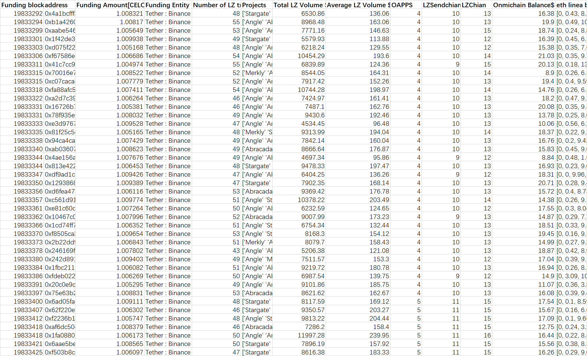

# Reported Addresses

This is fourth batches(batch31-40) I submit, the ,  and  one is here.

```
0xb75699194ead0d09aeafa708c7310d7d2d34a762
0xad305fbb29592e51aefa85aea8a359820b9e7767
0xabdd950886f885f8f72e245ba8e3375b18bd6729
0xc9a4da16b3b75bae2b31fe4703bd1048cfc440fe
0xb3510e0e98dd7b305cf84c24657ecf444c40969f
0x8a0fe5ed9df777b9f12a3478731dbfd45df6ce76
0xefb6c75c6baded2e162087a31081df092e2cd691
0x5eb52736ad2a0eb9682a3c64c842f9defc51d9cd
0xb56097a48e777a3fcddd56e2bd7870253a1eed40
0xfeab9d97b307bb83f1a2211f896860a488e8e1c5
0x7bd761c327ca93531f3943453028a57af5b15c45
0x4e0eff0a3889302ac13a2e96eb30778dac55426c
0x57a4ecb315ec5214c7530e47d5c455df43ebffe4
0x297264309853cfc4ec8f9f4efc497910f4c7b92e
0x0656755e303feaa5e9e05cdfc33c68d68579998c
0xcc9c8eb6197d6391b378a5b7e944e66b746e2823
0x033a43d8e9b1254b32cff3949905c9e2d6ba20fc
0xe0416f57a4346ca66e8ded262b0e52d9f39558c5
0xb1a0f03d2d4cb814f64de22f3e5c4b8fcf703682
0x146c01f1533cb74675d7ed324b34f128b37f037f
0xd9d306029c763a3a9b55b10e1018d375db4a3eec
0x5c628e4d2b3776ab120c51bad0b1a27544d917d3
0x83d0a15a44541b5b62293c4b82c09c0f3fa615d4
0x0ed20033792c5c53e2c851199033f9dc5185de47
0xdc65a4fc0920d2b9e41586942873328491fac24a
0xc47e5694ac3d681587a25e81e3634e3fa784e8de
0x5cbc33887534b58c96a51901091005fb7392eb68
0x3029179853393bbc6d9c30863325f94ce7a578ea
0xa5d7edda926bafad74796ffba4cdbd1c65473c43
0x1dd68b65c830d2cdaa981b99e0e546e757873a42
0xecb3bb1a6be792d599b57e1baf8284d13777579d
0x1be4d8095d6015a147f5dc778cd034d1020168b8
0x82a87a9897bb13a8096f8f9e0f9ba7e9fc901ced
0x858d791788fccc13828dfa487570514148b02dc7
0xdd5fb8621a1cdfdee55f84ab6e474b72421cc573
0xdb554ddf284bb7d20655be6fc44f5ce611dacc61
0xbbcf6286257cec5600ad43e8deab2ec83b1b68d0
0xd8b9c0733453a5a40a8b8794c4b9703178838fd7
0x1373ce19ce303a5bb54cbef057d92c4d36117f26
0x3ae38e7fc2902827622b89b059813a7f35c9ddbc
0xe41948a2d5787d419adba920dff6fc807ac73853
0xd8a3510d3dd1af09d444bcedf79a425b49c74aa2
0x474be149e98c7ba34abf15f5ba9cf26eec11b53d
0x9aac48677dc10f8a0ca1ca7980c2bd00bd199bd4
0x63c4b68062fd73ffb3cd7009a9e0d99c0d12ad0a
0x5028fd569c0b091402b69aaa6df860da8333b969
0xaf16b9c14dccb95d725c897907619c3563541a3e
0x4ea678545c79f6b640ec284d648f1cd21f8d33c4
0x6be294a732d9473507c3b48c6a5b260cced96c82
0x64b8efe89e17dd47fcdbc49c2f8efca5991ed2e7

0x052e5fbed0c4e62b91be17b5875823f9f30a1ef1
0x38c6b2582c29eb57ab42a12bd588adb9447a0939
0xb8571048edf1dffdd283ae4f9241be42b13affd8
0x716d8da05dcab9696fef90151e7fe9a762f8eaf7
0x4cf87f737cbcc974ef09ecd599a970d007bca1e9
0xfc88dfc3d1359d21c18189312ba03cef9d9d7d14
0x4ae6a23b1927f64c1bcd553d3f4f1b8e7b9e1af1
0x6ceb904df41183116df909567cb196c882f2d7e6
0xaf9e4522f3b0c0d92e7e6e434e8432b5de4e6cda
0x42824361684b0ee91a1ccb2243110d04aeb90509
0xcf65ea339e525ad23b0fe5e58261e5201fca002d
0xe5892f4e36afc19b3af495e821a2b476547509a3
0xad928192342a9c76cfd38bc38a20d35161e07d56
0xac83f1634811525b166a4774b01a3f2971b644b3
0xf41591cae4202bab28ef04040084aa0d0f86a34e
0x25bbf35b9ce0ac6caff4153193ab6e44875eca32
0xe11c226b61641feafdc0ecd225244d8ca55fa713
0x26287e02bb3693530b2bed48cb35b3aead33060c
0x58bfa6be8523fa28f6f9fc2ca182c9c1d743bad5
0xfa2facd3d3e70b8e56d1b8d8a51a978b3ad42303
0xd6f93a6ab6c2b12d000ffa43376c1b599658955e
0x80fd1dd6d2bc870c6dad7c65f9ff02e953d0560a
0xa78bd281bf63ee3360ae81972b2e6f9a80e9bc86
0x26ef436510a3ec79e220e3c37b03efddf4569cfb
0xe12447c47b23e116e12a0010b426a48a2507995b
0x60d53fa8c7cd1569954b8f40ebe78ee9bdc9ec27
0xc319f5afb0482053668a7c39fc0812144e3e2dfa
0x9ff6ee50a836713fc5cb49412111da59724dc38a
0xef381d82b91a01e26b1a7905e5e76227197fd63e
0xf0a85ab86071fc22b21d545d3c5aa241e1a6ae85
0x7de8f2aadf19086f201a5e1b009c90c192874c27
0xd85d92e3924c1b9876d0fcbfd55c8140f19cd8cb
0xe21aa34cf3e0bc1743fa432c1c946e4b5ca6a21c
0x8b9fd8593bbca8cb72c4487b17282ae033006675
0x297d8c588c116d860edfda80b7a085194cc87620
0xec38eac3cab72a8285cd91bf496a3b877b00b9ce

0x445ed16a11abfa0782793363a912f976f7c4e20d
0x616ec23db966f4c6b07fd89916df9499183b908b
0xda780c5896d536408de08ec9402da4a146487d2f
0x8a65a3a5661176237cb0845501f6b3e51776f360
0xe68368a195142fe17ccdf64aecc1e5591d6ae0d1
0xd60ab7e0f06ca19a58c03d605d5d758d85936ace
0x380e62d09232ecb1dc067c323e3554c84c9526da
0x88fe58eb03cc2e3be148acb9494fef140315f342
0xdf2b849939baf4e38e5c50761ea032d642e52f3f
0xbf194ce8d1c681efbd324868ecf41fe7b69ed528
0x03dd65543f51ecd8d098e2c4176885b710b42681
0x3296824d2f588df0d5f9ed1a4279229f82c4ceb1
0xd0b7f0b083e0524e0a16a29b78df21fb9837321e
0xafd3b80aa325d963ef58c82fe6666fc0a8c889e8
0x3fa668382b56eca6a51bcf73ccef9d9cf823d185
0x81ebd983a2f86029b240a37c1c3163156ba7e3ef
0x84e8a4b3f208a66213e49d020318b0e735cb4f97
0x7de14bf687c430866e6653f169872d244694838d
0x34134db8ddb430a1589675a0e8fabb3f7b641866
0x110ed5c98e64044ef5396b8639f6086b1bf125aa
0xe0de5044c2fca56acd6da7fb6feb8cb1a4a4ea92
0x4bb2dd3aa0e2d93cfa5c15283b63c2716a1aa506
0x4614339c00efa4d10ce15c7b03e88dd03ed1a169
0xf43cd90b401ed472070c5c30648464fb3162de79
0x16d51f05d6adc52823c9e72e2dcd5d8c80c594b6
0x8b293e63d993f99867cd44000691602dfcc5f2ed
0x14798d4fc2b9c81701f60d3f63bc62a77d723524
0xb4ed6f980d4c683ea783774a19094416837be5ae
0x6221884297230afa8438b3be573b11d45bb17974
0xea0ed6f2689e709cd5d09fa6b8207651d0e8f8d6
0xc31e354858a71700737d440ca3b7767143fec8db
0xbe734cb83cdbddbaee5d8cdbeaeddd017d8d142e
0x9378f8f3c5898e9446350b72352814739827d2c0
0x730dd5ec75f0037392678deb962b37eb9f466fb5
0x23250372d4cae29ea18cda0236a860e981abd511
0x69c7178d37fe9c41171c74ee1bfc713b36136727
0xb102e1d44483ae62c7729d83858723737e41980e
0xca5912b7fa88860540635a6ae037d3e31c1a42dc
0x0b2fe315f46da0806ea8dc9bf744dae419e1fbd6
0xde813af811804037b23d2576f52329432d4a4d92
0xdfa8fc3a814bb68f3d1c7ce8fdb6d2be44441de9
0x32c265913a537e851e92c9944bc2d3a8369b3570
0x449c3b6565fd092c8cb81aa80567666895026505
0x4ae6d1ec38e6decc15d79b5de985bb29cc73ffc3
0x60111761996671c241cae71be475c392b40cc418

0xf1814fc163a13dbe4a1ea65cb46d666d3ceb57df
0x9a46ee0040c1f5247d2f9b2ff4d5e7b371cd9b8f
0x6b79d6ccce85f41a0fed603ad3ad95c93a2bdcf2
0x833499c5a2799fd29d074797ec71995bac29b600
0xe5727f9996ebfa6422d58f2d1697c5061082f6d2
0xdef8074cfe09d042de346ca92cb8b2fb52f5348d
0xc1beab742f2c8cd49fe437c706fff825a13435d3
0x7a6e6c50230d4c6c359f09a059cbddb8c55c5ed0
0xaf86896ed76d4336623676a4b3c274de9e440b4a
0x3048e1386bc8539a689c44c9a56e0306c34a7d3f

0x34f7ee2b68f674b2e8956566418f6c16f56be1dd
0xe13041d37731ed25d127a9a79ccbf16715adef2b
0x82fc2429abbed37f011a91e94e2c05e6d44418ad
0x445843c521413b8740bcda7626da29f3855b990c
0x0cc93ec692ef37e36250f911230035a24d9169fd
0x574e1201c7bf55a62fdc246af35fb30f337ce4b1
0xd38d0bb2e5849785eafcb936b4fae3eb510fd25b
0x18175bacaa43b833e45fff427c7a91742cec3948
0x0ec1658454e36d94834cf5e1a3d8efaf0e0a6363
0x6954fc79f94c2ae063691dbd73bde97453485045
0xb7188234b7804a3ca77d733333103a188342ac63
0xe4ded69380f5c866356a6885e3b03e0032bd985a

0xd93e4d58c321904ffd872f7f15a92b9615db1b2e
0x16917594ecdeed40ae1f143d3cd28222278a695c
0xf07153babb00aa76aecf854a23e099d53b41e019
0xfe30190a5b40aaff874560bcfb94062fb5895c7e
0x499cb09f5ebcea0b5629d4f8c0bd66920b8ba835
0x41c1a43edf8d8ff8f62592c4ad0130be21c20bd1
0xb19e834b2756e25630bd3bb84ea68920ee1afaae
0xb7eed903732007a8485cf1698ab5a8ad14450804
0xc391ffb7d8350cdef986c7389931bb3d266251d2
0x5116f25e3b3523a1cb46a333fe61f2fbb4be7eae

0x4a1bcfff314733da67c70f271eb94583f642b818
0xb1a426097ab503ae6f6e02ed0d39512000c76266
0xaabe546e7440c1ebd1753ba4609aa8c581771011
0x1f42de336ebaca4e1de6d758eeb5140897f033bc
0xd075f22d0a2cc18f9a667b6c109fe6a8df5a5662
0xf67586e422ba68957c67b9c7dc0dea7e17e05455
0x41c7cc994403b88429e0d3df6104193618fd19d8
0x70016e7c0eddae14a5cb1d67e106c3edaff3634f
0xc07caca800660bcd0ad5f460a1275fc65765026e
0xfa88afc57e1e5f83ce115b4785d1022ffec62ef8
0xa2d7c39f3c2d358d8cbb4c17185f038a426cc24e
0x16726b7618e20d64dc8b8f37481b2a739d5b437b
0x78f935ef674653799f54c4822c7e6f416494ef85
0xe3d97676200fb2022e722e4ee56814e3e5363db6
0x81f25c5dcc825581279085140d0fbccb0e0b5212
0x94ca4ca974f8b49867a068106c31a932409e1cdc
0xab03607da531299bcee666c852c02c73f3011541
0x4ae156aea468e624cab43df1ab7f15b6a0d0f5ba
0x813e4223a60356b3b6a31ca486663b11176d5dd0
0xdf9ad1c936742b9a91f33bb960de6df363715813
0x12938683626c45703c4205b5b7ee754848235977
0xd6fea473f0bcdc136227f8a89f6e9dfc9b1bf876
0xc561d916cdcfa925b05bbe35c1bfb5b1dd92f97c
0xe81c60d4de45bb15a5e39b8eea1cd74f1d870262
0x10467c0bf27548fa0c1999ff5076566f62c0fb91
0x1cd74ff7e40c8d2786bd62623494243e788e9cf9
0xf8505ca32f58d538a658e2dc8b00348e93ec0041
0x2b22dd970b9c14e1bbb3973a870882c5ac7de5a4
0x246169fed5f4f39b380412d39d8da4ef86d0a736
0x242d8911142805f672b6cc1ee1989809e423fea7
0x1fbc2115407e89100206720fc7ab287a34a70f93
0xfdeb02290539ab8930d9905bdfec42bf8a89cf90
0x20c0e9c6cef57e0b1d6352dade551d955a1f4362
0x75e63b2747f8365aeb448eadd4954c6b62e7137a
0x6ad05fa4ef014d50cd59ed5fb6e9353002038c4e
0x62f220e661f76e0728ffb3184d140f477c38c167
0xf2236b1cff4c9fda660be5f09bd4fe35be895bc2
0xaf6dc50472d14d3f716a655f8b00c0166662c5d9
0x1fa0880bad2aa9fd164409f6488307f45228d2f6
0x6aae5becf4aebbadf0cf7e6b0f8dd6e06e98b2ea
0xf503b8c431f37ba23f4def7dd67270baef4afd85

0x9d3da662d162b31d5c6190c25213f4826db95e17
0xbd29faf6bee91106d5dceb8e7c96358b95ac757c
0x3e0a407ec4a66029622e5e45b8f2864e111bf23a
0x27c079b2a2a155ca1694473e1a21f32d7fbbddfd
0xe3d6fa0392a64bafe588fb74b0f7355953a1a700
0xd1dfc4a184cf01be10a671e7b1166d539792d1af
0x6c97485fab05b0456ec3bdbe6cbcb4a66f898767
0xc0b2f10a0ce9cbb788cf38661639ce75e37aacae
0x2aec41e83dac93d8951308a0d7944280d4008d8a
0x4089433c18c574a955cc8bd6f61ea9957b53425f
0x03913a78e868a689fe98e96d9c1aa6dec0f76a56
0xfdceadf97eec36ab8646f31ab446d6425727e367
0xe4147173709ddf37e1404ac53015ab6695ac9d06
0x2ce698a94d920bdb3df4893163444cd263c217ff
0x2d44cffcd36c0b8501c57b43c2574a44078b60b3
0xd92deae51cfb9c25ecee8562520cc86f776b4e3d
0xd5bec3e3b33d732979565cc785a0208bbd81690b

0xdff9539e3430cad9f23fdb312ffdd8097900bc05
0xf9879135d5874aa56939d039595d99418f4a9050
0x76d0b5e0348be0dfeacd7e52f9c6a9b8c2f52b15
0x89c15507177910f4f971a3242201f1b800831fb7
0xd36450598374cd91fc4dd12bca4f5a2c699a10d4
0xdef8e3f0e36a8b07518022cede833c433fd1320c
0x744d256ae58e84801cec9e757f64b6c07e57d872
0x5b97aa303fdd0dbc6abb263b3efadc07b2b9ee38
0xc38058af07926480113e2143b5a884cf7cf5698b
0x4ffbd7081a6c08829e9646c0085f26f9d8175f94
0xdb60723f73969bfa2dbd424547f3a9483ac24f0a
0xbcce55584ff7c80efcdf1a1096f1b5889da2ad2e
0xdcd6adc2508214e62cfc4ce9e2923faa104336d0
0xda19abd1001904472b716e50df0a8141d4a7a37c
0xfb07bf0b56950de0676b05fbb4d9a245f43599a3

0xc3f7617f5577d9a0652e45cad1534b6bf7a7dbac
0x0f0d67067d1d499a4a0ef409ef572087e3c98876
0xf1e117021566317a9f709c8ecc1017344a38021a
0x3b439d2d28bd6316f292c65a95b503098646d32d
0xd5c44ef4e28bf8b706cf65cc834ace48d85bfb37
0x75bc95e26071a578bfc1cf555236b799ee24d8c6
0x19f46cbd148f9d4d0bc54182b4a15d241adba70a
0x403d14d068a4eefd3c53584c0d04f005ac979aa2
0x00b4aaad88311a1f77ff229f84c76bf52b62a3b5
0x36716803c65956bc6c7064ea7ca3ee7f5c6d072c
0x6e16ecb3cca28cfe944512e3ef12c479154e4294
0x0bd1e21180c04f10eef2c6768d4103d5d45017f5
0xca905ed168190fcc6eaa5786eb5c78befe01c5ae
0xb65b5685f843dd556acbaa408a7e52463c6b9e5e
0x1b307971b91250e91f83f1060e0f153b87886feb
0xcaece32c25dd0a53e898d0af1674b90df018ee06


```

# Description
The Affinity Propagation algorithm is used to filter suspicious data four times, strictly reducing false positive samples, and the filtered cluster address data is highly similar. In order to be sufficiently convincing, evidence of the homogenization operation of each cluster address on the entire chain is also provided.

# Detailed Methodology & Walkthrough
Affinity Propagation is a clustering algorithm that identifies exemplars by passing "responsibility" and "availability" messages between data points. It automatically determines the number of clusters based on a preference parameter and similarity matrix, without requiring the number of clusters to be specified beforehand.I have tried many cluster analysis methods and found this method to be the most useful and effective.

## Dataset

**Note: The multichain wallet balance$ snapshot on around May-20-2024 00:30PM UTC+8, data get from debank api**

By monitoring the withdrawal operations from the Binance exchange on the CELO chain, I found that a large number of abnormal behaviors occurred on the chain from June 10th to June 16th (withdrawing ~CELO from the exchange, and then conducting layerzero transactions). I set the filter conditions to this time period, the sender is Tether-Binance, the transaction amount is 0.9-1.1CELO, and I got about 6,000 pieces of data.

Next, I used the transaction data provided by Layerzero to obtain the _'Number of LZ tx' 'Projects' 'Total LZ Volume $' 'Average LZ Volume $' 'Number of OAPPS' 'Number of Sendchian' 'Number of Chian'_ and **the _multichain wallet balance_ of each address were obtained through Debank**. You can see the .

## Data processing
In the data processing, I used the affinity propation algorithm four times to identify the data. After each identification, clusters with less than 20 samples were eliminated, and each identification and filtering process had different goals.

### First filter(initial filter)
The set Affinity Propagation feature parameters are
```python
features = ['Number of LZ tx', 'Average LZ Volume $', 'Number of OAPPS', 'Number of Chian', 'Onmichain Balance$']
```
After obtaining the clustering results, if the number of a certain cluster is less than 20, the cluster will be deleted. This step resulted in the deletion of addresses that had not traded layerzero and real-person accounts that had no problems at all.

### Second filter
The set Affinity Propagation feature parameters are
```python
features = ['Number of LZ tx', 'Total LZ Volume $', 'Average LZ Volume $', 'Number of OAPPS', 'Number of Sendchian','Number of Chian', 'Onmichain Balance$']
```
This is the first comprehensive cluster analysis. After the analysis, clusters with less than 20 counts are again eliminated.

### Third filter
The set Affinity Propagation feature parameters are
```python
features = ['Number of Sendchian','Number of Chian', 'Onmichain Balance$']
```
This clustering analysis reduces the dimensionality of the input parameters, especially focusing on wallet balances. By eliminating clusters with less than 20 counts, this step will eliminate real users whose wallets have larger balances (even though they may not be trustworthy). ). The consideration for this step is that Witch accounts generally do not hold large balances.

### Fourth filter(final filter)
The set Affinity Propagation feature parameters are
```python
features = ['Funding block','Funding Amount[CELO]','Number of LZ tx','Total LZ Volume $','Average LZ Volume $','Number of OAPPS','Number of Sendchian','Number of Chian', 'Onmichain Balance$','Onmichain Balance$']
```
The input of the last clustering algorithm is all available parameters of the data set, and it attempts to divide the data set into as many clusters as possible. Similarly, clusters with less than 20 internal members will be deleted. **Thanks to the efforts of Layerzero and its partners in the previous phase, I filtered out nearly 4,000 addresses and nearly 2,000+ addresses were flagged as known witches.** At this point, we have the final data, see . To provide further evidence, I will provide each cluster address with a large-scale homogenization operation different from this data set (such as a large-scale homogenization withdrawal from the exchange again)

### More ways to remove false positive samples
When verifying the evidence I provided, I used random sampling to verify, and paid special attention to the data at the edge of the cluster. Moreover, among the submitted clusters, I artificially excluded clusters whose features did not appear to be particularly obvious. The final cluster had almost no possibility of false positives.

---
## Sybil address batches and extra evidence

**batch31**
```
0xb75699194ead0d09aeafa708c7310d7d2d34a762
0xad305fbb29592e51aefa85aea8a359820b9e7767
0xabdd950886f885f8f72e245ba8e3375b18bd6729
0xc9a4da16b3b75bae2b31fe4703bd1048cfc440fe
0xb3510e0e98dd7b305cf84c24657ecf444c40969f
0x8a0fe5ed9df777b9f12a3478731dbfd45df6ce76
0xefb6c75c6baded2e162087a31081df092e2cd691
0x5eb52736ad2a0eb9682a3c64c842f9defc51d9cd
0xb56097a48e777a3fcddd56e2bd7870253a1eed40
0xfeab9d97b307bb83f1a2211f896860a488e8e1c5
0x7bd761c327ca93531f3943453028a57af5b15c45
0x4e0eff0a3889302ac13a2e96eb30778dac55426c
0x57a4ecb315ec5214c7530e47d5c455df43ebffe4
0x297264309853cfc4ec8f9f4efc497910f4c7b92e
0x0656755e303feaa5e9e05cdfc33c68d68579998c
0xcc9c8eb6197d6391b378a5b7e944e66b746e2823
0x033a43d8e9b1254b32cff3949905c9e2d6ba20fc
0xe0416f57a4346ca66e8ded262b0e52d9f39558c5
0xb1a0f03d2d4cb814f64de22f3e5c4b8fcf703682
0x146c01f1533cb74675d7ed324b34f128b37f037f
0xd9d306029c763a3a9b55b10e1018d375db4a3eec
0x5c628e4d2b3776ab120c51bad0b1a27544d917d3
0x83d0a15a44541b5b62293c4b82c09c0f3fa615d4
0x0ed20033792c5c53e2c851199033f9dc5185de47
0xdc65a4fc0920d2b9e41586942873328491fac24a
0xc47e5694ac3d681587a25e81e3634e3fa784e8de
0x5cbc33887534b58c96a51901091005fb7392eb68
0x3029179853393bbc6d9c30863325f94ce7a578ea
0xa5d7edda926bafad74796ffba4cdbd1c65473c43
0x1dd68b65c830d2cdaa981b99e0e546e757873a42
0xecb3bb1a6be792d599b57e1baf8284d13777579d
0x1be4d8095d6015a147f5dc778cd034d1020168b8
0x82a87a9897bb13a8096f8f9e0f9ba7e9fc901ced
0x858d791788fccc13828dfa487570514148b02dc7
0xdd5fb8621a1cdfdee55f84ab6e474b72421cc573
0xdb554ddf284bb7d20655be6fc44f5ce611dacc61
0xbbcf6286257cec5600ad43e8deab2ec83b1b68d0
0xd8b9c0733453a5a40a8b8794c4b9703178838fd7
0x1373ce19ce303a5bb54cbef057d92c4d36117f26
0x3ae38e7fc2902827622b89b059813a7f35c9ddbc
0xe41948a2d5787d419adba920dff6fc807ac73853
0xd8a3510d3dd1af09d444bcedf79a425b49c74aa2
0x474be149e98c7ba34abf15f5ba9cf26eec11b53d
0x9aac48677dc10f8a0ca1ca7980c2bd00bd199bd4
0x63c4b68062fd73ffb3cd7009a9e0d99c0d12ad0a
0x5028fd569c0b091402b69aaa6df860da8333b969
0xaf16b9c14dccb95d725c897907619c3563541a3e
0x4ea678545c79f6b640ec284d648f1cd21f8d33c4
0x6be294a732d9473507c3b48c6a5b260cced96c82
0x64b8efe89e17dd47fcdbc49c2f8efca5991ed2e7

```

**Extra evidence**

In addition to accepting ~1CELO in batches on the CELO chain on June 15th. **This batch of addresses also accepted ~1.91CORE(3.5$) sent by 0xcfe2b85(unknown CEX) on the Corechain on around 2024-02-21T15:54:17 or ~1.5CORE(3$) on around 2024-02-18T14:47:36. After receive gas, this batch used core bridge to bridge about 2000USDT.**

**Data at a glance**


---
**batch32**
```
0x052e5fbed0c4e62b91be17b5875823f9f30a1ef1
0x38c6b2582c29eb57ab42a12bd588adb9447a0939
0xb8571048edf1dffdd283ae4f9241be42b13affd8
0x716d8da05dcab9696fef90151e7fe9a762f8eaf7
0x4cf87f737cbcc974ef09ecd599a970d007bca1e9
0xfc88dfc3d1359d21c18189312ba03cef9d9d7d14
0x4ae6a23b1927f64c1bcd553d3f4f1b8e7b9e1af1
0x6ceb904df41183116df909567cb196c882f2d7e6
0xaf9e4522f3b0c0d92e7e6e434e8432b5de4e6cda
0x42824361684b0ee91a1ccb2243110d04aeb90509
0xcf65ea339e525ad23b0fe5e58261e5201fca002d
0xe5892f4e36afc19b3af495e821a2b476547509a3
0xad928192342a9c76cfd38bc38a20d35161e07d56
0xac83f1634811525b166a4774b01a3f2971b644b3
0xf41591cae4202bab28ef04040084aa0d0f86a34e
0x25bbf35b9ce0ac6caff4153193ab6e44875eca32
0xe11c226b61641feafdc0ecd225244d8ca55fa713
0x26287e02bb3693530b2bed48cb35b3aead33060c
0x58bfa6be8523fa28f6f9fc2ca182c9c1d743bad5
0xfa2facd3d3e70b8e56d1b8d8a51a978b3ad42303
0xd6f93a6ab6c2b12d000ffa43376c1b599658955e
0x80fd1dd6d2bc870c6dad7c65f9ff02e953d0560a
0xa78bd281bf63ee3360ae81972b2e6f9a80e9bc86
0x26ef436510a3ec79e220e3c37b03efddf4569cfb
0xe12447c47b23e116e12a0010b426a48a2507995b
0x60d53fa8c7cd1569954b8f40ebe78ee9bdc9ec27
0xc319f5afb0482053668a7c39fc0812144e3e2dfa
0x9ff6ee50a836713fc5cb49412111da59724dc38a
0xef381d82b91a01e26b1a7905e5e76227197fd63e
0xf0a85ab86071fc22b21d545d3c5aa241e1a6ae85
0x7de8f2aadf19086f201a5e1b009c90c192874c27
0xd85d92e3924c1b9876d0fcbfd55c8140f19cd8cb
0xe21aa34cf3e0bc1743fa432c1c946e4b5ca6a21c
0x8b9fd8593bbca8cb72c4487b17282ae033006675
0x297d8c588c116d860edfda80b7a085194cc87620
0xec38eac3cab72a8285cd91bf496a3b877b00b9ce

```

**Extra evidence**

 In addition to accepting CELO in batches on the CELO chain on June 15th. **The owner of this cluster has a very shrewd differentiation operation. Among them, addresses 1-15 withdrow exactly 0.0095BNB(3$) from binance at aorund Feb-28-2023 02:53:29 AM +UTC; addresses 16-23 withdrow exactly 0.0095BNB(3$) from binance at aorund Mar-01-2023 06:28:37 AM +UTC, and the remaining addresses withdrow around 0.016BNB(5$) at aorund May-04-2023 10:34:05 AM +UTC**

**Data at a glance**


---
**batch33**
```
0x445ed16a11abfa0782793363a912f976f7c4e20d
0x616ec23db966f4c6b07fd89916df9499183b908b
0xda780c5896d536408de08ec9402da4a146487d2f
0x8a65a3a5661176237cb0845501f6b3e51776f360
0xe68368a195142fe17ccdf64aecc1e5591d6ae0d1
0xd60ab7e0f06ca19a58c03d605d5d758d85936ace
0x380e62d09232ecb1dc067c323e3554c84c9526da
0x88fe58eb03cc2e3be148acb9494fef140315f342
0xdf2b849939baf4e38e5c50761ea032d642e52f3f
0xbf194ce8d1c681efbd324868ecf41fe7b69ed528
0x03dd65543f51ecd8d098e2c4176885b710b42681
0x3296824d2f588df0d5f9ed1a4279229f82c4ceb1
0xd0b7f0b083e0524e0a16a29b78df21fb9837321e
0xafd3b80aa325d963ef58c82fe6666fc0a8c889e8
0x3fa668382b56eca6a51bcf73ccef9d9cf823d185
0x81ebd983a2f86029b240a37c1c3163156ba7e3ef
0x84e8a4b3f208a66213e49d020318b0e735cb4f97
0x7de14bf687c430866e6653f169872d244694838d
0x34134db8ddb430a1589675a0e8fabb3f7b641866
0x110ed5c98e64044ef5396b8639f6086b1bf125aa
0xe0de5044c2fca56acd6da7fb6feb8cb1a4a4ea92
0x4bb2dd3aa0e2d93cfa5c15283b63c2716a1aa506
0x4614339c00efa4d10ce15c7b03e88dd03ed1a169
0xf43cd90b401ed472070c5c30648464fb3162de79
0x16d51f05d6adc52823c9e72e2dcd5d8c80c594b6
0x8b293e63d993f99867cd44000691602dfcc5f2ed
0x14798d4fc2b9c81701f60d3f63bc62a77d723524
0xb4ed6f980d4c683ea783774a19094416837be5ae
0x6221884297230afa8438b3be573b11d45bb17974
0xea0ed6f2689e709cd5d09fa6b8207651d0e8f8d6
0xc31e354858a71700737d440ca3b7767143fec8db
0xbe734cb83cdbddbaee5d8cdbeaeddd017d8d142e
0x9378f8f3c5898e9446350b72352814739827d2c0
0x730dd5ec75f0037392678deb962b37eb9f466fb5
0x23250372d4cae29ea18cda0236a860e981abd511
0x69c7178d37fe9c41171c74ee1bfc713b36136727
0xb102e1d44483ae62c7729d83858723737e41980e
0xca5912b7fa88860540635a6ae037d3e31c1a42dc
0x0b2fe315f46da0806ea8dc9bf744dae419e1fbd6
0xde813af811804037b23d2576f52329432d4a4d92
0xdfa8fc3a814bb68f3d1c7ce8fdb6d2be44441de9
0x32c265913a537e851e92c9944bc2d3a8369b3570
0x449c3b6565fd092c8cb81aa80567666895026505
0x4ae6d1ec38e6decc15d79b5de985bb29cc73ffc3
0x60111761996671c241cae71be475c392b40cc418

```

**Extra evidence**

In addition to accepting CELO in batches on the CELO chain on June 15th, **This batch of addresses also accepted approximately 0.007arbETH(12$) sent by OKX on the arbitrumchain, and then use bungee and apto bridge to bridge gas** on around Jun-23-2023 08:25:49 AM +UTC

**Data at a glance**


---
**batch34**
```
0xf1814fc163a13dbe4a1ea65cb46d666d3ceb57df
0x9a46ee0040c1f5247d2f9b2ff4d5e7b371cd9b8f
0x6b79d6ccce85f41a0fed603ad3ad95c93a2bdcf2
0x833499c5a2799fd29d074797ec71995bac29b600
0xe5727f9996ebfa6422d58f2d1697c5061082f6d2
0xdef8074cfe09d042de346ca92cb8b2fb52f5348d
0xc1beab742f2c8cd49fe437c706fff825a13435d3
0x7a6e6c50230d4c6c359f09a059cbddb8c55c5ed0
0xaf86896ed76d4336623676a4b3c274de9e440b4a
0x3048e1386bc8539a689c44c9a56e0306c34a7d3f
```

**Extra evidence**

In addition to accepting CELO in batches on the CELO chain on June 15th. **This batch of addresses also accepted approximately 0.011ETH(20$,mainnet) sent by OKX and then used bungee(0.3$) at around Aug-04-2023 06:30:35 PM +UTC**

**Data at a glance**


---
**batch35**
```
0x34f7ee2b68f674b2e8956566418f6c16f56be1dd
0xe13041d37731ed25d127a9a79ccbf16715adef2b
0x82fc2429abbed37f011a91e94e2c05e6d44418ad
0x445843c521413b8740bcda7626da29f3855b990c
0x0cc93ec692ef37e36250f911230035a24d9169fd
0x574e1201c7bf55a62fdc246af35fb30f337ce4b1
0xd38d0bb2e5849785eafcb936b4fae3eb510fd25b
0x18175bacaa43b833e45fff427c7a91742cec3948
0x0ec1658454e36d94834cf5e1a3d8efaf0e0a6363
0x6954fc79f94c2ae063691dbd73bde97453485045
0xb7188234b7804a3ca77d733333103a188342ac63
0xe4ded69380f5c866356a6885e3b03e0032bd985a

```

**Extra evidence**

batch35 is liking batch32. In addition to accepting CELO in batches on the CELO chain on June 14th. **This batch of addresses withdrow exactly 0.0095BNB(3$) from binance at aorund Feb-28-2023 02:53:29 AM +UTC**

**Data at a glance**


---
**batch36**
```
0xd93e4d58c321904ffd872f7f15a92b9615db1b2e
0x16917594ecdeed40ae1f143d3cd28222278a695c
0xf07153babb00aa76aecf854a23e099d53b41e019
0xfe30190a5b40aaff874560bcfb94062fb5895c7e
0x499cb09f5ebcea0b5629d4f8c0bd66920b8ba835
0x41c1a43edf8d8ff8f62592c4ad0130be21c20bd1
0xb19e834b2756e25630bd3bb84ea68920ee1afaae
0xb7eed903732007a8485cf1698ab5a8ad14450804
0xc391ffb7d8350cdef986c7389931bb3d266251d2
0x5116f25e3b3523a1cb46a333fe61f2fbb4be7eae

```

**Extra evidence**

In addition to accepting CELO in batches on the CELO chain on June 15th. **This batch of addresses also accepted approximately 19MATIC(19$,polygon chian) sent by binance at around Apr-30-2023 07:54:11 PM +UTC**

**Data at a glance**


---
**batch37**
```
0x4a1bcfff314733da67c70f271eb94583f642b818
0xb1a426097ab503ae6f6e02ed0d39512000c76266
0xaabe546e7440c1ebd1753ba4609aa8c581771011
0x1f42de336ebaca4e1de6d758eeb5140897f033bc
0xd075f22d0a2cc18f9a667b6c109fe6a8df5a5662
0xf67586e422ba68957c67b9c7dc0dea7e17e05455
0x41c7cc994403b88429e0d3df6104193618fd19d8
0x70016e7c0eddae14a5cb1d67e106c3edaff3634f
0xc07caca800660bcd0ad5f460a1275fc65765026e
0xfa88afc57e1e5f83ce115b4785d1022ffec62ef8
0xa2d7c39f3c2d358d8cbb4c17185f038a426cc24e
0x16726b7618e20d64dc8b8f37481b2a739d5b437b
0x78f935ef674653799f54c4822c7e6f416494ef85
0xe3d97676200fb2022e722e4ee56814e3e5363db6
0x81f25c5dcc825581279085140d0fbccb0e0b5212
0x94ca4ca974f8b49867a068106c31a932409e1cdc
0xab03607da531299bcee666c852c02c73f3011541
0x4ae156aea468e624cab43df1ab7f15b6a0d0f5ba
0x813e4223a60356b3b6a31ca486663b11176d5dd0
0xdf9ad1c936742b9a91f33bb960de6df363715813
0x12938683626c45703c4205b5b7ee754848235977
0xd6fea473f0bcdc136227f8a89f6e9dfc9b1bf876
0xc561d916cdcfa925b05bbe35c1bfb5b1dd92f97c
0xe81c60d4de45bb15a5e39b8eea1cd74f1d870262
0x10467c0bf27548fa0c1999ff5076566f62c0fb91
0x1cd74ff7e40c8d2786bd62623494243e788e9cf9
0xf8505ca32f58d538a658e2dc8b00348e93ec0041
0x2b22dd970b9c14e1bbb3973a870882c5ac7de5a4
0x246169fed5f4f39b380412d39d8da4ef86d0a736
0x242d8911142805f672b6cc1ee1989809e423fea7
0x1fbc2115407e89100206720fc7ab287a34a70f93
0xfdeb02290539ab8930d9905bdfec42bf8a89cf90
0x20c0e9c6cef57e0b1d6352dade551d955a1f4362
0x75e63b2747f8365aeb448eadd4954c6b62e7137a
0x6ad05fa4ef014d50cd59ed5fb6e9353002038c4e
0x62f220e661f76e0728ffb3184d140f477c38c167
0xf2236b1cff4c9fda660be5f09bd4fe35be895bc2
0xaf6dc50472d14d3f716a655f8b00c0166662c5d9
0x1fa0880bad2aa9fd164409f6488307f45228d2f6
0x6aae5becf4aebbadf0cf7e6b0f8dd6e06e98b2ea
0xf503b8c431f37ba23f4def7dd67270baef4afd85

```

**Extra evidence**

In addition to accepting CELO in batches on the CELO chain on June 15th. **This batch of addresses also accepted approximately 0.1185CELO(0.11$,CELOchian) sent by Binance and then used merkly to bridge gas at around Dec-24-2023 08:02:01 PM +UTC**

**Data at a glance**


---
**batch38**
```
0x9d3da662d162b31d5c6190c25213f4826db95e17
0xbd29faf6bee91106d5dceb8e7c96358b95ac757c
0x3e0a407ec4a66029622e5e45b8f2864e111bf23a
0x27c079b2a2a155ca1694473e1a21f32d7fbbddfd
0xe3d6fa0392a64bafe588fb74b0f7355953a1a700
0xd1dfc4a184cf01be10a671e7b1166d539792d1af
0x6c97485fab05b0456ec3bdbe6cbcb4a66f898767
0xc0b2f10a0ce9cbb788cf38661639ce75e37aacae
0x2aec41e83dac93d8951308a0d7944280d4008d8a
0x4089433c18c574a955cc8bd6f61ea9957b53425f
0x03913a78e868a689fe98e96d9c1aa6dec0f76a56
0xfdceadf97eec36ab8646f31ab446d6425727e367
0xe4147173709ddf37e1404ac53015ab6695ac9d06
0x2ce698a94d920bdb3df4893163444cd263c217ff
0x2d44cffcd36c0b8501c57b43c2574a44078b60b3
0xd92deae51cfb9c25ecee8562520cc86f776b4e3d
0xd5bec3e3b33d732979565cc785a0208bbd81690b

```

**Extra evidence**

In addition to accepting CELO in batches on the CELO chain on June 15th. **This batch of addresses also accepted approximately 3CORE(5.5$, CORE chain gas token) sent by 0xcfe2b(unknown CEX) and then used core bridge to bridge USDT at around 2024-02-29T19:00:58**

**Data at a glance**


---
**batch39**
```
0xdff9539e3430cad9f23fdb312ffdd8097900bc05
0xf9879135d5874aa56939d039595d99418f4a9050
0x76d0b5e0348be0dfeacd7e52f9c6a9b8c2f52b15
0x89c15507177910f4f971a3242201f1b800831fb7
0xd36450598374cd91fc4dd12bca4f5a2c699a10d4
0xdef8e3f0e36a8b07518022cede833c433fd1320c
0x744d256ae58e84801cec9e757f64b6c07e57d872
0x5b97aa303fdd0dbc6abb263b3efadc07b2b9ee38
0xc38058af07926480113e2143b5a884cf7cf5698b
0x4ffbd7081a6c08829e9646c0085f26f9d8175f94
0xdb60723f73969bfa2dbd424547f3a9483ac24f0a
0xbcce55584ff7c80efcdf1a1096f1b5889da2ad2e
0xdcd6adc2508214e62cfc4ce9e2923faa104336d0
0xda19abd1001904472b716e50df0a8141d4a7a37c
0xfb07bf0b56950de0676b05fbb4d9a245f43599a3
```

**Extra evidence**

In addition to accepting CELO in batches on the CELO chain on June 15th. **This batch of addresses also accepted approximately 0.5CELO(0.5$) sent by Binance at around Jan-02-2024 10:10:33 AM +UTC**

**Data at a glance**


---
**batch40**
```
0xc3f7617f5577d9a0652e45cad1534b6bf7a7dbac
0x0f0d67067d1d499a4a0ef409ef572087e3c98876
0xf1e117021566317a9f709c8ecc1017344a38021a
0x3b439d2d28bd6316f292c65a95b503098646d32d
0xd5c44ef4e28bf8b706cf65cc834ace48d85bfb37
0x75bc95e26071a578bfc1cf555236b799ee24d8c6
0x19f46cbd148f9d4d0bc54182b4a15d241adba70a
0x403d14d068a4eefd3c53584c0d04f005ac979aa2
0x00b4aaad88311a1f77ff229f84c76bf52b62a3b5
0x36716803c65956bc6c7064ea7ca3ee7f5c6d072c
0x6e16ecb3cca28cfe944512e3ef12c479154e4294
0x0bd1e21180c04f10eef2c6768d4103d5d45017f5
0xca905ed168190fcc6eaa5786eb5c78befe01c5ae
0xb65b5685f843dd556acbaa408a7e52463c6b9e5e
0x1b307971b91250e91f83f1060e0f153b87886feb
0xcaece32c25dd0a53e898d0af1674b90df018ee06
```

**Extra evidence**

In addition to accepting CELO in batches on the CELO chain on June 15th, This batch of addresses also accepted approximately 6.6ONE(0.14$,harmony chain gas token) sent by 0x42347(unknown CEX) and then bridge 0.02$ gas on around 04/01/2024, 04:01:05

**Data at a glance**


# Reward Address (If Eligible)
0xfa8d0fc1c3fc17396ace8758079b42ec2dc7bd79

# Appendix
**Affinity propation code and filter**
```python

import numpy as np
import matplotlib.pyplot as plt
from sklearn.cluster import AffinityPropagation
from sklearn.metrics import pairwise_distances_argmin
import pandas as pd
from sklearn.preprocessing import StandardScaler

def affinity(features, df1):
    X = df1[features].values
    scaler = StandardScaler()
    X = scaler.fit_transform(X)

    af = AffinityPropagation(damping=0.8).fit(X)
    cluster_centers_indices = af.cluster_centers_indices_
    labels = af.labels_

    n_clusters_ = len(cluster_centers_indices)
    print(f"Estimated number of clusters: {n_clusters_}")

    df1['affinity'] = labels
    return df1

def filter(df2):
    affinity_counts = df2['affinity'].value_counts()
    valid_affinity_values = affinity_counts[affinity_counts >= 20].index
    filtered_df = df2[df2['affinity'].isin(valid_affinity_values)]
    return filtered_df

csv_file = 'dataset.csv'
output_file = 'final_aff_result.csv'
df = pd.read_csv(csv_file)
df = df.fillna(0)

features1 = ['Number of LZ tx', 'Average LZ Volume $', 'Number of OAPPS', 'Number of Chian', 'Onmichain Balance$']
df = affinity(features1, df)
df = filter(df)

features2 = ['Number of LZ tx', 'Total LZ Volume $', 'Average LZ Volume $', 'Number of OAPPS', 'Number of Sendchian','Number of Chian', 'Onmichain Balance$']
df = affinity(features2, df)
df = filter(df)

features3 = ['Number of Sendchian','Number of Chian', 'Onmichain Balance$']
df = affinity(features3, df)
df = filter(df)

features4 = ['Funding block','Funding Amount[CELO]','Number of LZ tx','Total LZ Volume $','Average LZ Volume $','Number of OAPPS','Number of Sendchian','Number of Chian', 'Onmichain Balance$','Onmichain Balance$']
df = affinity(features4, df)
df = filter(df)

df.to_csv('final_output',index=False)
```

**A schematic diagram of one result of affinity propagation algorithm**

The z-axis is the multichainwallet balance, and all axis data have been standardized.


**Dune SQL**
```SQL
SELECT
  date_trunc('day', block_time) AS time,
  COUNT(*) AS transaction_count,
  COUNT(DISTINCT "to") AS receiving_addresses
FROM celo.transactions
WHERE
  block_time BETWEEN TRY_CAST('2023-4-1 00:00:00.000 UTC' AS TIMESTAMP) AND TRY_CAST('2024-4-1 23:59:59.999 UTC' AS TIMESTAMP)
  AND "from" = FROM_HEX('f6436829Cf96EA0f8BC49d300c536FCC4f84C4ED')
  AND value BETWEEN TRY_CAST(0.9 * 1e18 AS DECIMAL(38, 0)) AND TRY_CAST(1.1 * 1e18 AS DECIMAL(38, 0))
GROUP BY 1
ORDER BY
  1 ASC
```
This figure shows 0.9-1.1CELO sent by binance from 2023-4-1 to 2024-4-1, Display a large number of witch activities at the extreme point.


